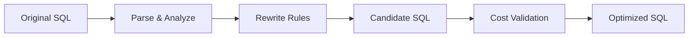

PawSQL Automatic SQL Rewrite uses SQL parsing, semantic analysis, and optimization rules to transform inefficient SQL into semantically equivalent forms that give the database optimizer better opportunities to produce efficient execution plans.

Instead of only returning textual recommendations, PawSQL aims to generate executable optimized SQL and then validate whether the rewrite actually improves performance.


## Overview

Many SQL performance problems are caused not by missing indexes, but by SQL structures that restrict the optimizer's available execution strategies.

Common examples include:

- Repeated execution of correlated subqueries
- Predicates that cannot be pushed down
- OR expressions that reduce index usability
- Unnecessary DISTINCT or GROUP BY operations
- Deep pagination that scans and sorts excessive rows
- Cross-shard data movement in distributed databases

Automatic SQL Rewrite targets these structural issues with equivalent transformations.



## Why SQL Rewrite Matters

A database optimizer searches for the best execution plan within the structure of the SQL statement it receives. It does not always transform the business expression of that SQL into an entirely different but equivalent form.

Semantically equivalent SQL expressions can expose very different optimization opportunities.

PawSQL SQL Rewrite expands the search space available to the optimizer.

## Key Capabilities

### Subquery rewrite

Analyze IN, EXISTS, scalar subqueries, and related forms to identify equivalent structures that may execute more efficiently on the target database.

### Predicate optimization

Optimize WHERE and JOIN predicates, including:

- Predicate pushdown
- Redundant predicate elimination
- OR-condition rewrite
- Expression simplification
- Recovery of index-friendly predicates

### Join optimization

Identify and optimize:

- Redundant joins
- Join elimination
- Structural join issues
- Subqueries that can be decorrelated
- Cross-shard join risks in distributed databases

### Aggregation optimization

Rewrite or simplify DISTINCT, GROUP BY, COUNT, MIN/MAX, and related aggregation patterns.

### Pagination optimization

Generate alternative forms for deep OFFSET / LIMIT pagination scenarios.

### Distributed SQL optimization

Consider distributed-database characteristics such as:

- Distribution keys
- Data movement
- Cross-node joins
- Replicated or broadcast tables
- Global and local indexes

### Big data SQL optimization

Analyze big-data SQL patterns such as:

- Partition pruning
- Bucket joins
- Data skew
- COUNT DISTINCT
- GROUP BY skew
- Window-function skew
- Global sorting

## Example

Original SQL:

```sql
SELECT *
FROM orders
WHERE customer_id = 100
   OR customer_id = 200
   OR customer_id = 300;
```

Possible equivalent rewrite:

```sql
SELECT *
FROM orders
WHERE customer_id IN (100, 200, 300);
```

Whether this rewrite should actually be used depends on the database engine, indexes, data distribution, and execution plan.

This is a key difference between PawSQL and static rewrite templates: **a rewrite is a candidate; validation determines whether it is valuable.**

## Semantic Safety

SQL rewriting must preserve semantics before it can improve performance.

PawSQL therefore needs to account for:

- NULL semantics
- Aggregation semantics
- DISTINCT behavior
- Outer join semantics
- Data types and implicit conversions
- Dialect differences
- Function and expression behavior

If semantic equivalence cannot be established reliably, a rewrite should not be forced merely for potential performance gain.

## Rewrite Categories

| Category | Typical examples |
|---|---|
| Predicate | OR → IN, predicate pushdown |
| Subquery | EXISTS / IN / scalar subquery |
| Join | Join elimination, subquery decorrelation |
| Aggregation | DISTINCT / GROUP BY simplification |
| Pagination | Deep pagination rewrite |
| Distributed SQL | Cross-shard and data movement optimization |
| Big Data | Partition, bucket, skew, global sort optimization |

## Related Features

<CardGroup cols={2}>
  <Card title="SQL Review" icon="list-check" href="/en/features/sql-review" />
  <Card title="Index Recommendation" icon="layers" href="/en/features/index-recommendation" />
  <Card title="Performance Validation" icon="gauge" href="/en/features/performance-validation" />
  <Card title="Execution Plan Visualization" icon="route" href="/en/features/execution-plan-visualization" />
</CardGroup>

## Related Use Cases

- Developer SQL Copilot
- DBA Batch Slow SQL Governance
- Database Migration SQL Governance
- Enterprise SQL Governance Platform

## Next Steps

Continue with:

<CardGroup cols={2}>
  <Card title="Index Recommendation" icon="layers" href="/en/features/index-recommendation" />
  <Card title="Performance Validation" icon="gauge" href="/en/features/performance-validation" />
</CardGroup>
