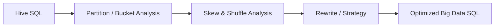
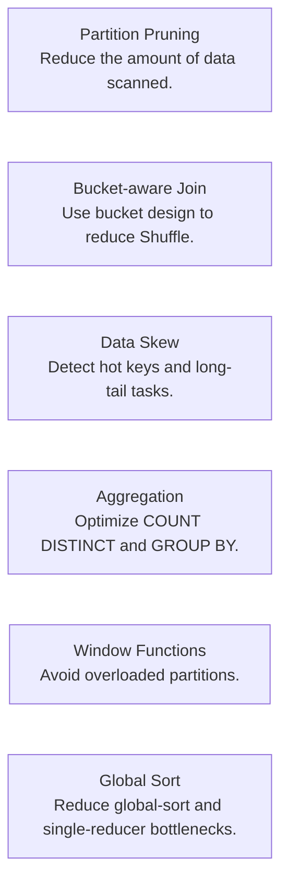

PawSQL Big Data SQL Optimization targets performance problems that are common in Hive and other large-scale SQL processing environments but less common in traditional relational databases.

The analysis focuses on partition pruning, bucket-aware joins, data skew, aggregation skew, window functions, global sorting, and large-scale Shuffle.

## Overview

In big-data SQL, performance is often determined not by a single operator but by the interaction between scan volume, Shuffle, partition design, and data skew.

A SQL statement with only a few dozen lines may trigger:

- Terabytes of data scanning
- Large network Shuffles
- Long-running Reduce tasks
- COUNT DISTINCT skew
- Hot partitions in window functions
- Global sorting that blocks the entire job

PawSQL applies big-data-specific optimization rules and analysis models to these patterns.



## Why Big Data SQL Needs Specialized Rules

Traditional database bottlenecks often involve:

- Random I/O
- Index access
- Join selection
- Single-node CPU and memory

In Hive and other big-data engines, the dominant costs are more often:

- Data scan volume
- Shuffle
- Task count
- Data skew
- Partition and bucket design
- Global sorting and aggregation

Big-data SQL therefore requires optimization methods that differ from OLTP databases.

## Key Capabilities

### Partition pruning analysis

Detect cases where functions, expressions, or inappropriate predicates on partition columns prevent partition pruning.

For example:

```sql
WHERE date_format(dt, 'yyyy-MM-dd') = '2026-09-09'
```

may prevent the engine from pruning directly on `dt`.

### Bucket join analysis

Analyze whether join columns and bucket design are compatible, including:

- Mismatched bucket columns
- Bucket-count relationships
- SMB Join conditions
- Small-table opportunities for Map Join

### COUNT DISTINCT skew

Detect scenarios where `COUNT(DISTINCT ...)` may create reducer skew and suggest multi-stage aggregation or equivalent rewrites.

### GROUP BY skew

Analyze Group Key distribution and identify cases where a small number of hot keys overload individual Reduce tasks.

### Window-function skew

For `ROW_NUMBER()`, `RANK()`, `SUM() OVER (...)`, and similar functions, identify imbalanced partition keys that may create hot tasks.

### Global sort optimization

Detect the cost of `ORDER BY` global sorting.

For Top-N scenarios, PawSQL can evaluate local sorting, window-based techniques, or multi-stage Top-N strategies.

### UNION and aggregation optimization

Identify:

- Cases where `UNION ALL` is sufficient
- Extra Shuffle caused by UNION deduplication
- Skew in global aggregation
- Multi-stage aggregation opportunities

## Typical Optimization Areas



## Example: Partition Pruning

Suppose the table is:

```text
sales
PARTITIONED BY (dt STRING)
```

Inefficient form:

```sql
SELECT *
FROM sales
WHERE substr(dt, 1, 7) = '2026-09';
```

A more pruning-friendly form may be:

```sql
SELECT *
FROM sales
WHERE dt >= '2026-09-01'
  AND dt <  '2026-10-01';
```

The latter makes the required partition range easier for the engine to identify directly.

## Example: Global Top-N

Original SQL:

```sql
SELECT *
FROM events
ORDER BY score DESC
LIMIT 100;
```

On a very large data set, global sorting may be expensive.

Depending on engine capabilities, PawSQL can analyze whether the query can use:

- Local Top-N
- Partitioned sorting
- Two-stage Top-N
- Window functions

to reduce full global sorting.

## Big Data Optimization Is About Data Movement

For big-data SQL, one of the most important questions is usually not:

> “Which index is better?”

but:

<Note>
**How much data must be scanned? How much data must move? Why is the slowest task slow?**
</Note>

PawSQL therefore treats scan volume, Shuffle, partitioning, bucketing, and skew as first-class optimization signals.

## Related Features

<CardGroup cols={2}>
  <Card title="Automatic SQL Rewrite" icon="wand-sparkles" href="/en/features/automatic-sql-rewrite" />
  <Card title="Distributed SQL Optimization" icon="waypoints" href="/en/features/distributed-sql-optimization" />
  <Card title="Performance Validation" icon="gauge" href="/en/features/performance-validation" />
</CardGroup>

## Related Use Cases

- DBA Batch SQL Governance
- Big Data SQL Quality Governance
- Enterprise SQL Governance Platform

## Next Steps

Continue with:

<CardGroup cols={2}>
  <Card title="Distributed SQL Optimization" icon="waypoints" href="/en/features/distributed-sql-optimization" />
  <Card title="Supported Databases" icon="database" href="/en/getting-started/supported-databases" />
</CardGroup>
