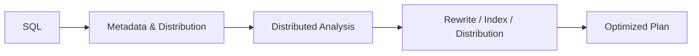
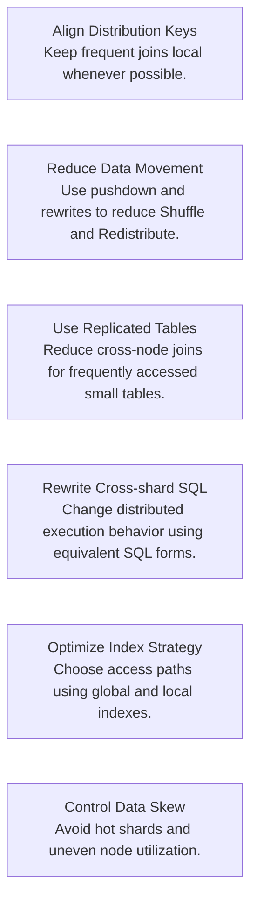

PawSQL Distributed SQL Optimization targets performance problems that are specific to distributed databases by analyzing data distribution, cross-node movement, join paths, distribution keys, and index strategies.

Unlike traditional single-node databases, distributed SQL performance depends not only on access paths, but also on where data is located and whether computation can be pushed down to the nodes that own the data.

## Overview

In a distributed database, a SQL statement may be logically correct and still perform poorly because of inefficient data distribution.

Common problems include:

- Join columns that do not align with distribution keys
- Large Shuffle / Redistribute operations between nodes
- Small tables that are not replicated
- Predicates that are not pushed down
- Data skew caused by poor distribution-key selection
- Inefficient use of global or local indexes

PawSQL analyzes both SQL structure and distribution metadata.



## Why Distributed SQL Needs Specialized Optimization

Traditional SQL optimization focuses on:

- Indexes
- Join algorithms
- Scan types
- Predicate pushdown
- Aggregation and sorting

Distributed databases add another set of questions:

- Which node owns the data?
- Can the join be completed locally?
- Must data move between nodes?
- Which side is suitable for broadcast?
- Does the distribution key match the dominant access pattern?
- Is data heavily skewed?

As a result, SQL that is efficient on a single-node database may be inefficient in a distributed environment.

## Key Capabilities

### Distribution key analysis

Evaluate whether table distribution keys align with common filter conditions, join predicates, and access patterns.

Typical issues include:

- Frequently joined tables using unrelated distribution keys
- Filters that do not benefit from the distribution strategy
- Low-cardinality distribution keys
- Hot partitions or node-level skew

### Cross-shard join detection

Identify joins that require data to cross shards or nodes.

For large business tables, cross-shard joins can introduce:

- Network transfer
- Shuffle
- Intermediate-result explosion
- Coordinator pressure

PawSQL can further analyze potential optimization paths.

### Data movement analysis

Identify execution-plan operators such as:

- Redistribute
- Broadcast
- Exchange
- Motion
- Shuffle

and determine whether some of that movement can be avoided.

### Replicated table recommendation

For relatively small tables that are frequently joined, such as configuration, dimension, or parameter tables, PawSQL can evaluate whether replicated or broadcast-table designs are more appropriate.

Potential benefits include:

- Fewer cross-node joins
- Lower network overhead
- Better join pushdown

### Predicate and join pushdown

Analyze whether filters and joins can be pushed closer to the data nodes to reduce intermediate row volume.

### Global and local index analysis

For databases that support global and local indexes, PawSQL can evaluate:

- Index coverage
- Partition / shard access paths
- Global-index maintenance cost
- Whether local indexes satisfy the query pattern

## Common Optimization Strategies



## Example

Suppose two large distributed tables use different distribution keys:

```text
orders       DISTRIBUTED BY customer_id
payments     DISTRIBUTED BY payment_id
```

SQL:

```sql
SELECT *
FROM orders o
JOIN payments p
  ON o.customer_id = p.customer_id;
```

Because the two tables are distributed differently, the database may need to redistribute one side before completing the join.

Possible optimization strategies include:

1. Changing the distribution key
2. Reducing the joined data set using filters
3. Broadcasting the smaller side
4. Rewriting or decomposing the SQL to reduce data movement
5. Introducing an additional replica or replicated table

The correct strategy depends on data volume, database capabilities, and the business data model.

## Supported Scenarios

Distributed SQL Optimization applies to distributed database environments such as:

- TDSQL PostgreSQL
- TDSQLx-MySQL
- OceanBase
- GaussDB
- openGauss
- PolarDB-X
- GoldenDB
- Greenplum

See [Supported Databases](/en/getting-started/supported-databases) for detailed capability coverage.

## Related Capabilities

<CardGroup cols={2}>
<Card title="Automatic SQL Rewrite" icon="wand-sparkles" href="/en/features/automatic-sql-rewrite" />
<Card title="Index Recommendation" icon="database" href="/en/features/index-recommendation" />
<Card title="Performance Validation" icon="gauge" href="/en/features/performance-validation" />
<Card title="Execution Plan Analysis" icon="chart-line" href="/en/features/execution-plan-visualization" />
<Card title="Big Data SQL Optimization" icon="layers" href="/en/features/big-data-sql-optimization" />
</CardGroup>

## Related Use Cases

<CardGroup cols={2}>
  <Card title="DBA Batch Slow SQL Governance" icon="gauge" href="/en/use-cases/slow-sql-optimization" />
  <Card title="Database Migration SQL Governance" icon="arrow-right-left" href="/en/use-cases/index#sql-governance-for-database-migration" />
  <Card title="Enterprise SQL Governance Platform" icon="building-2" href="/en/use-cases/enterprise-sql-governance" />
</CardGroup>
