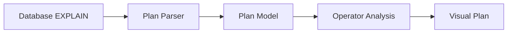
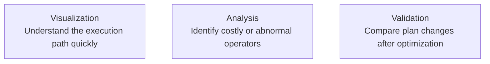

PawSQL Execution Plan Visualization transforms native database execution plans into more intuitive graphical structures so developers and DBAs can understand SQL execution paths faster.

It is designed not only to show which operators exist, but also to help identify performance bottlenecks, explain optimization results, and compare execution plans before and after tuning.


## Overview

Database execution plans may contain many layers of operators, cost estimates, row estimates, and database-specific attributes.

For complex SQL, reading raw text plans can be difficult and time-consuming.

PawSQL converts execution plans into a normalized visual structure:



## Why Plan Visualization Matters

SQL performance optimization ultimately requires understanding how the database intends to execute the SQL.

SQL text alone cannot answer many important questions:

- Is the database using an index?
- Which table is being fully scanned?
- Is the join using Hash Join or Nested Loop?
- Which operator has the highest cost?
- Is Sort or Aggregate becoming a bottleneck?
- Are estimated rows expanding dramatically?
- Is a distributed database redistributing data across nodes?

Execution plans provide this information, and visualization makes complex plans easier to interpret.

## Key Capabilities

### Plan tree visualization

Display execution-plan operators and parent-child relationships as a tree or graph.

Typical operators include:

- Table Scan
- Index Scan
- Index Seek
- Nested Loop
- Hash Join
- Merge Join
- Sort
- Aggregate
- Materialize
- Exchange / Redistribute

### Cost visibility

Show key metrics at plan nodes, such as:

- Node Cost
- Total Cost
- Estimated Rows
- Actual Rows, when available
- Width / Data Volume
- Execution Time, when present in the plan

### Bottleneck identification

Help identify:

- High-cost operators
- Full table scans
- Large sorts
- Row-count explosion
- Large-table Nested Loops
- Join skew
- Distributed data movement

### Before-and-after comparison

When used with Performance Validation, PawSQL can compare:

- Original execution plans
- Plans after SQL rewrite
- Plans after index recommendation

This makes access-path changes visible rather than implicit.

## Example

Suppose the original plan is:

```text
Nested Loop
├── Seq Scan orders
└── Index Scan customers
```

After optimization:

```text
Hash Join
├── Index Scan orders
└── Index Scan customers
```

Visualization should help the user understand not only that operators changed, but also:

- Why the access path changed
- Which node became cheaper
- Whether scanned data volume decreased
- Whether the new index is actually being used

## Plan Visualization Is Not Just a Pretty Tree

A professional execution-plan tool should do more than convert text into graphics.

The real value is helping users answer:

<Note>
**Where is the cost? Why is it expensive? What changed after optimization?**
</Note>

PawSQL can therefore combine visualization with:



## Database-aware Plan Parsing

EXPLAIN formats differ substantially across database systems.

PawSQL maps database-specific execution plans into a unified model while preserving database-specific details such as:

- MySQL access types
- PostgreSQL plan nodes
- Oracle operations
- SQL Server physical operators
- DB2 explain operators
- Distributed-database exchange / motion nodes

## Related Features

<CardGroup cols={2}>
  <Card title="SQL Review" icon="list-check" href="/en/features/sql-review" />
  <Card title="Automatic SQL Rewrite" icon="wand-sparkles" href="/en/features/automatic-sql-rewrite" />
  <Card title="Index Recommendation" icon="layers" href="/en/features/index-recommendation" />
  <Card title="Performance Validation" icon="gauge" href="/en/features/performance-validation" />
</CardGroup>

## Related Use Cases

- Developer SQL Copilot
- DBA Batch Slow SQL Governance
- Enterprise SQL Governance Platform

## Next Steps

Continue with:

<CardGroup cols={2}>
  <Card title="Performance Validation" icon="gauge" href="/en/features/performance-validation" />
  <Card title="Supported Databases" icon="database" href="/en/getting-started/supported-databases" />
</CardGroup>
