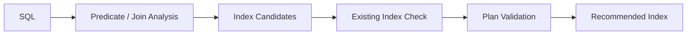

PawSQL Index Recommendation identifies index optimization opportunities and generates candidate indexes that better match SQL access paths.

The recommendation process goes beyond WHERE clauses. It also analyzes joins, ORDER BY, GROUP BY, column selectivity, existing indexes, and target-database execution plans.


## Overview

“Create an index on every WHERE column” is not a reliable indexing strategy.

An effective index usually depends on several factors:

- Which predicates provide meaningful filtering
- Which columns are used for joins
- Which columns should become leading columns in a composite index
- Whether the index can support sorting or grouping
- Whether equivalent or overlapping indexes already exist
- Whether a new index actually changes the execution plan

PawSQL separates index recommendation into candidate generation, filtering, simulation, and validation.



## Key Capabilities

### Predicate-driven candidate generation

Analyze equality, range, IN, LIKE, and other predicates to identify columns that may benefit from indexing.

### Join-aware indexing

Analyze join conditions to identify indexing opportunities on join keys.

For frequently joined business tables, this may be more important than analyzing WHERE predicates alone.

### Composite index design

Evaluate ordering across multiple index columns using:

- Selectivity
- Equality and range predicates
- Join conditions
- ORDER BY
- GROUP BY

to generate more practical composite-index candidates.

### Existing index analysis

Before recommending a new index, PawSQL evaluates existing indexes to avoid:

- Duplicate indexes
- Prefix-duplicate indexes
- Highly overlapping indexes
- Unnecessary index proliferation

### Database-aware index syntax

Index capabilities vary significantly by database.

PawSQL can account for database-specific characteristics such as:

- B-tree / bitmap and other index types
- INCLUDE / covering indexes
- Local / global indexes
- Concurrent or online index creation
- Partitioned-table indexes
- Distributed-database index restrictions

### Index effectiveness validation

The final goal is not to generate a `CREATE INDEX` statement. It is to determine:

<Note>
Will this index actually change the access path and reduce SQL cost?
</Note>

## Example

Original SQL:

```sql
SELECT order_id, order_date, amount
FROM orders
WHERE customer_id = ?
  AND order_date >= ?
ORDER BY order_date DESC;
```

Possible index candidate:

```sql
CREATE INDEX idx_orders_customer_date
ON orders(customer_id, order_date);
```

The candidate may be useful because:

- `customer_id` is used for equality filtering
- `order_date` is used for a range predicate
- `order_date` also participates in sorting

The final recommendation still depends on existing indexes, data distribution, and execution-plan validation.

## Recommend → Simulate → Validate

PawSQL's indexing workflow can be summarized as:


If the target database supports virtual indexes, hypothetical indexes, or equivalent mechanisms, recommendations can be validated without immediately creating physical indexes.

## What PawSQL Tries to Avoid

A good index recommendation system must understand not only which indexes to add, but also which indexes should not be added.

Examples include:

- Mechanically indexing low-selectivity columns
- Creating many similar indexes for individual SQL statements
- Ignoring existing composite indexes
- Optimizing reads while ignoring write overhead
- Recommending indexes that do not change the execution plan

## Related Capabilities

<CardGroup cols={2}>
<Card title="SQL Quality Check" icon="list-check" href="/en/features/sql-review" />
<Card title="Query Rewrite" icon="wand-sparkles" href="/en/features/automatic-sql-rewrite" />
<Card title="Performance Validation" icon="gauge" href="/en/features/performance-validation" />
<Card title="Execution Plan Analysis" icon="route" href="/en/features/execution-plan-visualization" />
</CardGroup>

## Related Use Cases

<CardGroup cols={2}>
  <Card title="Developer SQL Copilot" icon="code" href="/en/use-cases/developer-sql-copilot" />
  <Card title="DBA Batch Slow SQL Governance" icon="gauge" href="/en/use-cases/slow-sql-optimization" />
  <Card title="Enterprise SQL Governance Platform" icon="building-2" href="/en/use-cases/enterprise-sql-governance" />
</CardGroup>
