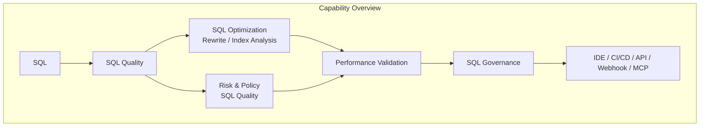
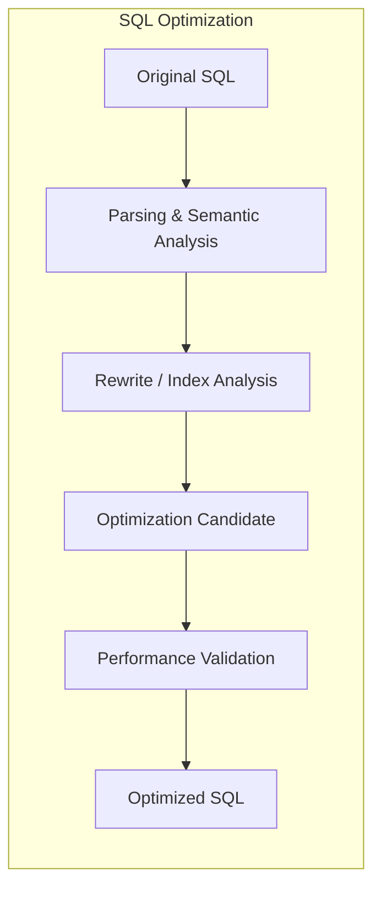
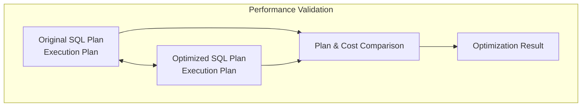
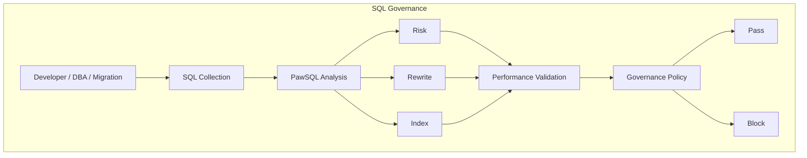
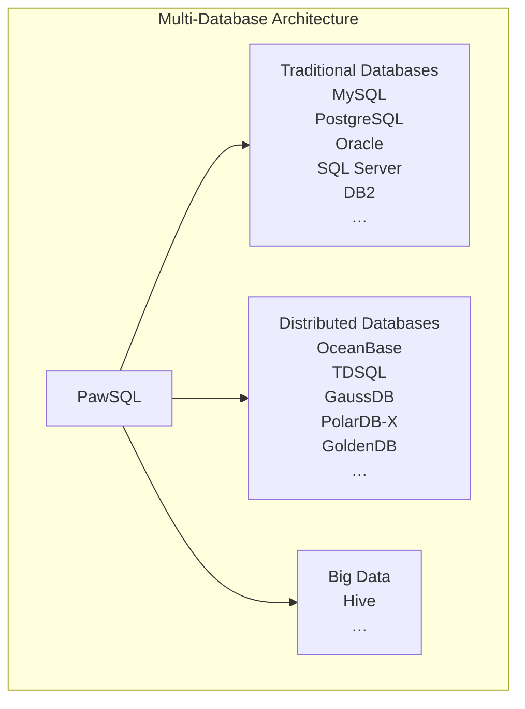
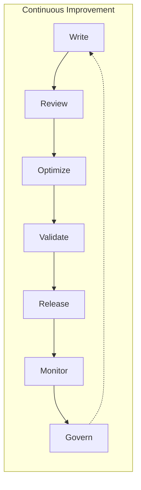

PawSQL is a **SQL engineering and governance platform** for developers, QA teams, DBAs, and enterprise database teams.

It provides a unified set of capabilities across the SQL lifecycle: from development-time review and optimization, to pre-release quality gates, production slow-SQL remediation, performance validation, and continuous SQL governance.

PawSQL capabilities are organized into five areas:

- **SQL Quality** — detect syntax, policy, risk, and potential performance issues
- **SQL Optimization** — automatically rewrite SQL, recommend indexes, and optimize database-specific workloads
- **Performance Intelligence** — validate improvements using execution plans, cost, and database optimizers
- **SQL Governance** — operationalize SQL quality and performance controls across CI/CD, production, and enterprise processes
- **Platform & Integration** — connect PawSQL with IDEs, CI/CD, APIs, webhooks, MCP, and internal platforms

---

## From SQL Analysis to Enterprise Governance

PawSQL goes beyond answering “what is wrong with this SQL statement?”

It also helps answer:

- Does the SQL violate coding or operational policies?
- Is there a semantically equivalent but more efficient form?
- Should an index be created or changed?
- Does the optimized version actually produce a better execution plan?
- Can the same checks be enforced automatically across development and release workflows?

---

## SQL Quality

Identify SQL issues before they reach testing, release, or production.

PawSQL performs structured SQL analysis using parsing, semantic analysis, database metadata, and rule engines instead of relying only on text matching or regular expressions.

### Key capabilities

- SQL syntax and compatibility checks
- SQL coding policy review
- High-risk DDL and DML detection
- Potential performance issue detection
- Database-specific rules
- Enterprise custom rules
- Stored procedure SQL analysis

### Typical scenarios

Developer self-review, code review, release checks, database change review, and enterprise SQL policy enforcement.

[Explore SQL Review →](/en/features/sql-review)

---

## SQL Optimization

Automatically discover more efficient SQL forms and index strategies.

PawSQL combines SQL parsing, semantic equivalence analysis, rewrite rules, index analysis, and database optimizer information to generate optimization candidates.

### Key capabilities

- Automatic SQL rewrite
- Subquery optimization
- Join optimization
- Predicate pushdown
- Aggregation and sorting optimization
- Deep pagination optimization
- Intelligent index recommendation
- Distributed SQL optimization
- Big data SQL optimization

The goal is not simply to produce suggestions, but to generate optimization candidates that can be evaluated and applied.

[Explore Automatic SQL Rewrite →](/en/features/automatic-sql-rewrite)

[Explore Index Recommendation →](/en/features/index-recommendation)

---

## Performance Intelligence

Determine whether an optimization actually improves the SQL.

SQL optimization should not rely only on heuristic rules. PawSQL uses database optimizer information, execution plans, and cost comparison to evaluate original and optimized SQL.

### Key capabilities

- Before-and-after execution plan comparison
- SQL cost comparison
- Index effectiveness validation
- Execution plan visualization
- High-cost operator detection
- Full-scan and large-volume operation detection
- Slow SQL analysis
- Optimization benefit assessment

This creates a complete optimization loop:

<Note>
**Detect → Optimize → Validate**
</Note>

[Explore Performance Validation →](/en/features/performance-validation)

[Explore Execution Plan Visualization →](/en/features/execution-plan-visualization)

---

## SQL Governance

Scale SQL optimization from individual statements to continuous enterprise governance.

When organizations need to manage thousands or millions of SQL statements, manual review and optimization cannot keep pace with modern delivery processes.

PawSQL integrates SQL analysis, risk control, and performance optimization into development, deployment, migration, and production workflows.

### Key capabilities

- CI/CD SQL Quality Gate
- Batch SQL review and optimization
- SQL fingerprinting
- Slow SQL governance
- Database migration SQL governance
- SQL risk classification
- Optimization prioritization
- Enterprise SQL governance dashboards

### Typical workflow

[Explore SQL Quality Gate →](/en/features/sql-quality-gate)

Explore Batch SQL Governance →

---

## Platform & Integration

Bring SQL intelligence into the tools your teams already use.

PawSQL can run inside development, DevOps, internal database platforms, and AI agent workflows instead of operating only as a standalone SQL tool.

### Integration options

| Integration | Typical use |
|---|---|
| IDE | Development-time SQL review and optimization |
| CI/CD | Pre-release SQL quality gates |
| REST API | Enterprise platform and automation integration |
| Webhook | DevOps workflow triggers |
| MCP | SQL review and optimization for AI agents |
| Web Console | DBA and enterprise SQL governance |

Typical integrations include:

- JetBrains
- Visual Studio Code
- Jenkins
- GitLab CI/CD
- Coding
- Enterprise DevOps platforms
- AI coding agents
- Internal database management platforms

Explore Platform & Integration →

---

## One Platform for Heterogeneous Database Environments

Modern enterprises often operate traditional relational databases, domestic database systems, distributed databases, and big data platforms at the same time.

PawSQL provides a unified SQL analysis model and a consistent review, optimization, and governance experience across heterogeneous database environments.

For database versions and capability coverage, see:

[Supported Databases →](/en/getting-started/supported-databases)

---

## Typical Ways to Use PawSQL

Different roles can enter PawSQL through different workflows.

| Role | Typical need | Recommended capabilities |
|---|---|---|
| Developer | Detect and optimize SQL while coding | SQL Review, SQL Rewrite, IDE Integration |
| DBA | Remediate slow SQL and index issues at scale | Batch SQL Governance, Index Recommendation, Performance Validation |
| DevOps | Block risky SQL before deployment | SQL Quality Gate, CI/CD Integration |
| Migration Team | Validate compatibility and performance after migration | Database Migration Governance |
| Database Platform Team | Build a unified SQL governance platform | API, Policy, Dashboard, Multi-Database Support |
| AI Agent | Validate and optimize generated SQL | MCP, SQL Review, SQL Optimization |

---

## The PawSQL Capability Loop

PawSQL organizes SQL quality and performance engineering into a continuous lifecycle:

↺ Continuous Improvement

SQL optimization therefore becomes a repeatable engineering capability rather than a reactive activity performed only after performance incidents occur.

---

## Next Steps

If you are new to PawSQL, continue with these core capabilities:

<CardGroup cols={2}>
  <Card title="SQL Review" href="/en/features/sql-review" icon="list-check">
    identify SQL quality and risk issues
  </Card>
  <Card title="Automatic SQL Rewrite" href="/en/features/automatic-sql-rewrite" icon="wand-sparkles">
    automatically transform inefficient SQL
  </Card>
  <Card title="Index Recommendation" href="/en/features/index-recommendation" icon="database">
    generate intelligent index recommendations
  </Card>
  <Card title="Performance Validation" href="/en/features/performance-validation" icon="gauge">
    validate optimization effectiveness
  </Card>
  <Card title="Execution Plan Visualization" href="/en/features/execution-plan-visualization" icon="chart-line">
    understand complex execution plans
  </Card>
  <Card title="Use Cases" href="/en/use-cases" icon="compass">
    see how PawSQL fits real development and database governance workflows
  </Card>
</CardGroup>
