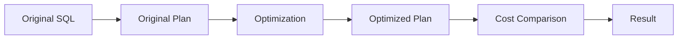
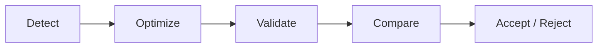

PawSQL Performance Validation determines whether a SQL optimization actually improves the execution plan instead of relying only on static rules, expert intuition, or language-model speculation.

It moves SQL optimization from **recommendation** to **validation**.


## Overview

A SQL statement that looks cleaner is not necessarily faster.

An index that looks reasonable is not necessarily used by the optimizer.

After generating a SQL rewrite or index recommendation, PawSQL can compare the original and optimized execution plans and optimizer costs to determine whether the candidate is likely to provide a real benefit.



## Why Validation Matters

One of the most common mistakes in SQL optimization is assuming that “theoretically faster” means “actually faster.”

An optimization may fail because:

- The optimizer still chooses the same access path
- Real data selectivity differs from expectations
- A new index costs more than it saves
- A rewrite introduces additional sorting or materialization
- Database versions or statistics change optimizer behavior
- Distributed databases introduce extra data movement

Performance Validation reduces this uncertainty by using information from the real target-database optimizer.

## Key Capabilities

### Before-and-after plan comparison

Compare the execution plans of original and optimized SQL.

Key changes include:

- Scan type
- Join algorithm
- Join order
- Sort and aggregate operations
- Estimated data volume
- Distributed data movement

### Cost comparison

Compare optimizer cost or equivalent estimated metrics.

Cost is not the same as execution time, but it is an important signal for ranking and validating optimization candidates.

### Index validation

Determine whether a recommended index:

- Is actually selected by the optimizer
- Changes the access path
- Reduces scanned rows
- Reduces sort or join cost

### Rewrite validation

Determine whether a SQL rewrite improves the execution strategy rather than merely changing syntax.

### Optimization scoring

In batch-governance scenarios, optimization priority can incorporate:

- Cost reduction
- Execution frequency
- Current SQL cost
- Risk severity

## Example

Original SQL:

```sql
SELECT *
FROM orders
WHERE customer_id = 100;
```

Optimization candidate:

```sql
CREATE INDEX idx_orders_customer
ON orders(customer_id);
```

Validation should answer:

1. Does the optimizer switch from a full table scan to an index scan?
2. Does the optimizer cost decrease?
3. Does the estimated row volume decrease significantly?
4. Does an equivalent index already exist?
5. Is the read benefit worth the write and maintenance overhead?

Only after these questions are answered does the index recommendation become an engineering decision rather than a generic suggestion.

## Validation Loop



This creates a closed optimization loop instead of a static recommendation list.

## Cost Is Evidence, Not Absolute Truth

Database cost is an optimizer estimate, not actual runtime.

Therefore:

- Cost is useful for candidate comparison
- Plan structure should be analyzed together with cost
- Critical production SQL may require runtime evidence
- Cost should be interpreted carefully when statistics are inaccurate

## Related Capabilities

<CardGroup cols={2}>
<Card title="SQL Review" icon="list-check" href="/en/features/sql-review" />
<Card title="Automatic SQL Rewrite" icon="wand-sparkles" href="/en/features/automatic-sql-rewrite" />
<Card title="Index Recommendation" icon="layers" href="/en/features/index-recommendation" />
<Card title="Execution Plan Visualization" icon="list-tree" href="/en/features/execution-plan-visualization" />
<Card title="Supported Databases" icon="database" href="/en/getting-started/supported-databases" />
</CardGroup>

## Related Use Cases

<CardGroup cols={2}>
  <Card title="Developer SQL Copilot" icon="code" href="/en/use-cases/developer-sql-copilot" />
  <Card title="DBA Batch Slow SQL Governance" icon="gauge" href="/en/use-cases/slow-sql-optimization" />
  <Card title="SQL Quality Gate" icon="git-merge" href="/en/use-cases/sql-quality-gate-cicd" />
  <Card title="Enterprise SQL Governance Platform" icon="building-2" href="/en/use-cases/enterprise-sql-governance" />
</CardGroup>
