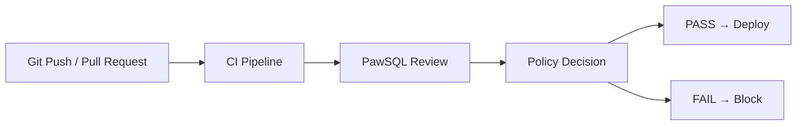
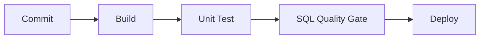

PawSQL SQL Quality Gate embeds SQL Review, risk detection, and performance rules into CI/CD workflows so SQL quality control becomes an automated release gate instead of a manual pre-production check.

Before SQL reaches testing or production, PawSQL can automatically decide whether the change should **pass, warn, or block**.


## Overview

In traditional database release processes, SQL review often happens near the end of the delivery cycle:

1. Developers submit SQL
2. DBAs review it manually
3. Problems are returned for correction
4. SQL is resubmitted
5. The release proceeds

This process depends heavily on manual expertise and can become a bottleneck in continuous delivery.

SQL Quality Gate moves review directly into the pipeline:



## Why SQL Quality Gate Matters

Modern software delivery already relies on:

- Unit tests
- Static analysis
- Security scans
- Code quality gates

Yet SQL in many organizations is still reviewed manually shortly before release.

SQL Quality Gate brings database quality controls into the same engineering model as application code.

## Key Capabilities

### Automated SQL review

Run SQL Review automatically inside the pipeline, including:

- Syntax and compatibility checks
- SQL coding policies
- High-risk DDL / DML
- Potential performance problems
- Database-specific rules

### Severity-based policy

Map issue severity to different actions.

For example:

| Severity | Action |
|---|---|
| Info | Record only |
| Warning | Warn but continue |
| Critical | Block pipeline |

### Configurable thresholds

Organizations can define:

- Maximum number of Critical issues
- Maximum number of Warnings
- Rules that may be ignored
- Rules that must always block
- Environment-specific policies

Testing environments may use looser policies, while production releases can enforce stricter ones.

### Pull Request feedback

Review results can be returned to the code-review workflow so developers see SQL issues before merging.

### Pipeline reports

Generate CI/CD-friendly review output such as:

- Pass / fail status
- Issue count
- Severity
- Rule name
- SQL location
- Remediation guidance

### API and webhook integration

SQL Quality Gate can integrate through:

- REST API
- Webhook
- CLI / Script
- DevOps integrations

## Typical CI/CD Flow



SQL becomes a standard quality-control object in the software delivery pipeline rather than an isolated database activity.

## Example

Suppose a change includes:

```sql
DELETE FROM orders;
```

PawSQL identifies:

- DELETE has no WHERE clause
- The operation may affect the entire table
- Severity: Critical

Pipeline output:

```text
SQL Quality Gate: FAILED

Critical: 1
Warning: 0

Rule:
DELETE statement without WHERE clause
```

CI/CD can automatically stop the production deployment.

## Policy as Code

Over time, SQL Quality Gate can act as the enforcement layer for enterprise **SQL Policy as Code**.

Organizations can convert database standards into executable policies such as:

```text
Policy
├─ No DELETE without WHERE
├─ No full table scan on large tables
├─ No forbidden DDL
├─ Index naming convention
├─ Maximum affected rows
└─ Database-specific production rules
```

Policies then move from Wiki pages and governance documents directly into delivery pipelines.

## Integration Scenarios

SQL Quality Gate can be used with:

- GitLab CI/CD
- Jenkins
- Coding
- Enterprise DevOps platforms
- Internal release systems
- Database change platforms

## Related Features

<CardGroup cols={2}>
  <Card title="SQL Review" icon="list-check" href="/en/features/sql-review" />
  <Card title="Automatic SQL Rewrite" icon="wand-sparkles" href="/en/features/automatic-sql-rewrite" />
  <Card title="Index Recommendation" icon="layers" href="/en/features/index-recommendation" />
  <Card title="Performance Validation" icon="gauge" href="/en/features/performance-validation" />
</CardGroup>

## Related Use Cases

- SQL Quality Gate for CI/CD
- Developer SQL Copilot
- Enterprise SQL Governance Platform

## Next Steps

Continue with:

<CardGroup cols={2}>
  <Card title="SQL Review" icon="list-check" href="/en/features/sql-review" />
  <Card title="API & Webhook" icon="plug" />
</CardGroup>
