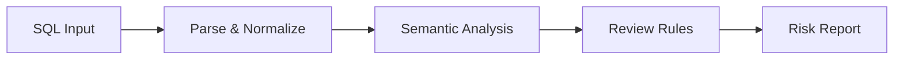

PawSQL SQL Quality Check helps teams detect SQL issues early in the lifecycle, including syntax and compatibility problems, policy violations, risky DDL/DML, and patterns that may lead to performance degradation.

Instead of relying only on text matching or regular expressions, PawSQL combines SQL parsing, semantic analysis, database metadata, and database-specific rules to perform structured SQL quality checks.


## Overview

Traditional SQL quality checking often depends on manual DBA checks, regular expressions, or lightweight linting. These approaches have difficulty understanding complex SQL structures, object relationships, database semantics, stored procedures, and heterogeneous database environments.

PawSQL separates SQL quality checks into multiple analysis stages:



## Why SQL Quality Check Matters

The later a SQL issue is discovered, the more expensive it usually becomes to fix.

A full-table scan discovered while coding can be corrected immediately. The same SQL discovered after production deployment may cause CPU pressure, excessive I/O, lock contention, or release rollback.

The purpose of SQL Quality Check is therefore not simply to find mistakes, but to shift SQL quality control earlier into engineering and delivery workflows.

## Key Capabilities

### SQL syntax and compatibility checks

Detect syntax errors, dialect differences, and SQL constructs that are not supported by the target database.

Typical scenarios include:

- Post-migration compatibility checks
- Multi-database product development
- Developer self-service validation

### SQL coding policy review

Check SQL against organizational or team-level policies, such as:

- Discouraged SQL patterns
- Table, column, and index conventions
- SELECT / UPDATE / DELETE constraints
- DDL change policies
- SQL maintainability rules

### High-risk DDL and DML detection

Detect operations that may have a significant impact on data safety or production stability, including:

- UPDATE / DELETE without filters
- TRUNCATE
- DROP TABLE
- High-risk ALTER TABLE operations
- Operations that may hold large locks

### Performance issue detection

Identify potential performance risks before deployment, such as:

- Full table scans
- Non-SARGable predicates
- Ineffective index usage
- Unnecessary sorting and aggregation
- Cartesian joins
- Inefficient subquery and join patterns

### Database-specific rules

Apply database-aware rules rather than using one generic rule set for every database.

This is especially important across Oracle, MySQL, PostgreSQL, SQL Server, DB2, domestic databases, and distributed databases.

### Stored procedure analysis

PawSQL can analyze SQL embedded inside stored procedures, extending SQL Quality Check beyond standalone SQL statements into procedural SQL such as T-SQL and PL/pgSQL.

## Example

The following SQL is syntactically valid but operationally risky:

```sql
UPDATE orders
SET status = 'CLOSED';
```

PawSQL can identify that:

- The UPDATE statement has no filter condition
- A large number of rows may be affected
- The operation may create a long-running transaction or broad locking impact

Review results can be mapped to severity levels such as:

| Level | Meaning | Typical action |
|---|---|---|
| Info | Advisory policy issue | Developer review |
| Warning | Potential risk | Recommended change |
| Critical | High-risk operation | Block release |

## Review in the Development Lifecycle

SQL Quality Check can be used through multiple entry points:

- IDE: instant developer feedback
- Web Console: manual SQL quality checks
- CI/CD: SQL Quality Gate
- API: enterprise platform integration
- Webhook: DevOps workflow integration
- MCP: SQL Quality Check capability for AI agents

## SQL Quality Check vs. Simple SQL Lint

| Capability | Simple SQL Lint | PawSQL SQL Quality Check |
|---|---|---|
| Syntax check | ✓ | ✓ |
| AST analysis | Limited | ✓ |
| Database metadata | Usually no | ✓ |
| Database-specific rules | Limited | ✓ |
| Performance rules | Limited | ✓ |
| Risk classification | Limited | ✓ |
| Stored procedure analysis | Usually no | ✓ |
| CI/CD governance | Depends | ✓ |

## Related Capabilities

<CardGroup cols={2}>
<Card title="Query Rewrite" icon="wand-sparkles" href="/en/features/automatic-sql-rewrite" />
<Card title="Index Recommendation" icon="layers" href="/en/features/index-recommendation" />
<Card title="Performance Validation" icon="chart-line" href="/en/features/performance-validation" />
<Card title="Execution Plan Analysis" icon="list-tree" href="/en/features/execution-plan-visualization" />
<Card title="SQL Quality Gate" icon="git-merge" href="/en/use-cases/sql-quality-gate-cicd" />
<Card title="Supported Databases" icon="database" href="/en/getting-started/supported-databases" />
</CardGroup>

## Related Use Cases

<CardGroup cols={2}>
  <Card title="Developer SQL Copilot" icon="code" href="/en/use-cases/developer-sql-copilot" />
  <Card title="SQL Quality Gate for CI/CD" icon="git-merge" href="/en/use-cases/sql-quality-gate-cicd" />
  <Card title="DBA Batch SQL Governance" icon="gauge" href="/en/use-cases/slow-sql-optimization" />
  <Card title="Database Migration SQL Governance" icon="arrow-right-left" href="/en/use-cases/database-migration-sql-governance" />
</CardGroup>
