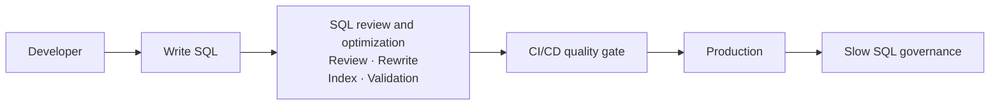
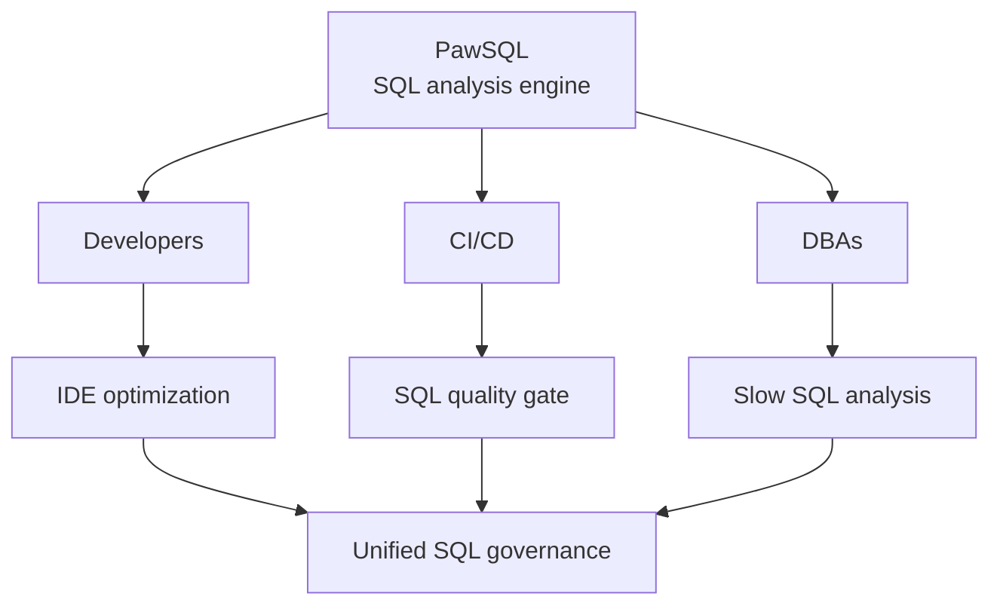
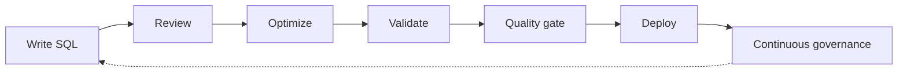

SQL performance problems rarely appear out of nowhere in production. Inefficient query patterns, missing or unsuitable indexes, and execution-plan changes after a database migration are usually introduced during development and only surface later as production incidents.

PawSQL is a **SQL engineering and governance platform** for developers, testers, database administrators, and enterprise governance teams. It brings SQL review, query rewriting, index recommendation, performance validation, and execution plan analysis into one platform covering the full SQL lifecycle.

> **Make SQL quality and performance part of the software engineering lifecycle.**

<CardGroup cols={2}>
  <Card title="Use Cases" icon="users" href="/en/use-cases/index">
    End-to-end workflows for development, CI/CD, DBA, and enterprise governance.
  </Card>
  <Card title="Quickstart" icon="bolt" href="/en/getting-started/quickstart">
    Run your first review, rewrite, and index recommendation on a single query.
  </Card>
  <Card title="Supported Databases" icon="database" href="/en/getting-started/supported-databases">
    Database, version, and capability support matrix.
  </Card>
  <Card title="Choose How to Use PawSQL" icon="route" href="/en/getting-started/choose-access">
    Public cloud, private deployment, or IDE / API / MCP access.
  </Card>
</CardGroup>

## PawSQL in a Minute

<iframe
  className="w-full aspect-video rounded-xl"
  src="https://player.bilibili.com/player.html?bvid=BV1RJoNY9Es7&high_quality=3"
  title="PawSQL in a Minute"
  scrolling="no"
  frameBorder="0"
  allow="accelerometer; autoplay; clipboard-write; encrypted-media; gyroscope; picture-in-picture"
  allowFullScreen
/>

## The Full SQL Lifecycle

| Stage | Typical problem | How PawSQL helps |
|---|---|---|
| **Development** | SQL quality depends on individual experience | Check and optimize SQL in the IDE |
| **Code review** | Manual review rarely catches every SQL issue | Run review and optimization analysis automatically |
| **CI/CD** | Risky SQL can reach production | Enforce a SQL quality gate before release |
| **Database migration** | Dialect differences change compatibility and performance | Scan and govern migration SQL consistently |
| **Production** | Large volumes of slow SQL, analyzed by hand | Batch-analyze and govern slow SQL |
| **Enterprise governance** | Teams, databases, and rule sets diverge | Build one unified SQL governance platform |



## Core Capabilities

PawSQL does not only detect SQL problems — it produces actionable optimization plans.

<CardGroup cols={2}>
  <Card title="SQL Review" icon="list-check" href="/en/reference/audit-rules/index">
    Detect risks against development standards and database best practices before release.
  </Card>
  <Card title="Query Rewrite" icon="code-compare" href="/en/reference/optimizer-rules/index">
    Restructure queries under semantic-equivalence constraints to give the optimizer better options.
  </Card>
  <Card title="Index Recommendation" icon="layer-group" href="/en/features/index-recommendation">
    Design candidate indexes from filters, joins, ordering, and statistics.
  </Card>
  <Card title="Performance Validation" icon="chart-line" href="/en/features/performance-validation">
    Use the database optimizer to compare cost, access paths, and plans before and after.
  </Card>
  <Card title="Execution Plan Visualization" icon="sitemap" href="/en/features/execution-plan-visualization">
    Turn text plans into a visual execution tree to locate bottlenecks quickly.
  </Card>
</CardGroup>

### Rewrite example

<Tabs>
  <Tab title="Before">
    ```sql
    SELECT *
    FROM orders
    WHERE customer_id = 1001
       OR customer_id = 1002;
    ```
  </Tab>
  <Tab title="After">
    ```sql
    SELECT *
    FROM orders
    WHERE customer_id IN (1001, 1002);
    ```
  </Tab>
</Tabs>

For more complex queries, PawSQL also analyzes subqueries, joins, aggregation, and predicate pushdown, generating candidate plans while preserving semantics.

### What each capability checks

<AccordionGroup>
  <Accordion title="SQL Review">
    - SQL coding standards
    - DDL and DML risks
    - Query performance risks
    - Index usage issues
    - Database best practices
    - Custom enterprise rules
  </Accordion>
  <Accordion title="Query Rewrite">
    - Subquery and join rewrites
    - Aggregation and grouping optimization
    - Predicate pushdown
    - Structural rewrites such as OR and UNION
    - Semantic equivalence checks
  </Accordion>
  <Accordion title="Index Recommendation">
    - Filter and join conditions
    - Sort and grouping columns
    - Existing and redundant indexes
    - Column selectivity
    - Composite index design
    - Database optimizer behavior
  </Accordion>
  <Accordion title="Performance Validation">
    - Optimizer cost
    - Access paths and join methods
    - Estimated row counts
    - Index usage
    - Plans before and after optimization
  </Accordion>
  <Accordion title="Execution Plan Visualization">
    - Full table scans
    - High-cost operators
    - Join strategies
    - Index usage
    - Cardinality estimates and cost distribution
  </Accordion>
</AccordionGroup>

## One Product, Several Delivery Forms

PawSQL is **one product**. `Cloud` denotes the public deployment form; Engine, Optimizer, Auditor, Advisor, and Patroller are **components or delivery forms** of the same product — not five separate products.

Start from the task you need to accomplish, then check the environment requirements for the access method. See [Choose How to Use PawSQL](/en/getting-started/choose-access).

## Fits Into Your Existing Workflow

SQL does not live only in a database client. It appears in IDEs, repositories, CI/CD pipelines, review platforms, migration projects, slow-query logs, and internal developer platforms.



PawSQL integrates through IDE extensions, APIs, webhooks, MCP, or PawSQL Server. See [Choose How to Use PawSQL](/en/getting-started/choose-access).

## Start by Role or Scenario

<Tabs>
  <Tab title="Developers">
    Get feedback and optimization suggestions while writing SQL.

    ```mermaid
    flowchart LR
        A[Write SQL] --> B[Analyze] --> C[Review suggestions] --> D[Apply]
    ```

    Start with [Developer SQL Copilot](/en/use-cases/developer-sql-copilot).
  </Tab>
  <Tab title="Platform and DevEx teams">
    Keep low-quality SQL out of production.

    ```mermaid
    flowchart LR
        A[Commit] --> B[CI pipeline]
        B --> C[SQL quality gate]
        C -->|pass| D[Deploy]
        C -->|block| E[Fix SQL]
    ```

    Start with [SQL Quality Gate for CI/CD](/en/use-cases/sql-quality-gate-cicd).
  </Tab>
  <Tab title="Database administrators">
    Analyze and govern large volumes of production slow SQL.

    ```mermaid
    flowchart LR
        A[Slow SQL] --> B[Deduplicate] --> C[Batch analyze]
        C --> D["Rewrite / index"] --> E[Validate] --> F[Optimization tasks]
    ```

    Start with [Slow SQL Optimization at Scale](/en/use-cases/slow-sql-optimization).
  </Tab>
  <Tab title="Enterprise platform teams">
    Build unified SQL management and governance.

    <Note>
    PawSQL works as the shared SQL analysis and governance layer for the enterprise — consuming development, CI/CD, migration, and production monitoring, and adapting to multiple database environments.
    </Note>

    Start with [Enterprise SQL Governance](/en/use-cases/enterprise-sql-governance).
  </Tab>
  <Tab title="Database migration">
    SQL that runs on the target database is not necessarily fast on it.

    ```mermaid
    flowchart LR
        A[SQL inventory] --> B[Compatibility] --> C[Performance risk]
        C --> D["Rewrite / index"] --> E[Validation] --> F[Migration governance]
    ```

    Start with [SQL Governance for Database Migration](/en/use-cases/index#sql-governance-for-database-migration).
  </Tab>
</Tabs>

## Built for Multi-Database Environments

Real enterprise environments run relational, distributed, and domestic databases and data warehouses side by side, each with its own dialect, optimizer, indexing model, and plan format.

PawSQL was designed for **multi-database SQL governance** from the start: one analysis entry point for every database, while keeping database-specific optimization logic. [View supported databases →](/en/getting-started/supported-databases)

## From SQL Optimization to SQL Engineering

Traditional SQL optimization happens after production problems appear. PawSQL moves governance earlier and keeps it continuous.

| Aspect | Traditional approach | With PawSQL |
|---|---|---|
| When | After a production incident | From the first line of SQL |
| How | Manual, query by query | Automated review, rewrite, and index recommendation |
| Judgment | Individual experience | Validated with the database optimizer |
| Outcome | One-off fixes | Continuous governance and improvement |



SQL is therefore no longer just a string in an application, but an engineering asset that can be **analyzed, validated, governed, and continuously improved**.

## Get Started in Three Steps

<Steps>
  <Step title="Choose how to use PawSQL">
    Decide where the service runs and how your team connects to it. See [Choose How to Use PawSQL](/en/getting-started/choose-access).
  </Step>
  <Step title="Create a workspace">
    Specify the database engine and version, then provide context through DDL or a database connection. See [Workspaces and Database Context](/en/user-guide/workspaces/index).
  </Step>
  <Step title="Run your first optimization">
    Submit a query and review findings, rewrite suggestions, index recommendations, and validation results. See [Quickstart](/en/getting-started/quickstart).
  </Step>
</Steps>

### Find documentation by goal

<CardGroup cols={2}>
  <Card title="Supported Databases" icon="database" href="/en/getting-started/supported-databases">
    Confirm database, version, and capability coverage.
  </Card>
  <Card title="Choose How to Use PawSQL" icon="route" href="/en/getting-started/choose-access">
    Installation, deployment, and access methods.
  </Card>
  <Card title="Audit Rule Reference" icon="list-check" href="/en/reference/audit-rules/index">
    Look up a specific review rule.
  </Card>
  <Card title="Optimizer Rule Reference" icon="code-compare" href="/en/reference/optimizer-rules/index">
    Understand the basis for a rewrite.
  </Card>
  <Card title="API Reference" icon="plug" href="/api-reference/list-workspaces">
    Integrate PawSQL through the API.
  </Card>
</CardGroup>

---

[阅读中文文档 →](/)
