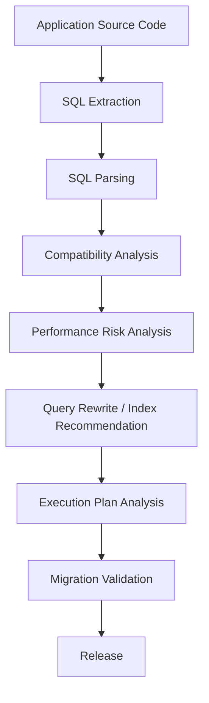
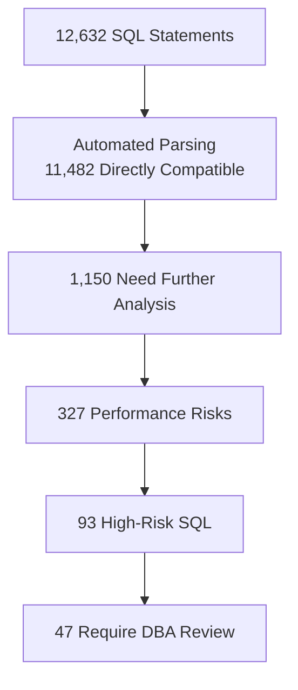
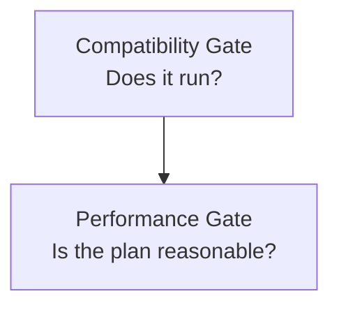

## Audience

Database migration teams — migration leads, DBAs, architects, application developers, and project managers responsible for SQL governance during legacy-system modernization or database migration.

## Problem

Database migration projects usually start with "can this SQL run on the target database?", but production soon raises a harder question — "will it still run fast enough?".

After moving SQL from Oracle to PostgreSQL, openGauss, GaussDB, Kingbase, DM, TDSQL, or OceanBase, even syntactically converted SQL can develop new performance problems from differences in optimizer behavior, indexing, data types, hint handling, pagination, and distributed execution.

Migration must therefore solve not only syntax compatibility, but also performance compatibility.

## Goal

Take migration from "it runs" to "it runs stably and efficiently" — elevating syntax migration to SQL Migration Engineering, and keeping legacy performance problems out of the new database.

## Workflow

PawSQL turns migration SQL governance into an end-to-end pipeline:



## Dependencies

Built from the following capabilities (see each capability page for check items and rewrite logic):

<CardGroup cols={2}>
  <Card title="SQL Quality Check" icon="list-check" href="/en/features/sql-review" />
  <Card title="Query Rewrite" icon="git-compare" href="/en/features/automatic-sql-rewrite" />
  <Card title="Index Recommendation" icon="layers" href="/en/features/index-recommendation" />
  <Card title="Execution Plan Analysis" icon="route" href="/en/features/execution-plan-visualization" />
  <Card title="Performance Validation" icon="gauge" href="/en/features/performance-validation" />
  <Card title="Distributed SQL Optimization" icon="network" href="/en/features/distributed-sql-optimization" />
</CardGroup>

## Success Criteria

| Metric | Objective |
|---|---|
| SQL auto-parsing coverage | Increase |
| SQL auto-compatibility rate | Increase |
| SQL requiring manual migration | Decrease |
| Pre-migration performance risk discovery rate | Increase |
| Execution plan regression count | Decrease |
| Post-release slow SQL count | Decrease |
| DBA manual review workload | Decrease |

---

## Four Categories of SQL Risk in Migration

Migration SQL risk usually falls into four categories:

1. **Syntax compatibility** — database-specific functions, keywords, hints, pagination syntax, DDL, and stored procedures (e.g. `NVL` → `COALESCE`)
2. **Semantic compatibility** — the SQL runs but results differ (NULL handling, empty strings, date precision, collation, implicit conversion)
3. **Performance compatibility** — the access path breaks after conversion, e.g. `TRUNC(create_time)` → `DATE(create_time)` prevents efficient index use
4. **Distributed execution** — moving from centralized to distributed adds cross-node joins, data redistribution, mismatched distribution keys, and shuffle

Performance compatibility risk is the category most projects discover late — and the hardest to diagnose.

## From SQL Inventory to Two Gates

The first difficulty is "how much SQL is there to migrate?". SQL is scattered across Java, MyBatis mappers, XML, stored procedures, ETL, and release scripts. After batch parsing, the team gets a quantifiable inventory:



Instead of manually hunting for SQL across the codebase, the team focuses on a few dozen cases that genuinely need human judgment.

A complete migration should also set two gates:



Only when both gates pass is SQL truly ready for production.

## Where PawSQL Fits in the Migration Toolchain

PawSQL doesn't need to replace vendor migration tools — schema conversion, data migration, and SQL syntax conversion remain their job. PawSQL focuses on the weak link in traditional tooling:

```text
Migration tools:  Convert
PawSQL:           Analyze + Optimize + Validate
```

The two are complementary, not substitutes.

<CardGroup cols={2}>
  <Card title="Explore Query Rewrite" icon="wand-sparkles" href="/en/features/automatic-sql-rewrite" />
  <Card title="Explore Execution Plan Analysis" icon="route" href="/en/features/execution-plan-visualization" />
  <Card title="Explore Distributed SQL Optimization" icon="network" href="/en/features/distributed-sql-optimization" />
  <Card title="Request a Migration Assessment" icon="plug" href="https://www.pawsql.com" />
</CardGroup>
