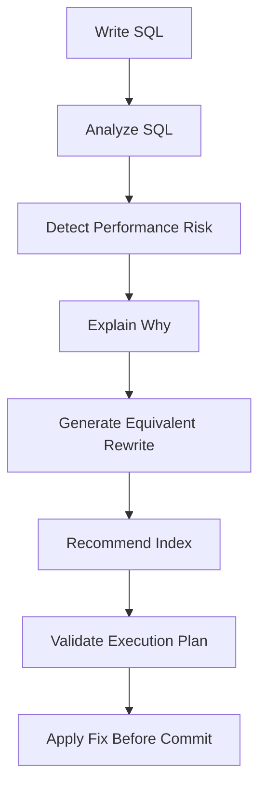
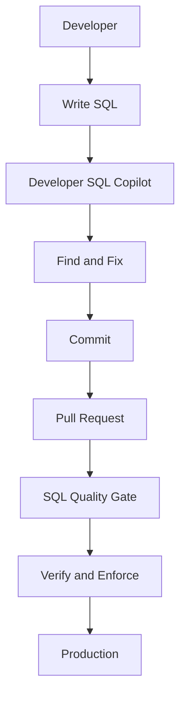

## Audience

Backend developers (Java, Go, and similar) who write SQL every day but don't need to become database optimization experts.

## Problem

A query that returns in milliseconds in development (tens of thousands of rows) can become a bottleneck in production (tens to hundreds of millions of rows).

Consider an order query:

```sql
SELECT order_id, customer_id, order_status, create_time, total_amount
FROM orders
WHERE DATE(create_time) = '2026-09-04'
  AND customer_id = 10086
ORDER BY create_time DESC;
```

`DATE(create_time)` wraps the filter column in a function, preventing the optimizer from efficiently using an index on `create_time` and widening the scan.

Developers typically don't check for these issues while writing SQL — execution plans, index structure, optimizer behavior, and predicate selectivity aren't part of their daily work.

## Goal

Find and fix SQL performance risks before the code is committed, so problems stop at development instead of surfacing in production months later.

## Workflow

Developer SQL Copilot brings database performance analysis directly into the development workflow:



The whole flow happens inside the existing development process — developers don't need to switch tools.

## Dependencies

Built from the following capabilities (see each capability page for rewrite rules and index-design logic):

<CardGroup cols={2}>
  <Card title="SQL Quality Check" icon="list-check" href="/en/features/sql-review" />
  <Card title="Query Rewrite" icon="git-compare" href="/en/features/automatic-sql-rewrite" />
  <Card title="Index Recommendation" icon="layers" href="/en/features/index-recommendation" />
  <Card title="Execution Plan Analysis" icon="route" href="/en/features/execution-plan-visualization" />
  <Card title="Performance Validation" icon="gauge" href="/en/features/performance-validation" />
</CardGroup>

## Success Criteria

| Metric | Objective |
|---|---|
| SQL issues found during development | Increase |
| SQL issues discovered after deployment | Decrease |
| Average SQL optimization turnaround time | Decrease |
| Developer-to-DBA consultation requests | Decrease |
| Production slow queries caused by new releases | Decrease |

---

## Beyond Generating SQL

Many AI coding assistants focus on "how do I write this SQL?". But production-grade SQL also needs to answer:

> Will this use the right index? Will it still perform on a hundred million rows? Is there a better rewrite? What index should I add? Is the execution plan reasonable? Is it actually faster after optimization?

Developer SQL Copilot's value is here — it doesn't just generate SQL; it analyzes, rewrites, and validates against database semantics and the optimizer.

## Developer SQL Copilot + SQL Quality Gate

Developer SQL Copilot solves the problem at coding time; SQL Quality Gate solves it at commit and release time. Together they form a shift-left performance strategy:



<CardGroup cols={2}>
  <Card title="Try PawSQL" icon="bolt" href="/en/getting-started/quickstart">
    Run your first quality check, rewrite, and index recommendation.
  </Card>
  <Card title="Learn About SQL Quality Gate" icon="git-merge" href="/en/use-cases/sql-quality-gate-cicd">
    Block risky SQL in your CI/CD pipeline.
  </Card>
  <Card title="Explore Query Rewrite" icon="wand-sparkles" href="/en/features/automatic-sql-rewrite">
    See how equivalent rewrites are generated.
  </Card>
  <Card title="Request a Demo" icon="building-2" href="https://www.pawsql.com">
    Talk to the PawSQL team.
  </Card>
</CardGroup>
