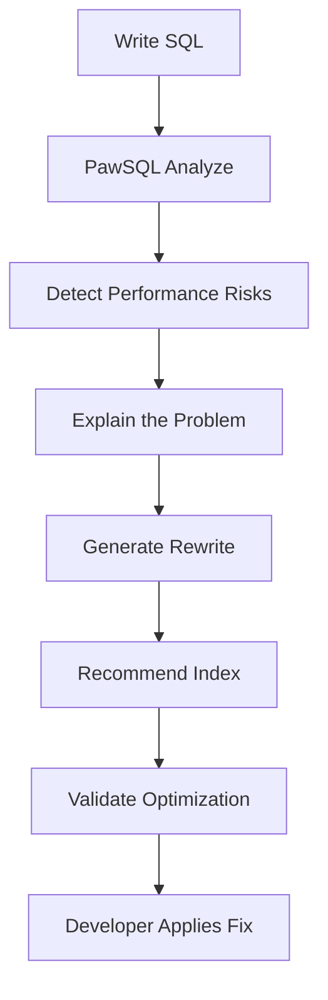
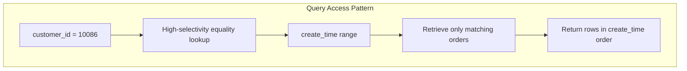
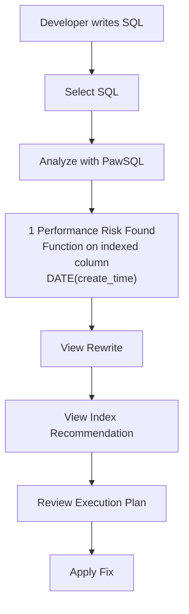
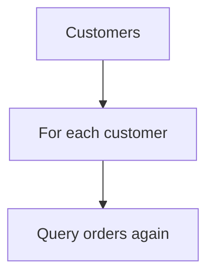
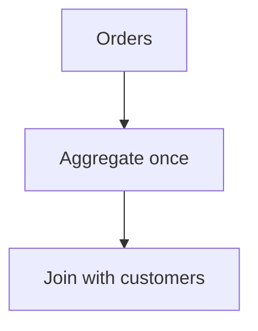
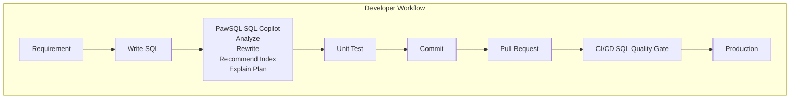
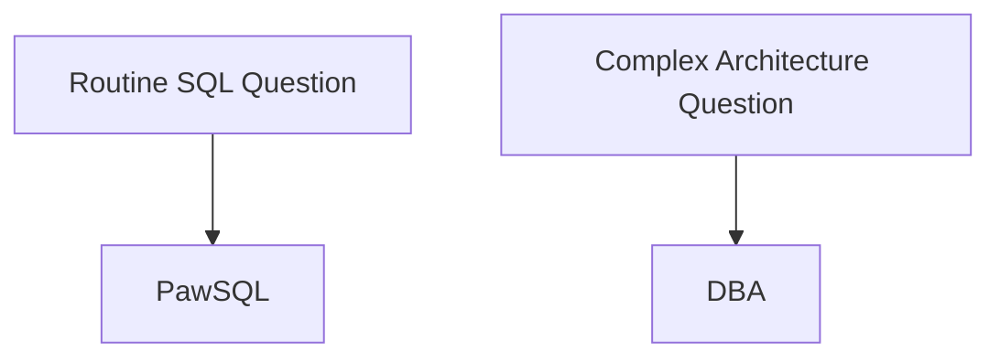
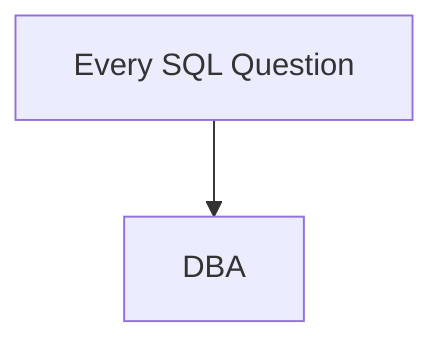
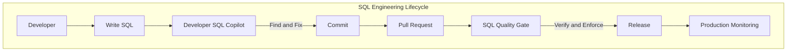

## Optimize SQL While You Code

Developers write SQL every day.

But writing SQL that is functionally correct is very different from writing SQL that will continue to perform well when the table grows from:

```text
10,000 rows

to

100,000,000 rows
```

A query may run in milliseconds in a development environment and become a production bottleneck months later.

The challenge is that most developers do not have the time—or database expertise—to manually analyze every execution plan, indexing strategy, join method, and optimizer behavior.

**PawSQL Developer SQL Copilot brings SQL performance analysis directly into the development workflow, helping developers detect, understand, and fix SQL problems before they reach production.**

---

## The Challenge

Consider a backend developer building an order management API.

The application uses:

- Java
- Spring Boot
- MyBatis
- MySQL
- IntelliJ IDEA

The developer needs to implement an API that returns a customer's orders for a specific day.

They write:

```sql
SELECT
    order_id,
    customer_id,
    order_status,
    create_time,
    total_amount
FROM orders
WHERE DATE(create_time) = '2026-09-04'
  AND customer_id = 10086
ORDER BY create_time DESC;
```

The SQL works correctly.

In the development database, the `orders` table contains only:

```text
50,000 rows
```

The query returns almost instantly.

So the developer submits the code.

There is only one problem.

The production table contains:

```text
80,000,000+ rows
```

---

## Functional Correctness Is Not Performance Correctness

From an application perspective, the SQL is correct.

From a database performance perspective, however, there may be a problem:

```sql
DATE(create_time)
```

The function is applied directly to the filtering column.

Depending on the database and available indexes, this expression may prevent the optimizer from efficiently using a normal index on:

```text
create_time
```

The query may therefore scan significantly more data than necessary.

The developer now has several options.

<Tabs>
  <Tab title="Option 1 — Ignore It">
    The SQL passes testing.

    Ship it.

    This is the fastest option today—and potentially the most expensive option later.
  </Tab>
  <Tab title="Option 2 — Ask a DBA">
    The developer sends the SQL to the DBA:

    ```text
    Can you check whether this SQL has a performance problem?
    ```

    The DBA needs to:

    1. understand the SQL,
    2. inspect the schema,
    3. check indexes,
    4. obtain an execution plan,
    5. analyze the predicate,
    6. recommend a rewrite,
    7. possibly recommend an index.

    This works.

    But doing this for hundreds of developers does not scale.
  </Tab>
  <Tab title="Option 3 — Ask a General AI Assistant">
    The developer can also ask an LLM:

    ```text
    How can I optimize this SQL?
    ```

    The model may suggest:

    - rewriting the function,
    - adding an index,
    - changing the query structure.

    Some recommendations may be useful.

    But the developer still needs to determine:

    - Is the rewritten SQL logically equivalent?
    - Is the suggested index appropriate?
    - Does the database already have a similar index?
    - Will the new SQL actually produce a better execution plan?
    - Is the advice suitable for this specific database?

    This is where SQL-specific engineering context becomes important.
  </Tab>
</Tabs>

## The PawSQL Approach

PawSQL acts as a SQL performance copilot inside the developer workflow.

Instead of treating SQL performance as a separate DBA activity, PawSQL moves optimization closer to where the SQL is written.



The developer remains in control.

PawSQL provides the database-specific analysis needed to make a better engineering decision.

---

## Example: Optimizing an Order Query

Let's return to the original SQL.

```sql
SELECT
    order_id,
    customer_id,
    order_status,
    create_time,
    total_amount
FROM orders
WHERE DATE(create_time) = '2026-09-04'
  AND customer_id = 10086
ORDER BY create_time DESC;
```

Assume the production schema looks like this:

```sql
CREATE TABLE orders (
    order_id       BIGINT PRIMARY KEY,
    customer_id    BIGINT NOT NULL,
    order_status   VARCHAR(32),
    create_time    DATETIME NOT NULL,
    total_amount   DECIMAL(18, 2)
);
```

Existing indexes:

```sql
CREATE INDEX idx_orders_create_time
ON orders(create_time);

CREATE INDEX idx_orders_customer
ON orders(customer_id);
```

<Steps>
<Step title="Step 1 — Detect the SQL Performance Risk">

PawSQL analyzes the query and identifies the expression:

```sql
DATE(create_time)
```

The issue can be presented to the developer as:

```text
Performance Risk

Function applied to filtering column:

DATE(create_time)

Potential impact:

The expression may prevent the database from
efficiently using an index on create_time.

Suggested action:

Rewrite the predicate as a range condition.
```

This is important because the tool does not simply say:

```text
SQL is slow.
```

It explains the specific SQL pattern responsible for the risk.

</Step>

<Step title="Step 2 — Generate an Equivalent Rewrite">

The query can be rewritten as:

```sql
SELECT
    order_id,
    customer_id,
    order_status,
    create_time,
    total_amount
FROM orders
WHERE create_time >= '2026-09-04 00:00:00'
  AND create_time <  '2026-09-05 00:00:00'
  AND customer_id = 10086
ORDER BY create_time DESC;
```

The original predicate:

```sql
DATE(create_time) = '2026-09-04'
```

becomes:

```sql
create_time >= '2026-09-04 00:00:00'
AND create_time < '2026-09-05 00:00:00'
```

The filtering column is no longer wrapped inside a function.

This gives the optimizer a better opportunity to use an index range scan.

</Step>

<Step title="Step 3 — Analyze the Existing Indexes">

The query filters on:

```text
customer_id
```

and:

```text
create_time
```

while also ordering by:

```text
create_time DESC
```

The existing indexes are:

```text
idx_orders_customer(customer_id)

idx_orders_create_time(create_time)
```

Each index covers only one part of the access pattern.

PawSQL can analyze the query predicates and recommend a composite index such as:

```sql
CREATE INDEX idx_orders_customer_create_time
ON orders(customer_id, create_time);
```

The index aligns more closely with the query:

```text
Equality Predicate
customer_id = ?

        +

Range Predicate
create_time >= ?
create_time < ?

        +

Ordering
ORDER BY create_time DESC
```

</Step>

<Step title="Step 4 — Show the Reasoning Behind the Recommendation">

A useful developer tool should not only output:

```text
Create this index.
```

It should help the developer understand why.

Conceptually:



Compared with two independent indexes, a composite index may provide a more efficient access path for this specific query pattern.

</Step>

<Step title="Step 5 — Validate With the Execution Plan">

When database connectivity and execution-plan analysis are available, PawSQL can evaluate how the database intends to execute the original and optimized queries.

The developer may see a result similar to:

```text
Original SQL

Access Path:
Large range scan / additional filtering

Estimated Rows:
1,820,000

Estimated Cost:
18,452
```

After optimization:

```text
Optimized SQL

Access Path:
Composite index range scan

Index:
idx_orders_customer_create_time

Estimated Rows:
124

Estimated Cost:
327
```

The point is not the absolute cost number.

The important part is that the recommendation can be checked against the database optimizer rather than being accepted purely as theoretical advice.

</Step>

<Step title="Step 6 — Apply the Optimization Before Code Review">

The developer updates the mapper SQL before creating the pull request.

Before:

```sql
WHERE DATE(create_time) = #{queryDate}
  AND customer_id = #{customerId}
```

After:

```sql
WHERE create_time >= #{startTime}
  AND create_time < #{endTime}
  AND customer_id = #{customerId}
```

The performance problem is fixed during development.

It never becomes:

- a production incident,
- a slow-query alert,
- a DBA ticket,
- an emergency optimization task.

</Step>

</Steps>

---

## The Developer Experience

The ideal workflow is simple.



The developer does not need to leave the coding workflow and start a separate database tuning project.

---

## Another Example: Correlated Subquery

Developer SQL Copilot becomes even more valuable as SQL complexity increases.

Consider:

```sql
SELECT
    c.customer_id,
    c.customer_name,
    (
        SELECT COUNT(*)
        FROM orders o
        WHERE o.customer_id = c.customer_id
          AND o.order_status = 'PAID'
    ) AS paid_orders
FROM customers c;
```

For every customer row, the correlated subquery may need to evaluate the `orders` relationship.

On large datasets, this pattern can become expensive.

PawSQL can identify the correlated subquery and evaluate whether it can be transformed into an aggregation and join.

For example:

```sql
SELECT
    c.customer_id,
    c.customer_name,
    COALESCE(o.paid_orders, 0) AS paid_orders
FROM customers c
LEFT JOIN (
    SELECT
        customer_id,
        COUNT(*) AS paid_orders
    FROM orders
    WHERE order_status = 'PAID'
    GROUP BY customer_id
) o
    ON c.customer_id = o.customer_id;
```

The optimization changes the execution pattern from conceptually:



to:



For developers working with complex SQL, this type of rewrite is far more valuable than simple SQL formatting or linting.

---

## Another Example: Deep Pagination

A developer implements a pagination API:

```sql
SELECT
    order_id,
    customer_id,
    create_time
FROM orders
ORDER BY create_time DESC
LIMIT 1000000, 20;
```

The query works.

But deep pagination can require the database to process a large number of rows before returning only 20 records.

PawSQL can identify the pattern:

```text
Deep Pagination Risk

OFFSET:
1,000,000

Returned Rows:
20
```

and recommend considering keyset pagination.

For example:

```sql
SELECT
    order_id,
    customer_id,
    create_time
FROM orders
WHERE create_time < #{lastCreateTime}
ORDER BY create_time DESC
LIMIT 20;
```

The important point is not that one rewrite fits every application.

The important point is that the developer is alerted to the scaling problem while designing the API—not after the endpoint becomes slow in production.

---

## What Developer SQL Copilot Can Help Detect

PawSQL can help developers identify different categories of SQL performance problems.

<AccordionGroup>
  <Accordion title="Predicate Problems">
    Examples include:

    ```sql
    WHERE YEAR(create_time) = 2026
    ```

    ```sql
    WHERE amount + 100 > 1000
    ```

    ```sql
    WHERE CAST(customer_id AS CHAR) = '10086'
    ```

    These expressions may make index access less efficient.
  </Accordion>

  <Accordion title="Subquery Problems">
    Examples include:

    - correlated subqueries,
    - unnecessary nested subqueries,
    - inefficient `IN` / `EXISTS` patterns,
    - scalar subqueries that execute repeatedly.
  </Accordion>

  <Accordion title="Join Problems">
    Examples include:

    - redundant joins,
    - missing join predicates,
    - inappropriate join conditions,
    - joins that prevent predicate pushdown,
    - unnecessarily large intermediate result sets.
  </Accordion>

  <Accordion title="Aggregation Problems">
    Examples include:

    - unnecessary `DISTINCT`,
    - inefficient aggregation,
    - redundant grouping,
    - aggregation performed on unnecessarily large datasets.
  </Accordion>

  <Accordion title="Pagination Problems">
    Examples include:

    ```sql
    LIMIT 500000, 20
    ```

    or equivalent deep-offset pagination patterns.
  </Accordion>

  <Accordion title="Index Problems">
    Examples include:

    - missing indexes,
    - inefficient index leading columns,
    - redundant indexes,
    - query predicates not aligned with existing indexes.
  </Accordion>
</AccordionGroup>

---

## From SQL Assistant to SQL Engineering Copilot

Many developer assistants focus primarily on SQL generation.

A developer asks:

```text
Write a SQL query that returns
the latest 20 orders for a customer.
```

The assistant generates SQL.

That solves the first problem:

> How do I write this query?

But production engineering requires additional questions.

```text
Is the SQL equivalent to the business requirement?

Will it use the right index?

Will it still perform well on 100 million rows?

Can the query be rewritten?

Is there a better index?

How will the database optimizer execute it?
```

Developer SQL Copilot should help answer these questions as well.

That is the role PawSQL is designed to play.

---

## PawSQL in the Developer Workflow

PawSQL can participate at multiple points in the development lifecycle.



This creates two layers of protection.

#### Developer Layer

Fix SQL while it is being written.

#### CI/CD Layer

Verify SQL again before release.

Together, they shift SQL governance significantly earlier in the software lifecycle.

---

## Reduce Developer Dependence on DBA Availability

Developers should still involve DBAs for complex database decisions.

But they should not need to ask a DBA every time they encounter questions such as:

```text
Can this predicate use an index?

Should I rewrite this subquery?

Which columns should be in the index?

Is this pagination pattern dangerous?

Why does this SQL scan so many rows?
```

PawSQL can automate much of this first-line analysis.

A better model is:



Instead of:



---

## Benefits for Developers

### Faster SQL Optimization

Developers receive optimization feedback without waiting for a separate DBA review cycle.

---

### Learn While Coding

Each optimization becomes an opportunity to understand:

- optimizer behavior,
- index design,
- predicate selectivity,
- SQL rewriting,
- execution plans.

PawSQL does not only provide a result.

It can help explain why the original SQL is problematic.

---

### Fewer Production Surprises

Performance risks are discovered while the developer still has full context about the code being written.

---

### More Confidence in SQL Changes

Instead of relying entirely on intuition, developers can use:

```text
SQL Analysis
+
Schema Metadata
+
Index Information
+
Execution Plan
```

to make better decisions.

---

## Benefits for DBAs

Developer SQL Copilot is also valuable to DBA teams.

The objective is not:

```text
Replace the DBA
```

The objective is:

```text
Reduce repetitive DBA work
```

<Tabs>
  <Tab title="Without automated developer-side analysis">
    ```mermaid
    flowchart TD
        A[100 Developers] --> B[Hundreds of SQL Questions]
        B --> C[DBA Team]
    ```
  </Tab>
  <Tab title="With PawSQL">
    ```mermaid
    flowchart TD
        A[100 Developers] --> B[PawSQL First-Line Analysis]
        B --> C[Only Complex Cases]
        C --> D[DBA Team]
    ```
  </Tab>
</Tabs>

DBAs can spend more time on:

- database architecture,
- performance engineering,
- capacity planning,
- production troubleshooting,
- schema design,
- critical SQL review.

---

## Benefits for Engineering Managers

SQL performance is often treated as individual developer knowledge.

That makes performance quality difficult to scale.

Developer SQL Copilot turns part of this knowledge into an engineering capability available to the entire team.

Instead of:

```text
Senior Developer
knows SQL tuning

Junior Developer
does not
```

the organization moves toward:

```text
Every Developer
        +
Shared SQL Engineering Tooling
```

This helps teams establish more consistent SQL quality across projects.

---

## Recommended Success Metrics

Organizations adopting Developer SQL Copilot can track metrics such as:

| Metric | Objective |
|---|---|
| SQL issues found during development | Increase |
| SQL issues discovered after deployment | Decrease |
| Developer-to-DBA SQL consultation requests | Decrease |
| Average SQL optimization turnaround time | Decrease |
| SQL automatically analyzed before commit/release | Increase |
| Production slow queries caused by new releases | Decrease |

For example, an organization might set an internal target such as:

```text
> 80% of SQL performance issues
detected before release
```

The exact target should be determined based on the organization's existing engineering process.

---

## Where Developer SQL Copilot Fits Best

This use case is particularly relevant for teams that:

- have many application developers writing SQL,
- use ORM frameworks such as MyBatis,
- operate large production databases,
- frequently encounter slow SQL after release,
- have limited DBA resources,
- use multiple database platforms,
- want to shift database performance left,
- are building DevOps or Database DevOps practices.

Typical environments include:

- financial services,
- SaaS platforms,
- e-commerce,
- enterprise applications,
- telecom systems,
- logistics platforms,
- large internal IT systems.

---

## Beyond a Single Database

Modern development organizations rarely use only one database.

A company may simultaneously operate:

```text
MySQL
PostgreSQL
Oracle
SQL Server
DB2
OceanBase
TDSQL
openGauss
GaussDB
Kingbase
DM
```

The same SQL pattern may behave differently across different database optimizers.

This makes database-aware optimization increasingly important.

PawSQL provides a common SQL analysis and optimization experience across heterogeneous database environments.

For development teams, this means developers do not need an entirely different SQL tuning workflow for every database platform.

---

## Developer SQL Copilot + SQL Quality Gate

Developer SQL Copilot solves the problem at coding time.

SQL Quality Gate solves the problem at delivery time.

Together:



This creates a complete **shift-left SQL performance strategy**.

---

## Build Better SQL Before Production

The cheapest SQL performance problem to fix is the one that never reaches production.

Developers should not need to become full-time DBAs to write efficient SQL.

They need the right database intelligence at the moment they write it.

**PawSQL Developer SQL Copilot helps developers analyze SQL, understand performance risks, generate optimization alternatives, recommend indexes, and validate improvements before release.**

<Note>
**Write SQL. Understand it. Optimize it. Before production.**
</Note>

<CardGroup cols={2}>
  <Card title="Try PawSQL" icon="bolt" href="/en/getting-started/quickstart">
    Run your first review, rewrite, and index recommendation.
  </Card>
  <Card title="Explore SQL Optimization" icon="wand-sparkles" href="/en/features/automatic-sql-rewrite">
    See how PawSQL generates equivalent rewrites.
  </Card>
  <Card title="Learn About SQL Quality Gate" icon="git-merge" href="/en/use-cases/sql-quality-gate-cicd">
    Block risky SQL in your CI/CD pipeline.
  </Card>
  <Card title="Request a Demo" icon="building-2" href="https://www.pawsql.com">
    Talk to the PawSQL team.
  </Card>
</CardGroup>

---

### Related Use Cases

- [SQL Quality Gate for CI/CD](/en/use-cases/sql-quality-gate-cicd)
- [Automated Slow SQL Optimization](/en/use-cases/slow-sql-optimization)
- SQL Governance for Database Migration
- [Enterprise SQL Governance](/en/use-cases/enterprise-sql-governance)
