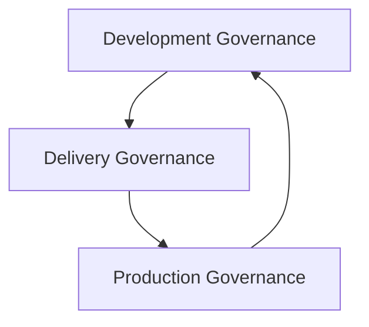

## Audience

Engineering leadership, CIO / CTO, architects, database platform owners, and technical governance committees — organizations that need unified SQL governance across teams, databases, and development processes.

## Problem

Enterprise SQL governance usually isn't a lack of tools — it's fragmentation: different teams maintain their own style guides, rely on manual DBA review, and use homegrown scripts; SQL is scattered across IDEs, repositories, CI/CD, migration scripts, and production slow logs; problems surface only after reaching production.

The capabilities already exist — what's missing is a unified system.

## Goal

Consolidate scattered SQL tooling and manual processes into a unified, executable, measurable governance platform spanning teams, databases, and the full SQL lifecycle.

## Workflow

Enterprise SQL governance falls into three layers that form a closed loop:



Each layer maps to a use case (follow the link for its end-to-end flow):

| Layer | Answers | Use case |
|---|---|---|
| Development governance | Is this SQL sound while being written? | [Developer SQL Copilot](/en/use-cases/developer-sql-copilot) |
| Delivery governance | Is it allowed into production? | [CI/CD SQL Quality Gate](/en/use-cases/sql-quality-gate-cicd) |
| Production governance | Is running SQL staying healthy? | [Slow SQL Optimization at Scale](/en/use-cases/slow-sql-optimization) |

All three share one underlying SQL analysis engine — not three separate tools.

## Dependencies

The unified platform is built from these capabilities (see each capability page):

<CardGroup cols={2}>
  <Card title="SQL Quality Check" icon="list-check" href="/en/features/sql-review" />
  <Card title="Query Rewrite" icon="git-compare" href="/en/features/automatic-sql-rewrite" />
  <Card title="Index Recommendation" icon="layers" href="/en/features/index-recommendation" />
  <Card title="Execution Plan Analysis" icon="route" href="/en/features/execution-plan-visualization" />
  <Card title="Performance Validation" icon="gauge" href="/en/features/performance-validation" />
  <Card title="Distributed SQL Optimization" icon="network" href="/en/features/distributed-sql-optimization" />
</CardGroup>

## Success Criteria

| Metric | Objective |
|---|---|
| SQL automated analysis coverage | Increase |
| Pre-release issue fix rate | Increase |
| Severe SQL shipped to production | Decrease |
| DBA manual review workload | Decrease |
| Production slow SQL count | Decrease |
| Governance rule unification rate | Increase |
| Multi-database governance coverage | Increase |

---

## One Rule Set, Many Teams and Databases

Unified governance isn't "every team uses an identical rule set" — it's "a unified baseline plus business-level differentiation":

```text
Group baseline rules + business-unit rules + project-specific rules
```

Likewise, multi-database governance isn't "identical checks everywhere." The correct model is:

```text
Unified governance framework + database-specific intelligence
```

Enterprise standards become custom SQL rules that are reused across development, CI/CD, and release review — avoiding "the same rule reimplemented by different tools."

## From Style Guides to Policy as Code

A fifty-page SQL development guide doesn't stop bad SQL from shipping. The mature approach turns standards into executable policy:

```text
Rule:  UPDATE without a WHERE clause
Level: Critical
Action: Block the pipeline
```

Governance shifts from "people remember the rules" to "the system enforces the rules."

## Make Governance Measurable

A unified platform also gives leadership unified metrics:

| Metric | This month | Trend |
|---|---:|---|
| SQL analyzed | 128,642 | ↑ |
| Critical issues | 186 | ↓ |
| Issues fixed pre-release | 4,382 | ↑ |
| Production slow SQL patterns | 312 | ↓ |

From there, a SQL Quality Score and team Scorecards turn governance from one-off audits into a measurable engineering system.

## A Typical Adoption Path

Large enterprises shouldn't turn everything on at once. A phased rollout:

1. **Unify SQL Quality Check** — unify rules and database coverage first
2. **CI/CD quality gate** — wire into Git, CI/CD, and webhooks for automatic policy enforcement
3. **Shift left to development** — surface SQL analysis in the IDE and development flow
4. **Production governance** — connect slow queries and monitoring for continuous performance governance
5. **Governance metrics** — build dashboards, scorecards, and a quality score to elevate governance from tooling to management system

## From Audit to Governance, from Optimization to Engineering

What an enterprise ultimately gains isn't a "SQL audit tool" or a "SQL optimization tool" — it's SQL Engineering capability built from standards, policy, analysis, optimization, workflow, and metrics.

<CardGroup cols={2}>
  <Card title="Explore Core Capabilities" icon="layers" href="/en/features/index" />
  <Card title="Explore Developer SQL Copilot" icon="code" href="/en/use-cases/developer-sql-copilot" />
  <Card title="Explore the SQL Quality Gate" icon="git-merge" href="/en/use-cases/sql-quality-gate-cicd" />
  <Card title="Explore Slow SQL Governance" icon="gauge" href="/en/use-cases/slow-sql-optimization" />
  <Card title="Request an Enterprise Demo" icon="compass" href="https://www.pawsql.com" />
</CardGroup>
