## One Platform for SQL Governance Across Teams, Databases, and the Entire Software Lifecycle

Large enterprises rarely suffer from a lack of SQL tools.

The bigger problem is fragmentation.

SQL is created by different teams, reviewed under different standards, deployed through different pipelines, executed across multiple database platforms, and monitored by separate operations teams.

A typical enterprise environment may include:

```text
50+ business applications

300+ developers

Multiple DBA teams

Dozens or hundreds of database instances

Multiple database technologies
```

such as:

```text
Oracle
MySQL
PostgreSQL
SQL Server
DB2
openGauss
GaussDB
TDSQL
OceanBase
Kingbase
DM
Hive
...
```

At the same time, different teams may manage SQL in completely different ways:

```text
Application Team A
Uses an internal SQL standards document

Application Team B
Relies on manual DBA review

Application Team C
Uses custom scripts

Data Platform Team
Maintains separate Hive SQL rules

Operations Team
Handles performance issues from slow-query logs
```

The organization already has SQL governance activities.

But the governance model is fragmented.

**PawSQL helps enterprises unify SQL development, review, delivery, monitoring, optimization, and governance metrics into a single SQL Governance Platform.**

---

## Why Enterprise SQL Governance Becomes Difficult at Scale

As engineering organizations grow, SQL governance becomes increasingly complex.

Four challenges appear repeatedly.

### Challenge 1 — More Databases, More Governance Complexity

An enterprise may start with:

```text
Oracle
+
MySQL
```

and later expand into:

```text
PostgreSQL
openGauss
GaussDB
TDSQL
OceanBase
Kingbase
DM
Hive
...
```

Each platform introduces different:

- SQL dialects
- DDL rules
- indexing mechanisms
- execution-plan formats
- optimizer behavior
- distributed execution strategies

If every database requires a separate governance process, operational complexity increases rapidly.

---

### Challenge 2 — SQL Exists Across the Entire Software Lifecycle

SQL does not exist only inside production databases.

It may appear in:

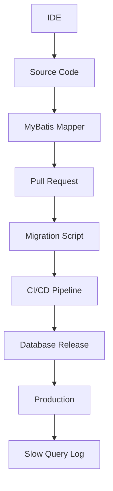

If governance happens only at one point—for example, manual DBA review before release—large parts of the lifecycle remain unmanaged.

---

### Challenge 3 — Governance Standards Differ Across Teams

A common enterprise pattern looks like this:

```text
Team A
50 SQL rules

Team B
80 SQL rules

Team C
Manual DBA review

Team D
No consistent SQL review
```

The organization may already have a formal document such as:

```text
Database Development Standards.pdf
```

But written standards are not automatically enforced.

The difference is significant:

```text
Documented Standard
```

versus:

```text
Executable Engineering Policy
```

---

### Challenge 4 — SQL Problems Are Detected Too Late

<Tabs>
  <Tab title="Reactive Governance">
    Traditional SQL governance often looks like this:

    ```mermaid
    flowchart TD
        A["Write SQL"] --> B["Release"] --> C["Production Slow Query"] --> D["DBA Investigation"] --> E["Emergency Optimization"]
    ```

    This is fundamentally:

    <Note>
    **Reactive Governance**
    </Note>
  </Tab>
  <Tab title="Proactive Governance">
    A more mature model introduces governance controls earlier:

    ```mermaid
    flowchart TD
        A["Development"] --> B["Delivery"] --> C["Production"]
    ```

    with a different control mechanism at each stage.
  </Tab>
</Tabs>

---

## The PawSQL Enterprise Governance Model

PawSQL organizes enterprise SQL governance into three major layers:

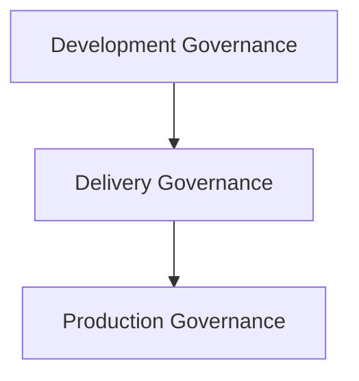

Each layer answers a different question.

<Tabs>
  <Tab title="Development Governance">
    > Is this SQL well designed while it is being written?
  </Tab>
  <Tab title="Delivery Governance">
    > Should this SQL be allowed to reach production?
  </Tab>
  <Tab title="Production Governance">
    > Is this SQL continuing to perform well after deployment?
  </Tab>
</Tabs>

Together, they form a complete:

<Note>
**SQL Lifecycle Governance Model**
</Note>

---

## Enterprise SQL Governance Architecture

A high-level architecture looks like this:

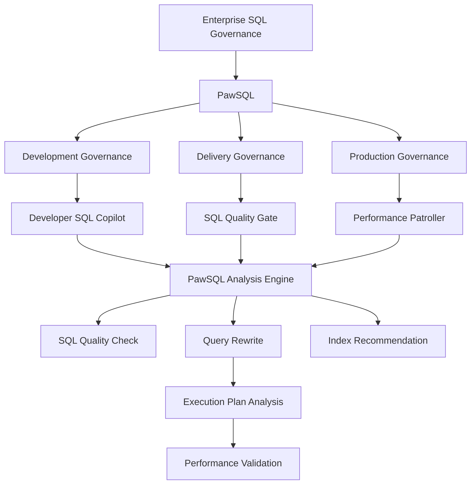

The important point is not one individual feature.

The core principle is:

<Note>
Every governance stage shares the same underlying SQL intelligence.
</Note>

---

## Layer 1 — Development Governance

The earliest opportunity to improve SQL quality is when developers are still writing the query.

Common development-stage issues include:

- non-SARGable predicates
- inefficient subqueries
- deep pagination
- problematic joins
- missing indexes
- unnecessary `DISTINCT`
- potential performance risks

For example:

```sql
SELECT *
FROM orders
WHERE DATE(create_time) = '2026-09-04'
  AND customer_id = 10086;
```

The query may appear perfectly healthy in a development database with:

```text
50,000 rows
```

while the production table contains:

```text
80,000,000+ rows
```

PawSQL Developer SQL Copilot can analyze:

```text
DATE(create_time)
```

and provide:

- risk explanation
- Query Rewrite
- Index Recommendation
- Execution Plan Analysis

The objective of development governance is simple:

<Note>
**Fix common SQL problems before they become part of the codebase.**
</Note>

---

## Layer 2 — SQL Quality Gate for Delivery

Developer-side optimization is valuable, but enterprises also need organization-level controls.

That is the role of:

> **SQL Quality Gate**

A typical workflow may look like:

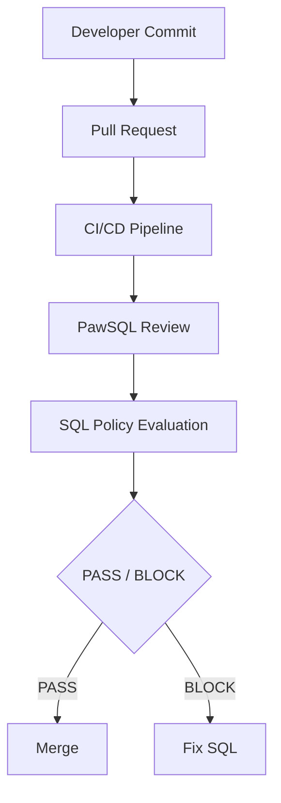

The policy can cover several dimensions.

<AccordionGroup>
  <Accordion title="Safety Risks">
    Examples:

    - `DELETE` without an appropriate predicate
    - `UPDATE` without an appropriate predicate
    - `TRUNCATE`
    - `DROP`
    - high-risk DDL
  </Accordion>
  <Accordion title="SQL Standards">
    Examples:

    - `SELECT *`
    - naming conventions
    - data type standards
    - index conventions
    - DDL conventions
  </Accordion>
  <Accordion title="Performance Risks">
    Examples:

    - deep pagination
    - non-SARGable predicates
    - inefficient subqueries
    - missing indexes
    - problematic joins
    - inefficient aggregation
  </Accordion>
</AccordionGroup>

This turns a document such as:

```text
Database Development Standards.pdf
```

into:

```text
Executable SQL Policy
```

---

## Layer 3 — Production SQL Performance Governance

Even with strong development and delivery controls, production systems will still generate new SQL performance issues.

Because:

- data grows
- data distributions change
- statistics change
- indexes evolve
- new releases are deployed
- workloads shift

Production governance therefore requires a continuous loop:

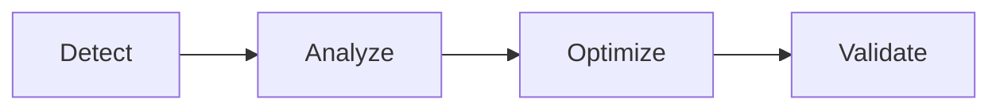

PawSQL can help process production slow SQL through:

- SQL normalization
- SQL pattern grouping
- priority ranking
- Query Rewrite
- Index Recommendation
- Execution Plan Analysis
- optimization validation

Instead of asking DBAs to inspect:

```text
2,000 Slow Queries
```

one by one, the system can progressively narrow them into:

```text
A few dozen high-value SQL patterns
```

that actually deserve expert review.

---

## Turn Three Separate Processes into One Closed Loop

When development, delivery, and production each use isolated tools, the architecture often becomes:

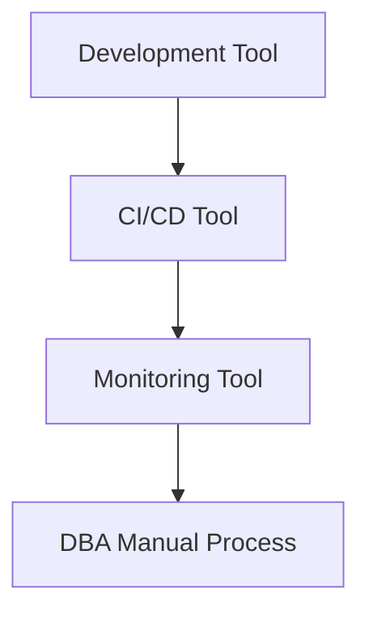

This creates process and data silos.

A unified model connects them:

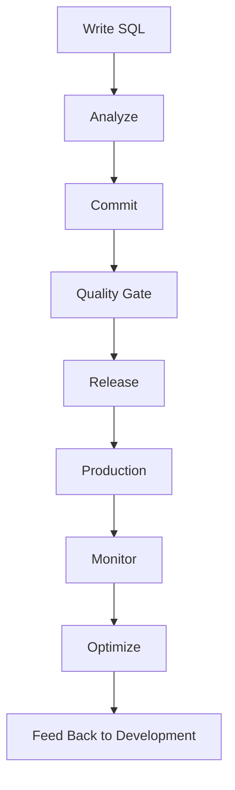

This creates:

<Note>
**Closed-Loop SQL Governance**
</Note>

Production findings can influence future engineering standards instead of remaining isolated operational incidents.

---

## One Governance Standard Across Multiple Teams

A major benefit of enterprise governance is consistency.

An organization can define a shared SQL policy framework.

For example:

<AccordionGroup>
  <Accordion title="P0 — Critical">
    ```text
    DELETE without predicate
    UPDATE without predicate
    DROP TABLE
    TRUNCATE TABLE
    ```

    Action:

    ```text
    BLOCK
    ```
  </Accordion>
  <Accordion title="P1 — High">
    Examples:

    - high-risk DDL
    - deep pagination
    - full-scan risk
    - expensive subqueries
    - missing critical indexes

    Action:

    ```text
    DBA Review Required
    ```
  </Accordion>
  <Accordion title="P2 — Warning">
    Examples:

    - `SELECT *`
    - unnecessary `DISTINCT`
    - optimizable predicates
    - non-recommended SQL patterns

    Action:

    ```text
    Pass with Warning
    ```
  </Accordion>
</AccordionGroup>

The organization now has a consistent control model rather than a collection of individual DBA preferences.

---

## Enterprise Baseline + Business Unit Extensions

Enterprise governance should not mean forcing every team to use an identical rule set.

A more scalable model is:

```text
Enterprise Baseline Rules
        +
Business Unit Rules
        +
Project-Specific Rules
```

For example:

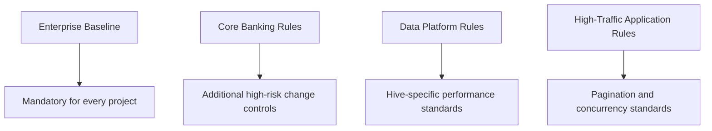

This allows the organization to establish a common baseline while preserving domain-specific controls.

---

## Unified Governance Across Multiple Databases

A true enterprise SQL Governance Platform has to assume that multiple database technologies will coexist.

Different platforms may require different rule sets:

```text
MySQL SQL Rules

Oracle SQL Rules

PostgreSQL SQL Rules

TDSQL Distributed SQL Rules

Hive Performance Rules
```

But enterprise stakeholders still want a common governance view:

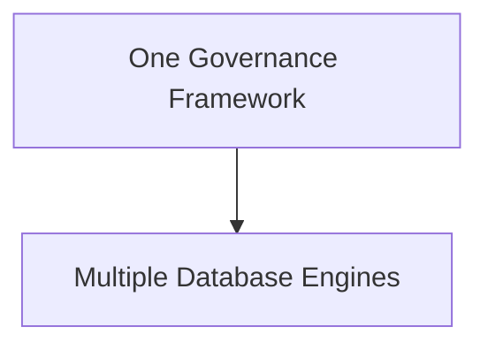

PawSQL can provide a common analysis and governance layer while still preserving database-specific intelligence.

---

## Unified Governance Does Not Mean Identical Rules

Different databases require different technical awareness.

<Tabs>
  <Tab title="MySQL">
    Typical concerns include:

    - `LIMIT`
    - implicit conversion
    - index leading columns
    - InnoDB access paths
  </Tab>
  <Tab title="Oracle">
    Typical concerns include:

    - hints
    - `ROWNUM`
    - function-based indexes
    - PL/SQL
  </Tab>
  <Tab title="PostgreSQL / openGauss">
    Typical concerns include:

    - sequential scans
    - join strategies
    - CTE behavior
    - data distribution
  </Tab>
  <Tab title="Hive">
    Typical concerns include:

    - partition pruning
    - data skew
    - MapJoin
    - global sorting
  </Tab>
</Tabs>

Therefore, the correct model is:

```text
Unified Governance Framework
            +
Database-Specific Intelligence
```

---

## From SQL Standards Documents to Policy as Code

Many enterprises already maintain large SQL standards documents.

The problem is:

<Note>
Documentation does not block bad SQL from reaching production.
</Note>

A mature governance model converts rules into:

> **Policy as Code**

For example:

```text
Rule:
UPDATE without WHERE

Severity:
Critical

Action:
Block Pipeline
```

Or:

```text
Rule:
Deep Pagination

Threshold:
OFFSET > 100000

Severity:
High

Action:
Require Review
```

The governance model moves from:

```text
People Remember the Rules
```

to:

```text
Systems Enforce the Rules
```

---

## Support Enterprise-Specific SQL Rules

Every large organization has internal standards that go beyond generic SQL best practices.

Examples may include:

```text
Index names must start with IDX_

Certain data types are prohibited

Large DML transactions require special handling

Backup tables must follow naming standards

Batch workloads may use different thresholds
```

A unified governance platform should allow these policies to be implemented as:

```text
Custom SQL Rules
```

and reused across:

```text
Development
CI/CD
Release Review
```

without rebuilding the same logic in multiple tools.

---

## Move DBAs from Workflow Bottlenecks to Expert Decision-Makers

A traditional model looks like this:

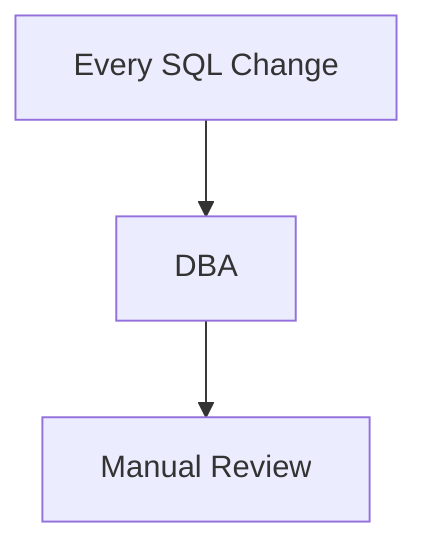

As development scales:

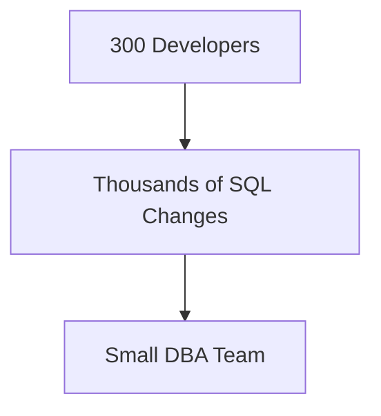

DBAs quickly become a delivery bottleneck.

A more scalable model is:

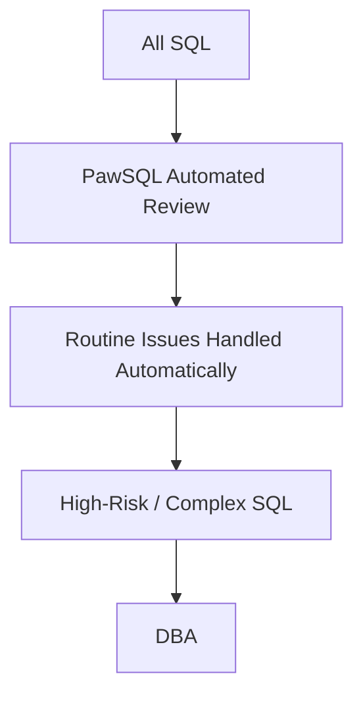

The DBA no longer needs to inspect every query.

Instead, the DBA focuses on:

<Note>
**The SQL that actually requires expert judgment.**
</Note>

---

## Enterprise SQL Governance Dashboard

A unified platform also enables governance metrics.

For example:

| Metric | This Month | Trend |
|---|---:|---|
| SQL Analyzed | 128,642 | ↑ |
| Critical Issues | 186 | ↓ |
| Issues Fixed Before Release | 4,382 | ↑ |
| Production Slow SQL Patterns | 312 | ↓ |
| SQL Automatically Optimized | 198 | ↑ |
| DBA Manual Reviews | 61 | ↓ |

Now the organization can answer more meaningful questions:

```text
Is SQL quality improving?

Which teams have the highest SQL risk?

Which databases generate the most issues?

How many problems are fixed before release?

How many production slow SQL patterns are being reduced?

Is DBA manual workload decreasing?
```

---

## Build an SQL Quality Score

Enterprises can go one step further and establish:

> **SQL Quality Score**

For example:

```text
Project A
92

Project B
76

Project C
64
```

The score may incorporate:

```text
Critical Issues
+
Performance Risks
+
Rule Violations
+
Production Slow SQL
+
Optimization Completion Rate
```

This creates a measurable:

> **SQL Engineering Quality Metric**

Governance becomes something that can be tracked over time rather than just an approval activity.

---

## Build Team-Level SQL Governance Scorecards

For example:

| Team | SQL Volume | Pre-Release Fix Rate | Production Issues | Score |
|---|---:|---:|---:|---:|
| Payments | 12,580 | 96% | 8 | 94 |
| CRM | 18,240 | 91% | 16 | 87 |
| Data Platform | 23,690 | 89% | 21 | 83 |

These metrics are useful for:

- engineering governance
- database platform teams
- architecture councils
- developer productivity teams
- technology management

---

## One Platform for Different Roles

Enterprise SQL governance is not only for DBAs.

<Tabs>
  <Tab title="Developers">
    Ask:

    > How can I write better SQL?

    Use:

    > Developer SQL Copilot
  </Tab>
  <Tab title="DevOps Teams">
    Ask:

    > How can we automatically prevent risky SQL from being released?

    Use:

    > SQL Quality Gate
  </Tab>
  <Tab title="DBAs">
    Ask:

    > How can we govern production slow SQL at scale?

    Use:

    > Slow SQL Optimization
  </Tab>
  <Tab title="Architects">
    Ask:

    > How can we standardize SQL governance across multiple databases?

    Use:

    > Multi-Database Governance
  </Tab>
  <Tab title="Engineering Managers">
    Ask:

    > Is SQL quality improving across teams?

    Use:

    > Governance Metrics
  </Tab>
  <Tab title="CIO / CTO">
    Ask:

    > Is enterprise database risk under control?

    Use:

    > Enterprise SQL Governance
  </Tab>
</Tabs>

---

## Integrate with the Existing Enterprise Toolchain

SQL Governance should not require organizations to rebuild their engineering processes.

PawSQL can act as an intelligence layer integrated with:

```text
IDE

Git Repository

Pull Request

CI/CD

Webhook

Database Release Platform

APM

Database Monitoring Platform
```

A simplified architecture looks like:

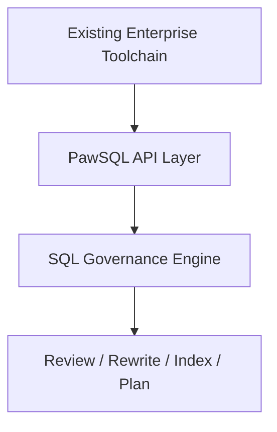

The objective is:

<Note>
Embed SQL governance into the systems teams already use.
</Note>

Not create another disconnected tool.

---

## From SQL Quality Review to SQL Governance

<Tabs>
  <Tab title="SQL Quality Review">
    Traditional SQL auditing usually asks:

    > Does this SQL violate a rule?
  </Tab>
  <Tab title="SQL Governance">
    Enterprise SQL Governance must answer more:

    ```text
    Is the SQL safe?

    Is it compliant?

    Is it efficient?

    Can it be optimized?

    Can the optimization be validated?

    Who needs to review it?

    Should it be allowed into production?

    Did it become slow after release?
    ```
  </Tab>
</Tabs>

The distinction can be summarized as:

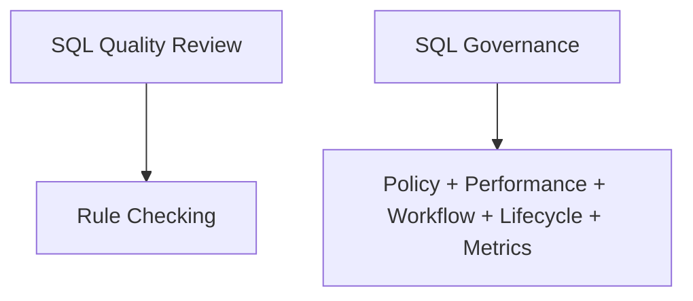

---

## From SQL Optimization to SQL Engineering

A point optimization tool typically looks like:

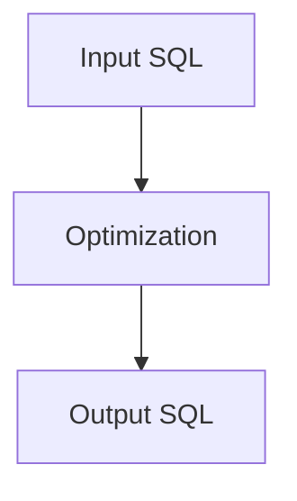

Enterprise engineering requires more:

```text
Development
+
Review
+
Release
+
Production
+
Optimization
+
Governance Metrics
```

This is better described as:

<Note>
**SQL Engineering**
</Note>

PawSQL's long-term role is not only to optimize individual SQL statements.

It is to help enterprises build a scalable SQL Engineering capability.

---

## A Practical Enterprise Adoption Roadmap

Large organizations do not need to deploy every governance capability at once.

A staged rollout is often more effective.

<Steps>
  <Step title="Phase 1 — Unified SQL Quality Check">
    Standardize:

    ```text
    SQL Rules
    +
    Database Coverage
    +
    Review Standards
    ```

    Goal:

    <Note>
    Establish a common SQL quality check platform.
    </Note>
  </Step>
  <Step title="Phase 2 — CI/CD Quality Gate">
    Integrate with:

    ```text
    Git
    +
    CI/CD
    +
    Webhook
    ```

    Goal:

    <Note>
    Enforce SQL policy automatically.
    </Note>
  </Step>
  <Step title="Phase 3 — Developer Shift Left">
    Move SQL analysis into:

    ```text
    IDE
    +
    Developer Workflow
    ```

    Goal:

    <Note>
    Reduce SQL problems during development.
    </Note>
  </Step>
  <Step title="Phase 4 — Production Governance">
    Connect:

    ```text
    Slow Query
    +
    Monitoring
    +
    Performance Patroller
    ```

    Goal:

    <Note>
    Establish continuous SQL performance governance.
    </Note>
  </Step>
  <Step title="Phase 5 — Enterprise Governance Metrics">
    Build:

    ```text
    Dashboard
    +
    Scorecard
    +
    Quality Score
    +
    Governance Report
    ```

    Goal:

    <Note>
    Turn SQL governance from a tooling capability into a measurable management system.
    </Note>
  </Step>
</Steps>

---

## Example of Enterprise-Scale Governance

Suppose an enterprise processes:

```text
128,000+ SQL statements per month
```

Automated governance may produce:

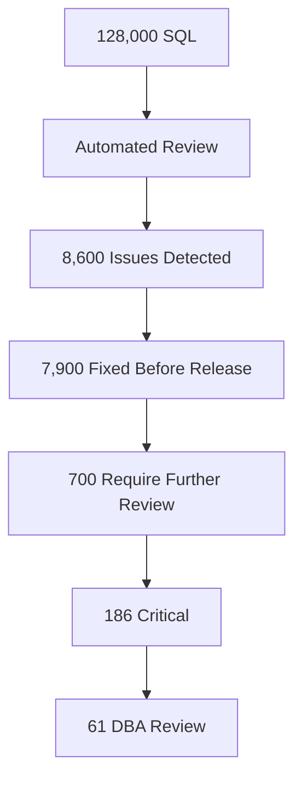

Production governance may then continue with:

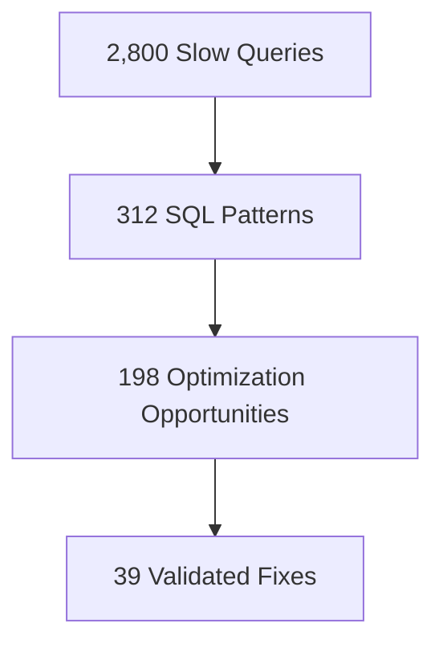

Management no longer sees only:

> How many SQL statements do we have?

Instead, the key question becomes:

> How effectively is SQL risk being reduced across the lifecycle?

---

## The Real Outcome Is an Enterprise Capability

The enterprise does not end up with only:

```text
SQL Review Tool
```

or:

```text
SQL Optimization Tool
```

It gains a combination of:

```text
SQL Standards
+
SQL Policy
+
SQL Analysis
+
SQL Optimization
+
SQL Workflow
+
SQL Metrics
```

Together, these form:

<Note>
**Enterprise SQL Governance Capability**
</Note>

---

## Who Is This For?

This use case is especially relevant for:

- banks
- securities firms
- insurance companies
- telecom operators
- large internet companies
- large state-owned enterprises
- multi-product SaaS platforms
- government and enterprise IT organizations
- enterprises with heterogeneous database environments

It is particularly valuable when the organization has:

```text
Many Development Teams
+
Many Database Technologies
+
Large SQL Volume
+
Frequent Releases
+
Limited DBA Capacity
+
High Production Performance Requirements
```

---

## Recommended Enterprise Governance Metrics

Organizations can track:

| Metric | Objective |
|---|---|
| Automated SQL analysis coverage | Increase |
| SQL issues found during development | Increase |
| Pre-release issue fix rate | Increase |
| Critical SQL reaching production | Decrease |
| DBA manual review workload | Decrease |
| Production slow SQL count | Decrease |
| Recurring slow SQL rate | Decrease |
| Automated optimization coverage | Increase |
| Governance rule consistency | Increase |
| Multi-database governance coverage | Increase |

These metrics ultimately support three enterprise goals:

```text
Lower Risk
+
Higher Developer Productivity
+
Lower Database Performance Cost
```

---

## Move from Tool Sprawl to a Unified SQL Governance Platform

Many enterprises currently operate a collection of tools:

```text
IDE Plugin
+
SQL Audit Tool
+
CI/CD Script
+
DBA Review
+
Monitoring Platform
+
Slow SQL Tool
```

Each tool solves part of the problem.

But the overall governance model remains fragmented.

PawSQL connects these stages:

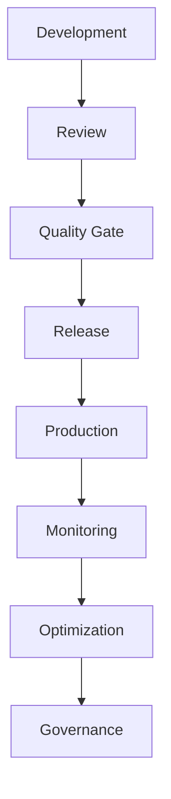

into a unified:

<Note>
**Enterprise SQL Governance Platform**
</Note>

---

## One Platform for the Entire SQL Lifecycle

SQL should not be governed only after something goes wrong in production.

Governance should begin when the first line of SQL is written.

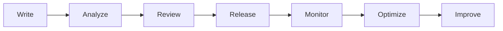

PawSQL helps enterprises turn SQL Quality Check, optimization, and production performance management from disconnected tools and manual processes into a unified, executable, and measurable governance system.

<Note>
**One platform. One SQL governance standard. Across every team, every database, and every stage of the software lifecycle.**
</Note>

<CardGroup cols={2}>
  <Card title="Explore PawSQL SQL Governance" icon="layers" href="/en/features/index" />
  <Card title="Explore Developer SQL Copilot" icon="code" href="/en/use-cases/developer-sql-copilot" />
  <Card title="Explore SQL Quality Gate" icon="git-merge" href="/en/use-cases/sql-quality-gate-cicd" />
  <Card title="Explore Slow SQL Optimization" icon="gauge" href="/en/use-cases/slow-sql-optimization" />
  <Card title="Request an Enterprise Demo" icon="compass" href="https://www.pawsql.com" />
</CardGroup>

---

### Related Use Cases

- [Developer SQL Copilot](/en/use-cases/developer-sql-copilot)
- [SQL Quality Gate for CI/CD](/en/use-cases/sql-quality-gate-cicd)
- [DBA Slow SQL Optimization at Scale](/en/use-cases/slow-sql-optimization)
- SQL Governance for Database Migration
- Distributed Database SQL Optimization
