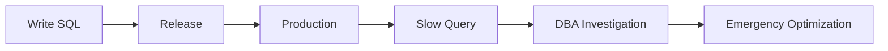
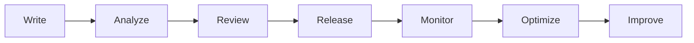
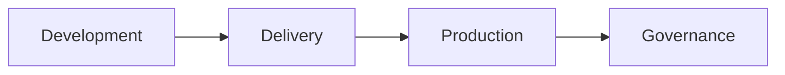
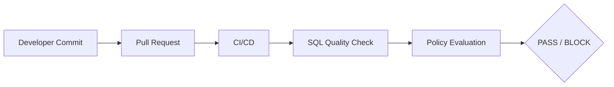
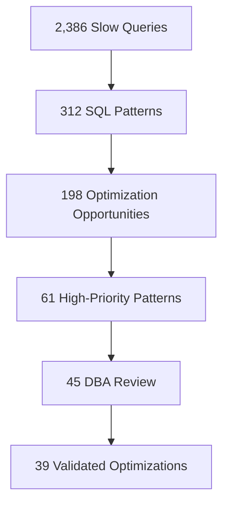
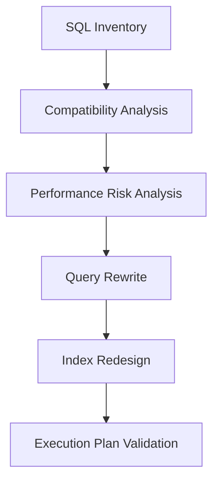
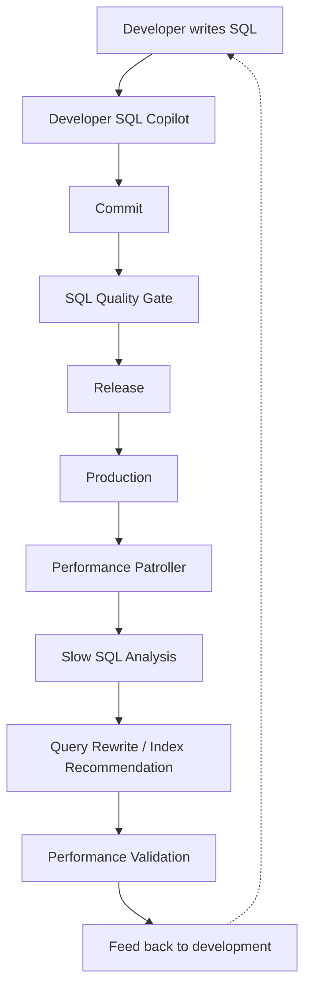

## Govern SQL Across the Entire Lifecycle — From Development to Production

SQL problems do not begin in production. They may be introduced when a developer writes the first query, during code review, while database changes are released, or later as data volume and workload patterns evolve.

A traditional workflow often looks like this:



PawSQL moves SQL governance earlier and extends it across the full software lifecycle:



<Note>
Whether you are a developer, DevOps engineer, DBA, database architect, or engineering leader, PawSQL provides a governance workflow for the SQL problems you are responsible for.
</Note>

## From SQL Optimization Tool to SQL Engineering Platform

Many enterprises already have SQL standards documents, manual DBA reviews, CI/CD pipelines, APM platforms, slow-query monitoring, and database migration tools. The problem is that these capabilities are often disconnected.

PawSQL connects SQL work across the lifecycle:



through a shared intelligence layer: **SQL Quality Check · Query Rewrite · Index Recommendation · Execution Plan Analysis · Performance Validation** — helping organizations build scalable SQL Engineering and SQL Governance capabilities.

## Choose the Use Case That Matches Your Challenge

### Developer SQL Copilot

Developers are usually the first people to work with SQL—and the earliest point where performance problems can be prevented.

```sql
SELECT *
FROM orders
WHERE DATE(create_time) = '2026-09-04'
  AND customer_id = 10086;
```

The query may perform well in development, but once the production table grows to tens or hundreds of millions of rows, function-wrapped predicates, inefficient subqueries, poor index design, and deep pagination can become serious bottlenecks.

PawSQL Developer SQL Copilot helps developers with: SQL performance risk detection · root-cause explanation · equivalent SQL rewrites · index recommendations · execution-plan analysis · optimization validation.

<Note>
**Fix SQL performance problems before the code is committed.**
</Note>

[Explore Developer SQL Copilot →](/en/use-cases/developer-sql-copilot)

### SQL Quality Gate for CI/CD

Application code already has unit tests, code review, security scanning, and CI/CD. Database SQL should have the same level of engineering control. PawSQL can integrate SQL quality check and performance analysis into CI/CD:



Teams can automatically detect risky DML / DDL, standards violations, performance risks, missing indexes, deep pagination, inefficient subqueries, and problematic joins — then decide between PASS, WARNING, DBA REVIEW, or BLOCK.

<Note>
**Turn SQL quality checking from a manual approval process into an automated quality gate.**
</Note>

[Explore SQL Quality Gate →](/en/use-cases/sql-quality-gate-cicd)

### DBA Slow SQL Optimization at Scale

Monitoring platforms can tell DBAs which SQL is slow. The harder questions are why it is slow, how it should be rewritten, which index is needed, and whether the optimized plan is actually better.

PawSQL connects slow-query collection, SQL normalization, pattern grouping, performance analysis, query rewrite, index advice, and plan validation into one flow:



<Note>
**Monitoring tells you which SQL is slow. PawSQL tells you why, how to fix it, and whether the fix is better.**
</Note>

[Explore Slow SQL Optimization →](/en/use-cases/slow-sql-optimization)

### SQL Governance for Database Migration

A migration project should answer not only whether SQL runs on the target database, but whether it still runs efficiently. PawSQL helps migration teams build a workflow around:



moving database migration from Syntax Migration to **Performance-Aware SQL Migration**.

<Note>
**Do not just migrate SQL. Avoid migrating legacy performance problems with it.**
</Note>

[Explore Database Migration SQL Governance →](/en/use-cases/database-migration-sql-governance)

### Enterprise SQL Governance Platform

Large organizations often have multiple development teams, DBA teams, database platforms, release processes, and SQL standards.

PawSQL unifies Development Governance, Delivery Governance, and Production Governance through Developer SQL Copilot, SQL Quality Gate, Performance Patroller, SQL Quality Check, Query Rewrite, Index Recommendation, Execution Plan Analysis, and Governance Metrics.

<Note>
**Build a unified, executable, and measurable SQL Governance Platform.**
</Note>

[Explore Enterprise SQL Governance →](/en/use-cases/enterprise-sql-governance)

## Choose PawSQL by Role

| Role | Typical Question | Recommended Use Case |
|---|---|---|
| Developer | How do I write SQL that is safer and faster? | [Developer SQL Copilot](/en/use-cases/developer-sql-copilot) |
| DevOps / Developer Productivity | How do we automatically stop risky SQL before release? | [SQL Quality Gate](/en/use-cases/sql-quality-gate-cicd) |
| DBA | How do we manage production slow SQL at scale? | [Slow SQL Optimization](/en/use-cases/slow-sql-optimization) |
| Migration Team | How do we reduce SQL performance regression during migration? | [Database Migration Governance](/en/use-cases/database-migration-sql-governance) |
| Engineering Leadership | How do we standardize SQL governance across teams and databases? | [Enterprise SQL Governance](/en/use-cases/enterprise-sql-governance) |

## Choose PawSQL by Software Lifecycle

<Tabs>
  <Tab title="Development">
    ```mermaid
    flowchart LR
        A[Write SQL] --> B[Developer SQL Copilot]
        B --> C[Analyze] --> D[Rewrite] --> E[Recommend index] --> F[Validate]
    ```

    Goal: **Find problems early.**
  </Tab>
  <Tab title="Delivery">
    ```mermaid
    flowchart LR
        A[Commit] --> B[Pull Request] --> C[CI/CD] --> D[SQL Quality Gate]
    ```

    Goal: **Prevent risky SQL from reaching production.**
  </Tab>
  <Tab title="Production">
    ```mermaid
    flowchart LR
        A[Production SQL] --> B[Monitoring] --> C[Slow SQL] --> D[PawSQL Optimization]
    ```

    Goal: **Continuously detect and optimize performance problems.**
  </Tab>
  <Tab title="Governance">
    ```mermaid
    flowchart LR
        A[Rules] --> B[Workflow] --> C[Metrics] --> D[Multi-Database Coverage]
    ```

    Goal: **Turn SQL optimization from individual expertise into an enterprise engineering capability.**
  </Tab>
</Tabs>

## One SQL Intelligence Layer for Multiple Governance Scenarios

| Capability | Purpose |
|---|---|
| SQL Quality Check | Detect standards, safety, and potential risks |
| Query Rewrite | Generate equivalent optimization alternatives |
| Index Recommendation | Recommend indexes based on query access patterns |
| Execution Plan Analysis | Understand database execution strategy |
| Performance Validation | Verify that optimization actually improves the plan |
| Multi-Database Support | Apply governance across heterogeneous database environments |

## A Complete SQL Engineering Lifecycle



This is not simply a collection of independent tools. It is a complete **SQL Lifecycle Governance** model.

## Start with the Use Case That Matters Most

<CardGroup cols={2}>
  <Card title="Developer SQL Copilot" icon="code" href="/en/use-cases/developer-sql-copilot">
    Get feedback and optimization suggestions while writing SQL.
  </Card>
  <Card title="SQL Quality Gate" icon="git-merge" href="/en/use-cases/sql-quality-gate-cicd">
    Block risky SQL in your CI/CD pipeline.
  </Card>
  <Card title="Slow SQL Optimization" icon="gauge" href="/en/use-cases/slow-sql-optimization">
    Govern production slow SQL at scale.
  </Card>
  <Card title="Database Migration Governance" icon="arrow-right-left" href="/en/use-cases/database-migration-sql-governance">
    Keep migrated SQL running efficiently.
  </Card>
  <Card title="Enterprise SQL Governance" icon="building-2" href="/en/use-cases/enterprise-sql-governance">
    Build one measurable governance platform.
  </Card>
</CardGroup>

## Move SQL from Post-Production Tuning to Lifecycle Governance

A mature SQL engineering model should cover the full loop: **Write → Review → Release → Monitor → Optimize → Improve**.

PawSQL connects SQL Quality Check, performance optimization, CI/CD quality gates, production governance, and multi-database standards into a unified SQL Engineering and SQL Governance capability.

<Note>
**From the first line of SQL to production, PawSQL keeps SQL quality and performance under continuous governance.**
</Note>

<CardGroup cols={2}>
  <Card title="Quickstart" icon="bolt" href="/en/getting-started/quickstart">
    Run your first review, rewrite, and index recommendation.
  </Card>
  <Card title="Supported Databases" icon="database" href="/en/getting-started/supported-databases">
    Database, version, and capability coverage.
  </Card>
</CardGroup>
