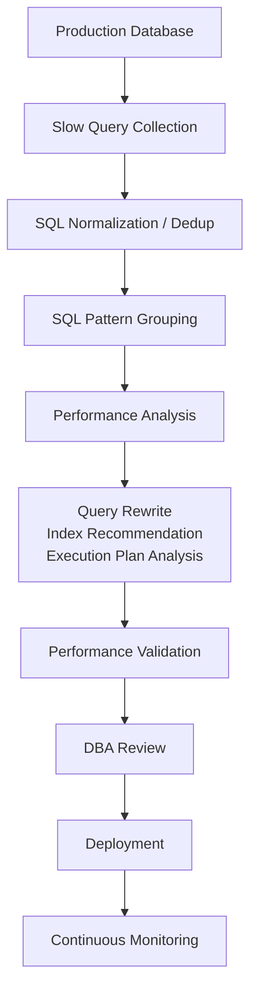
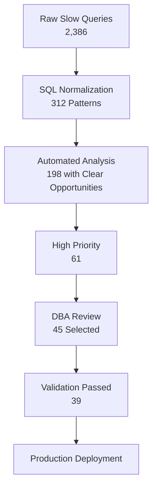
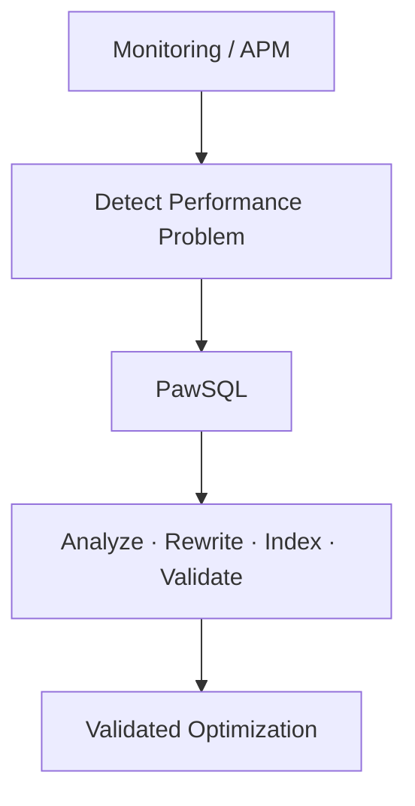

## Audience

DBAs and database operations teams responsible for production slow SQL governance.

## Problem

Production slow SQL governance isn't hard because of a lack of tools — it's hard to scale:

1. **Too many slow queries** — thousands a day, many of them the same pattern with different parameters
2. **Slow doesn't mean the SQL itself is wrong** — it may be index bloat, data growth, lock contention, or resource contention
3. **Knowing it's slow isn't knowing how to fix it** — the real cost is analyzing the cause, designing the rewrite, and judging the index
4. **Advice lacks validation** — "add an index" is far less useful than "which index, and is it actually faster after the change"

## Goal

Turn manual firefighting into automated, scalable batch governance, so DBAs focus on the SQL most worth optimizing instead of chasing slow queries one by one.

## Workflow

PawSQL connects production slow SQL governance into a sustainable loop:



## Dependencies

Built from the following capabilities (see each capability page for rewrite rules and index-design logic):

<CardGroup cols={2}>
  <Card title="SQL Quality Check" icon="list-check" href="/en/features/sql-review" />
  <Card title="Query Rewrite" icon="git-compare" href="/en/features/automatic-sql-rewrite" />
  <Card title="Index Recommendation" icon="layers" href="/en/features/index-recommendation" />
  <Card title="Execution Plan Analysis" icon="route" href="/en/features/execution-plan-visualization" />
  <Card title="Performance Validation" icon="gauge" href="/en/features/performance-validation" />
</CardGroup>

## Success Criteria

| Metric | Objective |
|---|---|
| Daily slow query count | Decrease |
| SQL pattern count | Remain manageable |
| Automated analysis coverage | Increase |
| Queries with actionable recommendations | Increase |
| Average DBA handling time per SQL | Decrease |
| High-value optimization completion rate | Increase |
| Recurring slow SQL rate | Decrease |

---

## SQL Normalization: Collapse Many Executions into a Few Patterns

Most production slow SQL differs only in literal values:

```sql
SELECT * FROM orders WHERE customer_id = 10001;
SELECT * FROM orders WHERE customer_id = 10002;
SELECT * FROM orders WHERE customer_id = 10003;
```

After normalization, they become one SQL pattern:

```sql
SELECT * FROM orders WHERE customer_id = ?;
```

"100,000 executions" collapse into "1,000 SQL patterns", moving governance from individual queries to SQL patterns.

## Priority Model: Optimize What's Worth It, Not What's Slowest

Latency alone isn't the only signal — a query run 20,000 times a day at 800ms is more worth optimizing than one run 5 times a day at 30s. Consider:

```text
Optimization Priority = Execution Time × Frequency × Resource Impact × Risk Level
```

## A Typical Batch Outcome

In one campaign, DBAs no longer analyze thousands of queries one by one:



Only a few dozen high-value SQL patterns need focused attention.

## Complement Your Monitoring and APM

APM and database monitoring are good at "where is it slow"; PawSQL answers "why, how to fix it, and whether the fix actually helps":



<CardGroup cols={2}>
  <Card title="Explore Query Rewrite" icon="wand-sparkles" href="/en/features/automatic-sql-rewrite" />
  <Card title="Explore Execution Plan Analysis" icon="route" href="/en/features/execution-plan-visualization" />
  <Card title="Learn About Developer SQL Copilot" icon="code" href="/en/use-cases/developer-sql-copilot" />
  <Card title="Request a Demo" icon="plug" href="https://www.pawsql.com" />
</CardGroup>
