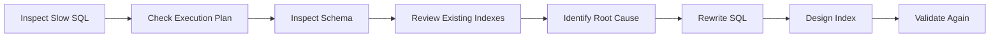
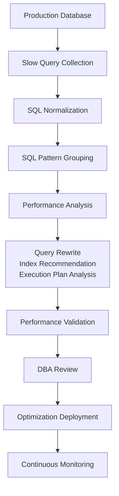
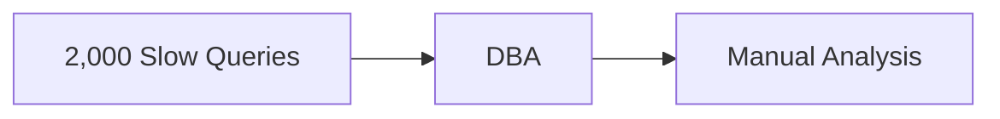
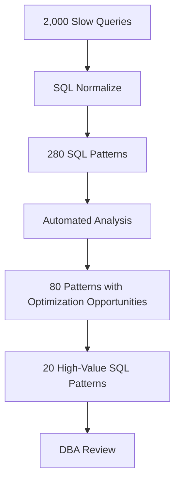
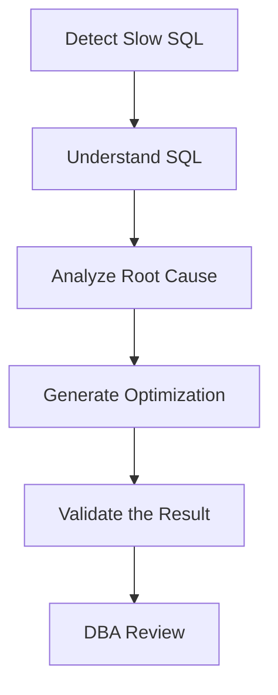
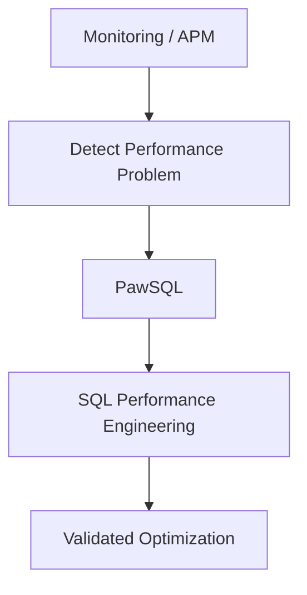
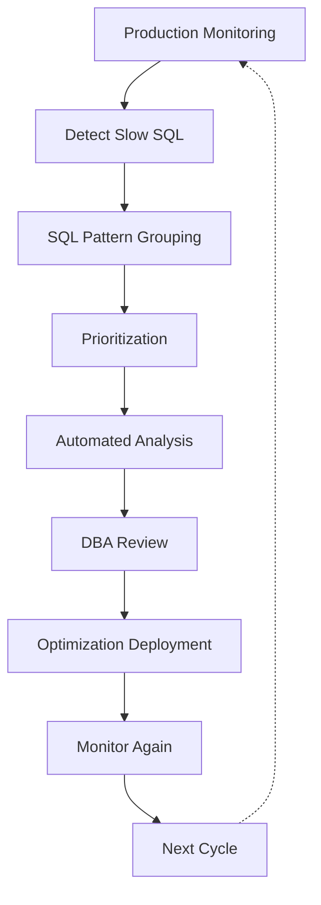
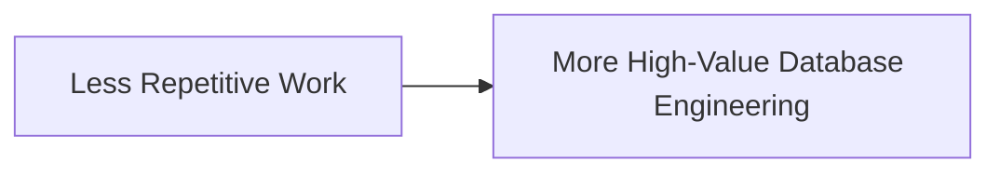
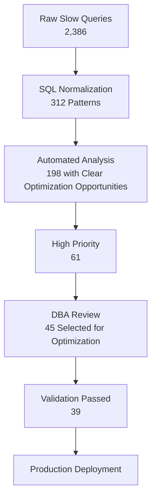
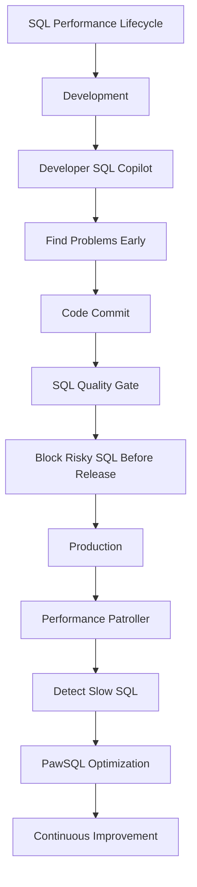

## Move from Reactive Firefighting to Continuous SQL Performance Governance

In production environments, slow SQL is rarely an isolated problem.

As applications grow, databases multiply, and workloads become more complex, DBAs are no longer dealing with:

> “Can you optimize this one query?”

Instead, the real question becomes:

> “We have hundreds or thousands of slow queries every day. Which ones matter most? Which can be optimized automatically? Which ones actually require DBA expertise?”

The traditional workflow is highly manual:



This approach works for a few queries.

It does not scale when the number of slow queries grows into the hundreds or thousands.

<Note>
**PawSQL connects slow-query collection, SQL normalization, performance analysis, query rewriting, index recommendation, and execution-plan validation into one workflow—helping DBAs build a scalable and sustainable SQL performance governance process.**
</Note>

## A Typical Production Environment

Consider a financial institution running:

```text
40+ Business Applications
80+ Database Instances
Multiple Database Platforms
```

including:

```text
MySQL
PostgreSQL
Oracle
SQL Server
DB2
openGauss
TDSQL
OceanBase
...
```

The production environment generates:

```text
2,000+ Slow Queries Per Day
```

Many of them differ only in literal values.

For example:

```sql
SELECT *
FROM orders
WHERE customer_id = 10086
  AND order_status = 'PAID';
```

```sql
SELECT *
FROM orders
WHERE customer_id = 20001
  AND order_status = 'PAID';
```

```sql
SELECT *
FROM orders
WHERE customer_id = 30012
  AND order_status = 'PAID';
```

From a raw log perspective, these are three separate SQL statements.

From a performance-governance perspective, they are the same:

> SQL Pattern

If DBAs review each statement independently, a large amount of time is wasted on repetitive work.

## Why Is Slow SQL Governance Difficult?

Production slow SQL management usually has four major challenges.

### Challenge 1 — There Are Too Many Slow Queries

Suppose the production environment generates:

```text
2,000 Slow Queries
```

per day.

Among them:

```text
1,400
Come from repeated SQL patterns

400
Are already-known issues

200
Require deeper analysis
```

Without normalization and grouping, DBAs may spend most of their time reviewing the same problem repeatedly.

### Challenge 2 — A Slow Query Does Not Always Mean Bad SQL

A query can become slow because of:

- inefficient SQL structure
- missing indexes
- index changes
- data growth
- data skew
- stale statistics
- execution-plan changes
- lock contention
- I/O pressure
- CPU contention

Therefore, seeing:

```text
Execution Time: 12.8s
```

does not automatically mean:

> Rewrite the SQL.

The first question should be:

> Can this problem actually be solved through SQL optimization?

### Challenge 3 — Detecting a Slow Query Is Not the Same as Fixing It

Monitoring platforms can tell DBAs:

```text
This SQL took 18 seconds.
```

But the real work begins after that.

The DBA still needs to answer:

```text
Why is it slow?

Which part of the SQL is problematic?

Can it be rewritten?

Does it need a new index?

Will the optimized SQL actually perform better?
```

This analysis is where most DBA time is spent.

### Challenge 4 — Optimization Advice Without Validation Is Risky

A very common recommendation is:

```text
Add an index.
```

But production optimization requires more precise answers:

```text
Which index?

Does a similar index already exist?

Will it create index redundancy?

Does the rewritten SQL really improve the execution plan?

Did the optimizer cost go down—or actually increase?
```

Production systems need:

<Note>
**Validated optimization recommendations.**
</Note>

Not just advice that “might be faster.”

## The PawSQL Approach

PawSQL turns slow SQL optimization into an end-to-end workflow:



This changes the DBA workflow from:

```text
Manual Query-by-Query Analysis
```

to:

```text
Batch Analysis
+
Automated Prioritization
+
Focused DBA Review
```

## Example: 2,000 Slow Queries — What Should the DBA Look at First?

Suppose PawSQL collects:

```text
2,146 Slow Queries
```

from production.

After SQL normalization:


The patterns can then be prioritized using metrics such as:

- execution frequency
- average latency
- total execution time
- resource impact
- risk level

For example:

| SQL Pattern | Executions | Avg. Time | Total Time | Risk |
|---|---:|---:|---:|---|
| SQL-001 | 12,840 | 1.8s | 6.42h | High |
| SQL-002 | 325 | 18.4s | 1.66h | Critical |
| SQL-003 | 8,920 | 420ms | 1.04h | Medium |
| SQL-004 | 61 | 42s | 42.7min | Critical |

Now the DBA no longer needs to randomly inspect thousands of queries.

Instead, the team can answer:

> Which SQL patterns have the greatest impact on overall database performance?

<Steps>
  <Step title="Step 1 — Identify High-Value Optimization Targets">

    Slow SQL should not be prioritized only by single-query latency.

    Consider two queries.

    #### SQL A

    ```text
    Execution Time: 30s
    Executions Per Day: 5

    Total Time:
    150s
    ```

    #### SQL B

    ```text
    Execution Time: 800ms
    Executions Per Day: 20,000

    Total Time:
    16,000s
    ```

    SQL A looks slower.

    But SQL B may consume far more total database resources.

    A meaningful slow SQL governance process should therefore consider:

    - average execution time
    - execution frequency
    - total execution time
    - rows scanned
    - rows returned
    - CPU consumption
    - I/O consumption
    - risk level

    The goal is to establish an:

    <Note>
    **Optimization Priority**
    </Note>

    not simply a list of the slowest individual queries.
  </Step>
  <Step title="Step 2 — Automatically Analyze SQL Performance Problems">

    Consider a high-frequency slow query:

    ```sql
    SELECT
        o.order_id,
        o.customer_id,
        o.create_time,
        o.total_amount
    FROM orders o
    WHERE DATE(o.create_time) = '2026-09-04'
      AND o.customer_id = 10086;
    ```

    PawSQL can identify:

    ```text
    Performance Issue

    Function applied to filtering column:

    DATE(create_time)

    Potential Impact:

    The database may not efficiently use
    the index on create_time.
    ```

    This is a typical example of a:

    > Non-SARGable Predicate

    The problem is not that the SQL is invalid.

    The problem is that the predicate structure may prevent efficient index access.
  </Step>
  <Step title="Step 3 — Generate an Equivalent SQL Rewrite">

    PawSQL can recommend rewriting the condition as:

    ```sql
    SELECT
        o.order_id,
        o.customer_id,
        o.create_time,
        o.total_amount
    FROM orders o
    WHERE o.create_time >= '2026-09-04 00:00:00'
      AND o.create_time <  '2026-09-05 00:00:00'
      AND o.customer_id = 10086;
    ```

    The original predicate:

    ```sql
    DATE(create_time) = '2026-09-04'
    ```

    becomes:

    ```sql
    create_time >= '2026-09-04 00:00:00'
    AND create_time < '2026-09-05 00:00:00'
    ```

    This gives the optimizer a better opportunity to use an index range scan.
  </Step>
  <Step title="Step 4 — Analyze Index Strategy">

    Assume the table currently has:

    ```sql
    CREATE INDEX idx_orders_create_time
    ON orders(create_time);

    CREATE INDEX idx_orders_customer
    ON orders(customer_id);
    ```

    The query filters on:

    ```text
    customer_id = ?
    ```

    and a range on:

    ```text
    create_time
    ```

    PawSQL can further recommend a composite index such as:

    ```sql
    CREATE INDEX idx_orders_customer_create_time
    ON orders(customer_id, create_time);
    ```

    The recommendation can take into account:

    - equality predicates
    - range predicates
    - join predicates
    - ORDER BY
    - GROUP BY
    - existing indexes

    rather than simply suggesting an index for every filtered column.
  </Step>
  <Step title="Step 5 — Validate the Execution Plan">

    The most important question is:

    > Does the optimization actually help?

    Suppose the original query has:

    ```text
    Original SQL

    Access Type:
    Range / Large Scan

    Estimated Rows:
    2,430,000

    Estimated Cost:
    31,842
    ```

    After optimization:

    ```text
    Optimized SQL

    Access Type:
    Index Range Scan

    Index:
    idx_orders_customer_create_time

    Estimated Rows:
    186

    Estimated Cost:
    592
    ```

    PawSQL can compare the plans:

    ```mermaid
    flowchart LR
        A["Original Cost<br/>31,842"] --> B["Optimized Cost<br/>592"] --> C["Cost Reduction<br/>98.1%"]
    ```

    For DBAs, this is far more useful than a generic recommendation such as:

    ```text
    Consider adding an index.
    ```

    The optimization has been evaluated against the database optimizer.
  </Step>
</Steps>

<Tabs>
  <Tab title="Example 2 — Correlated Subquery Causing Repeated Access">

    Consider another production query:

    ```sql
    SELECT
        c.customer_id,
        c.customer_name,
        (
            SELECT SUM(o.total_amount)
            FROM orders o
            WHERE o.customer_id = c.customer_id
              AND o.order_status = 'PAID'
        ) AS total_paid
    FROM customers c;
    ```

    When `customers` contains hundreds of thousands of rows, the correlated subquery may repeatedly access `orders`.

    Conceptually:

    ```mermaid
    flowchart TD
        A[Customers] --> B[Customer 1] --> C[Scan Orders]
        A --> D[Customer 2] --> E[Scan Orders]
        A --> F[Customer 3] --> G[Scan Orders]
        A --> H["..."]
    ```

    PawSQL can identify this pattern and determine whether the subquery can be decorrelated.

    For example:

    ```sql
    SELECT
        c.customer_id,
        c.customer_name,
        COALESCE(o.total_paid, 0) AS total_paid
    FROM customers c
    LEFT JOIN (
        SELECT
            customer_id,
            SUM(total_amount) AS total_paid
        FROM orders
        WHERE order_status = 'PAID'
        GROUP BY customer_id
    ) o
        ON c.customer_id = o.customer_id;
    ```

    The execution pattern becomes:

    ```mermaid
    flowchart LR
        A[Orders] --> B[Aggregate Once] --> C[Grouped Result] --> D[JOIN] --> E[Customers]
    ```

    This type of query rewrite is particularly valuable for large-scale automated slow SQL analysis.
  </Tab>
  <Tab title="Example 3 — Deep Pagination">

    A common production pattern is:

    ```sql
    SELECT
        order_id,
        customer_id,
        create_time
    FROM orders
    ORDER BY create_time DESC
    LIMIT 1000000, 20;
    ```

    The application returns:

    ```text
    20 rows
    ```

    but the database may need to process more than:

    ```text
    1,000,000 rows
    ```

    before returning the requested result.

    PawSQL can identify:

    ```text
    Deep Pagination

    OFFSET:
    1,000,000

    LIMIT:
    20
    ```

    and recommend evaluating keyset pagination.

    For example:

    ```sql
    SELECT
        order_id,
        customer_id,
        create_time
    FROM orders
    WHERE create_time < ?
    ORDER BY create_time DESC
    LIMIT 20;
    ```

    Whether this rewrite is appropriate depends on the application’s pagination semantics.

    The important point is that PawSQL can automatically identify this pattern among thousands of production slow queries.
  </Tab>
  <Tab title="Example 4 — Inefficient OR Predicates">

    Consider:

    ```sql
    SELECT *
    FROM orders
    WHERE customer_id = 10086
       OR mobile = '13800000000';
    ```

    If the two columns are indexed separately, some database optimizers or data distributions may still produce an inefficient access path.

    PawSQL can analyze whether a rewrite opportunity exists.

    For example:

    ```sql
    SELECT *
    FROM orders
    WHERE customer_id = 10086

    UNION ALL

    SELECT *
    FROM orders
    WHERE mobile = '13800000000'
      AND customer_id <> 10086;
    ```

    Whether this rewrite should be applied depends on:

    - database engine
    - available indexes
    - predicate selectivity
    - execution plan

    That is why Query Rewrite should ideally be combined with:

    <Note>
    **Execution Plan Validation**
    </Note>

    instead of being treated as an isolated transformation.
  </Tab>
</Tabs>

## DBAs Should Not Manually Analyze Every Slow Query

The traditional model looks like this:



This is difficult to sustain.

The PawSQL model is closer to:



The DBA focuses on:

> The SQL patterns that actually deserve human attention.

## Why SQL Normalization Matters

Consider:

```sql
SELECT *
FROM orders
WHERE customer_id = 10001;
```

```sql
SELECT *
FROM orders
WHERE customer_id = 10002;
```

```sql
SELECT *
FROM orders
WHERE customer_id = 10003;
```

After normalization:

```sql
SELECT *
FROM orders
WHERE customer_id = ?;
```

Three SQL statements become:

```text
1 SQL Pattern
```

At production scale, the transformation can look like:


This shifts performance management from:

> Query Execution Management

to:

<Note>
**Query Pattern Governance**
</Note>

That change is essential for scalable SQL performance engineering.

## Build a Slow SQL Priority Model

Not every slow query deserves immediate optimization.

A mature governance platform should help answer:

> Which SQL should we optimize first?

A simple conceptual model may include:

```text
Priority Score

=
Execution Time
× Frequency
× Resource Impact
× Risk Level
```

For example:

| SQL | Avg. Time | Executions | Total Time | Priority |
|---|---:|---:|---:|---|
| A | 25s | 10 | 250s | Medium |
| B | 1.2s | 20,000 | 24,000s | Critical |
| C | 8s | 300 | 2,400s | High |
| D | 400ms | 50,000 | 20,000s | High |

The goal is not:

> Find the slowest SQL.

The goal is:

<Note>
**Find the SQL with the highest optimization value.**
</Note>

## Automatically Detect Common SQL Performance Patterns

PawSQL can help DBAs identify multiple categories of performance issues.

<AccordionGroup>
  <Accordion title="Predicate Problems">

    Examples include:

    ```sql
    WHERE YEAR(create_time) = 2026
    ```

    ```sql
    WHERE amount + 100 > 1000
    ```

    ```sql
    WHERE CAST(customer_id AS CHAR) = '10086'
    ```
  </Accordion>
  <Accordion title="Subquery Problems">

    Examples include:

    - correlated subqueries
    - scalar subqueries
    - decorrelatable subqueries
    - inefficient `IN` / `EXISTS`
    - duplicated subqueries
  </Accordion>
  <Accordion title="JOIN Problems">

    Examples include:

    - redundant joins
    - missing join predicates
    - inefficient join structures
    - oversized intermediate result sets
    - blocked predicate pushdown
  </Accordion>
  <Accordion title="Sorting and Pagination Problems">

    Examples include:

    ```sql
    ORDER BY ...
    LIMIT 500000, 20
    ```

    as well as:

    - unnecessary sorting
    - global sorting over large datasets
    - deep pagination
  </Accordion>
  <Accordion title="Aggregation Problems">

    Examples include:

    - unnecessary `DISTINCT`
    - redundant `GROUP BY`
    - insufficient filtering before aggregation
    - repeated aggregation
  </Accordion>
  <Accordion title="Index Problems">

    Examples include:

    - missing indexes
    - poor leading-column selection
    - inefficient composite indexes
    - redundant indexes
    - indexes that do not match query access patterns
  </Accordion>
</AccordionGroup>

## Go Beyond Detection — Build an Optimization Loop

Monitoring platforms are excellent at:

```text
Detecting Slow SQL
```

PawSQL goes further:



This creates a complete:

<Note>
**Detect → Analyze → Optimize → Validate**
</Note>

performance engineering loop.

## Complement Your Monitoring and APM Platforms

APM platforms, database monitoring systems, and slow-query logs are good at answering:

> Where is the performance problem?

For example:

```text
SQL Avg Time: 8.4s

QPS: 320

Rows Examined:
1,840,000

CPU:
High
```

PawSQL focuses on the next set of questions:

```text
Why is it slow?

Which SQL structure is causing the problem?

Can the query be rewritten?

Which index should be added?

Will the execution plan actually improve?
```

Together, the architecture becomes:



PawSQL does not need to replace monitoring systems.

It complements them by addressing the SQL engineering work that begins after a slow query is detected.

## From Slow Query Troubleshooting to SQL Performance Governance

Optimizing one query:


does not solve the long-term problem.

A more mature model is continuous:



This is:

<Note>
**SQL Performance Governance**
</Note>

not just one-time query tuning.

## How Does the DBA Workflow Change?

<Tabs>
  <Tab title="Traditional DBA workflow">

    ```mermaid
    flowchart TD
        A[Slow SQL] --> B[Manual Analysis] --> C[Manual Rewrite] --> D[Manual Index Design] --> E[Manual Validation]
    ```
  </Tab>
  <Tab title="With PawSQL">

    ```mermaid
    flowchart TD
        A[Slow SQL] --> B[PawSQL Analysis] --> C[Query Rewrite] --> D[Index Recommendation]
        D --> E[Execution Plan Analysis] --> F[DBA Review]
    ```
  </Tab>
</Tabs>

The DBA moves from:

> SQL analysis executor

toward:

<Note>
**SQL optimization decision-maker**
</Note>

## Where Can DBAs Spend More Time?

By reducing repetitive slow SQL analysis, DBAs can focus more on:

- database architecture
- capacity planning
- schema design
- index strategy
- critical workload optimization
- database configuration
- data distribution
- database migration
- production troubleshooting
- high-risk SQL Quality Check

In short:



## Recommended Governance Metrics

Organizations can track metrics such as:

| Metric | Objective |
|---|---|
| Daily slow query count | Decrease |
| SQL pattern count | Remain manageable |
| Automated analysis coverage | Increase |
| Queries with actionable optimization recommendations | Increase |
| Average DBA handling time per SQL | Decrease |
| High-value optimization completion rate | Increase |
| Recurring slow SQL rate | Decrease |
| Total SQL resource consumption | Decrease |

Teams can also maintain a monthly optimization report such as:

```text
SQL Optimized This Month: 186

SQL Rewrite: 72
Index Optimization: 96
Rewrite + Index: 18
```

and track:

```text
Estimated Cost Reduction
```

or actual production runtime improvements.

## A Typical Batch Optimization Outcome

Consider one production optimization campaign:



Instead of analyzing:

```text
2,386 Individual Queries
```

DBAs focus on:

```text
A Few Dozen High-Value SQL Patterns
```

That is the core value of batch slow SQL governance.

## Who Is This For?

This use case is especially relevant for organizations that:

- operate large production databases
- manage many database instances
- generate large volumes of slow queries
- have limited DBA resources
- already use centralized database operations platforms
- already have APM or database monitoring systems
- run regular SQL optimization initiatives
- want to reduce database resource consumption

Typical industries include:

- banking
- securities
- insurance
- telecom
- e-commerce
- SaaS
- logistics
- large internet platforms
- government and enterprise IT

## Unified Slow SQL Governance Across Multiple Databases

Large organizations often operate multiple database technologies:

```text
Oracle
MySQL
PostgreSQL
SQL Server
DB2
openGauss
GaussDB
TDSQL
OceanBase
Kingbase
DM
...
```

Each database has its own:

- SQL dialect
- EXPLAIN format
- index behavior
- optimizer strategy

Using a completely separate tuning workflow for every database increases operational complexity.

PawSQL provides a more unified layer for:

```text
SQL Analysis
+
Query Rewrite
+
Index Recommendation
+
Execution Plan Analysis
```

helping organizations establish a more consistent SQL performance governance process across heterogeneous database environments.

## Build a Complete SQL Performance Lifecycle

Production slow SQL optimization is not an isolated use case.

It connects naturally with development-stage and delivery-stage SQL governance.



#### Developer SQL Copilot

Helps developers:

> Find SQL problems while writing code.

#### SQL Quality Gate

Helps engineering teams:

> Prevent risky SQL from reaching production.

#### Slow SQL Optimization

Helps DBAs:

> Continuously detect, prioritize, and optimize production SQL.

Together, these capabilities form a complete:

<Note>
**SQL Performance Lifecycle**
</Note>

## Turn Slow SQL Optimization into a Continuous Engineering Process

Production systems will always generate new slow queries.

Because:

- data continues to grow
- new SQL is constantly introduced
- data distribution changes
- indexes evolve
- application releases continue

The real question is not:

> How do we eliminate every slow query once and for all?

The better question is:

> How do we build a repeatable process that continuously identifies and optimizes the SQL that matters most?

PawSQL helps DBAs connect:

```text
Detection
+
Analysis
+
Optimization
+
Validation
```

into a scalable and sustainable SQL performance engineering workflow.

<Note>
**Stop chasing slow queries one by one. Build a continuous SQL performance governance process instead.**
</Note>

<CardGroup cols={2}>
  <Card title="Explore PawSQL SQL Optimization" icon="wand-sparkles" href="/en/features/automatic-sql-rewrite" />
  <Card title="Explore Execution Plan Analysis" icon="route" href="/en/features/execution-plan-visualization" />
  <Card title="Learn About Developer SQL Copilot" icon="code" href="/en/use-cases/developer-sql-copilot" />
  <Card title="Request a Demo" icon="plug" href="https://www.pawsql.com" />
</CardGroup>

### Related Use Cases

<CardGroup cols={2}>
  <Card title="Developer SQL Copilot" icon="code" href="/en/use-cases/developer-sql-copilot" />
  <Card title="SQL Quality Gate for CI/CD" icon="git-merge" href="/en/use-cases/sql-quality-gate-cicd" />
  <Card title="SQL Governance for Database Migration" icon="arrow-right-left" />
  <Card title="Enterprise SQL Governance" icon="building-2" href="/en/use-cases/enterprise-sql-governance" />
</CardGroup>
