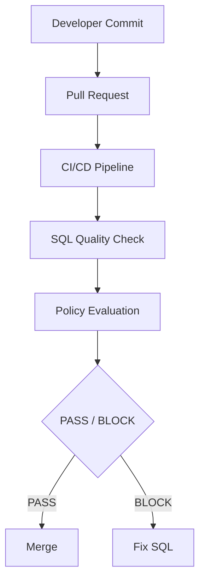
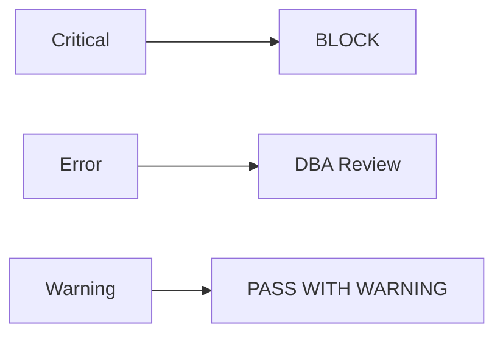

## Audience

DevOps / platform engineering teams, DBAs, and engineering leads — the teams responsible for wiring SQL quality control into the delivery pipeline.

## Problem

Application code already has unit tests, code scanning, security checks, and CI/CD — but database SQL in many organizations is still reviewed manually by DBAs. As teams scale and release cadence increases, three problems emerge:

1. The DBA becomes a delivery bottleneck
2. SQL quality check standards are hard to enforce consistently
3. SQL performance problems are found too late

## Goal

Treat SQL like application code — give it an automated quality gate before release, turning manual approval into a repeatable, auditable gate.

## Workflow

Wire PawSQL into the commit and release flow:



## Dependencies

Built from the following capabilities (see each capability page for check items and rewrite logic):

<CardGroup cols={2}>
  <Card title="SQL Quality Check" icon="list-check" href="/en/features/sql-review" />
  <Card title="Query Rewrite" icon="git-compare" href="/en/features/automatic-sql-rewrite" />
  <Card title="Index Recommendation" icon="layers" href="/en/features/index-recommendation" />
  <Card title="Execution Plan Analysis" icon="route" href="/en/features/execution-plan-visualization" />
  <Card title="Performance Validation" icon="gauge" href="/en/features/performance-validation" />
</CardGroup>

## Success Criteria

| Metric | Objective |
|---|---|
| SQL auto-review coverage | Increase |
| Issues found before release | Increase |
| DBA manual review workload | Decrease |
| Average SQL review time | Decrease |
| Critical SQL reaching production | Decrease |
| Production slow SQL from new releases | Decrease |

---

## Policy as Code

The gate's core value is turning a database development standard from a document into executable policy:

```text
Policy
├─ No DELETE / UPDATE without a predicate
├─ No full table scan on large tables
├─ No forbidden DDL
├─ Index naming convention
├─ Maximum affected rows
└─ Database-specific production rules
```

Standards no longer live only in a wiki or a policy document; they run directly in the delivery pipeline.

### Multi-level rules

Large organizations typically need a shared baseline plus per-business differentiation:

- **Group level**: no `DELETE` / `UPDATE` without a predicate
- **Core systems**: high-risk DDL requires DBA approval
- **Internet businesses**: `OFFSET > 100000` flagged as a deep-pagination risk

### Configurable thresholds

Configure the maximum Critical / Warning count, ignorable rules, mandatory-block rules, and per-environment policy — for example a relaxed test environment and a strict production release.

## Decide the Release Action by Severity

Define a consistent severity-to-action mapping:

| Severity | Action |
|---|---|
| Info | Record only |
| Warning | Allow with warning |
| Error | Require confirmation / review |
| Critical | Block pipeline |



## Connect the Gate to Your Pipeline

Integrate via REST API, Webhook, CLI / script, or DevOps platform:

<CardGroup cols={2}>
  <Card title="GitLab CI/CD" icon="git-merge" href="/en/user-guide/cicd/gitlab" />
  <Card title="GitHub" icon="git-merge" href="/en/user-guide/cicd/github" />
  <Card title="Tencent CODING" icon="git-merge" href="/en/user-guide/cicd/coding" />
  <Card title="BlueKing Pipeline" icon="git-merge" href="/en/user-guide/cicd/blueking" />
  <Card title="Jenkins / GitHub Actions via OpenAPI" icon="git-merge" href="/en/user-guide/cicd/openapi-pipeline" />
</CardGroup>

<CardGroup cols={2}>
  <Card title="Explore SQL Quality Check" icon="list-check" href="/en/features/sql-review">
    Review SQL standards, safety, and performance risks in CI/CD.
  </Card>
  <Card title="Explore Query Rewrite" icon="wand-sparkles" href="/en/features/automatic-sql-rewrite">
    Generate equivalent rewrites and index advice automatically.
  </Card>
  <Card title="Learn About Developer SQL Copilot" icon="code" href="/en/use-cases/developer-sql-copilot">
    Get real-time optimization advice while writing SQL.
  </Card>
  <Card title="Request a Demo" icon="plug" href="https://www.pawsql.com">
    Schedule a PawSQL product demo.
  </Card>
</CardGroup>
