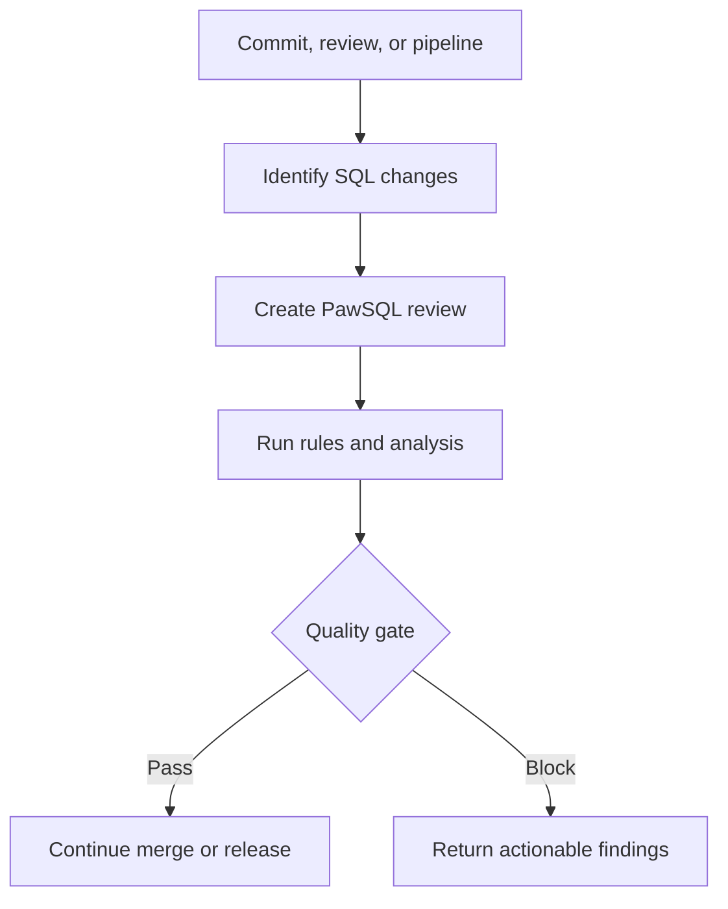

PawSQL can review SQL before a change is merged or released and return a pass, warning, or block decision to the engineering platform. Start by distinguishing a **prebuilt connector** from a **custom API integration**.

## Support matrix

| Integration type | Platform | Delivery model | Availability |
| --- | --- | --- | --- |
| Source repository | Tencent CODING | Prebuilt PawSQL connector | Ready to configure |
| Source repository | GitHub | Prebuilt PawSQL connector | Ready to configure |
| Source repository | GitLab | Prebuilt PawSQL connector | Ready to configure |
| CI/CD pipeline | BlueKing | Prebuilt PawSQL connector | Ready to configure |
| Other repositories or pipelines | Jenkins, GitHub Actions, GitLab CI, Azure Pipelines, and others | OpenAPI or custom adapter | No prebuilt connector |
| Internal engineering platforms | Developer portals, approval systems, and release platforms | OpenAPI, webhook, or custom adapter | No prebuilt connector |

<Info>
  “No prebuilt connector” does not mean the platform cannot integrate with PawSQL. It means your pipeline or integration service must orchestrate the OpenAPI workflow.
</Info>

## Choose a path

<CardGroup cols={2}>
  <Card title="Repository connectors" href="/en/user-guide/cicd/repositories" icon="code-branch">
    Connect CODING, GitHub, or GitLab and review SQL on repository events.
  </Card>
  <Card title="BlueKing pipeline connector" href="/en/user-guide/cicd/blueking" icon="diagram-project">
    Add PawSQL review and a quality gate to a BlueKing pipeline.
  </Card>
  <Card title="OpenAPI pipeline integration" href="/en/user-guide/cicd/openapi-pipeline" icon="code">
    Build a review stage for a CI/CD system without a prebuilt connector.
  </Card>
  <Card title="Custom platform integration" href="/en/user-guide/cicd/unsupported-platforms" icon="puzzle-piece">
    Choose OpenAPI, webhooks, or an integration service for Jenkins, Gitee, CodeArts, and internal platforms.
  </Card>
</CardGroup>

## Standard flow

## Before you begin

Prepare the PawSQL endpoint, an integration identity, the target project, a review workspace, and an approved policy. The workspace must match the database engine and version used by the SQL. Add DDL or a database connection when schema context is required.

<Warning>
  Automated review does not execute SQL or replace business validation, database authorization, change approval, backup, and rollback controls. Complete acceptance testing with sanitized SQL and a non-production environment first.
</Warning>

## Next step

Read the [integration model and core concepts](/en/user-guide/cicd/concepts) and [prerequisites and security](/en/user-guide/cicd/prerequisites), then choose a connector.
