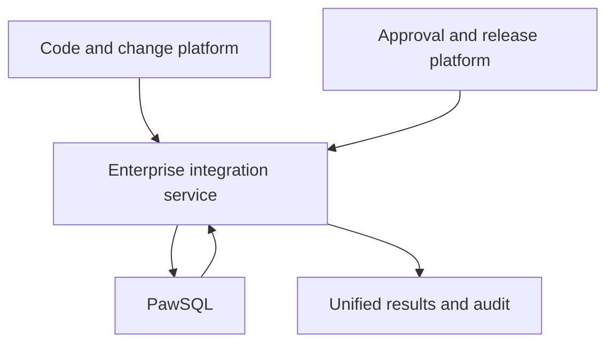

PawSQL does not ship prebuilt connectors for Jenkins, GitHub Actions, GitLab CI, Azure Pipelines, Gitee, Bitbucket, or CodeArts. Any platform that can check out code, protect secrets, issue HTTP requests, and set run status can perform SQL review through PawSQL OpenAPI or an enterprise adapter. Internal engineering portals, approval systems, and release platforms can connect through an integration service.

## Goal

Evaluate CI/CD systems and internal engineering platforms that lack a prebuilt connector, and choose OpenAPI, webhooks, or an enterprise integration service.

## Prerequisites

Confirm the platform can check out code, protect secrets, issue HTTP requests, and set run status.

## Common platform examples

- Jenkins, GitHub Actions, GitLab CI, and Azure Pipelines;
- Gitee and Gitee Go;
- Huawei Cloud CodeArts;
- Bitbucket Pipelines;
- TeamCity or Bamboo;
- Tekton or Argo Workflows;
- internal pipeline engines.

<Info>
  These platforms support a generic integration and are not part of the PawSQL prebuilt connector support list.
</Info>

## Platform capability checklist

| Capability | Minimum requirement |
| --- | --- |
| Code access | Retrieve the current commit and compare baseline and changed files |
| Secret management | Store and mask PawSQL credentials securely |
| HTTP calls | Send authenticated requests and parse JSON responses |
| Job control | Support polling, timeout, and exit codes |
| Result display | Print a summary, archive the report, or set a commit status |

## Choose an integration path

| Scenario | Path | Notes |
| --- | --- | --- |
| Pipeline-initiated review | [OpenAPI pipeline integration](/en/user-guide/cicd/openapi-pipeline) | The runner owns submit, poll, and gate |
| Event-driven repository | [Webhook integration](/en/user-guide/cicd/webhook) | The platform notifies PawSQL through events |
| Internal engineering platform | Enterprise integration service (below) | A service centralizes mapping and audit |

## Internal engineering platforms (integration service)

Large organizations route SQL through internal developer portals, approval systems, and release platforms. Wrap PawSQL OpenAPI in an integration service instead of having each business system store PawSQL credentials and implement gate logic.

### Recommended architecture

### Integration service responsibilities

- Verify caller identity and permissions;
- Map organizations, applications, repositories, environments, workspaces, and policies;
- Extract, segment, and submit SQL;
- Manage asynchronous state, timeouts, and retries;
- Convert results into the enterprise platform's unified risk model;
- Return approval decisions and report links;
- Preserve end-to-end correlation identifiers and audit records.

### Suggested mapping

| Enterprise object | PawSQL object |
| --- | --- |
| Tenant or department | Organization or project boundary |
| Application system | Project, tag, or integration configuration |
| Database environment | Workspace |
| Change type | Review policy |
| Release ticket or work order | External run identity |
| Risk level | Finding severity and gate decision |

### Reliability design

- Use a stable external request ID for idempotency;
- Design job creation and status queries as asynchronous flows;
- Retry transient network errors with bounded backoff;
- Do not auto-retry deterministic errors such as SQL violations or authentication failures;
- Retain the PawSQL job ID to resume an interrupted status query;
- Build compatibility tests for API version upgrades;
- Set split, size, and total processing time limits for large scripts.

### Security boundary

The integration service must not execute SQL with a high-privilege database account. SQL, DDL, and metadata needed for review must be transmitted, masked, and retained according to the enterprise data classification.

<Warning>
  If the platform allows automatic execution of reviewed SQL, keep review and execute as two separate permission domains, and retain manual approval, backup, and rollback controls.
</Warning>

## Expected Result

You select the right integration path — OpenAPI, webhook, or an enterprise integration service — for your platform.

## When to split into a dedicated page

Create a dedicated page only when the platform has a stable connector, a unique configuration interface, or a continuously maintained template. Otherwise maintain the generic pattern and proven examples here to avoid thin, duplicated pages.
