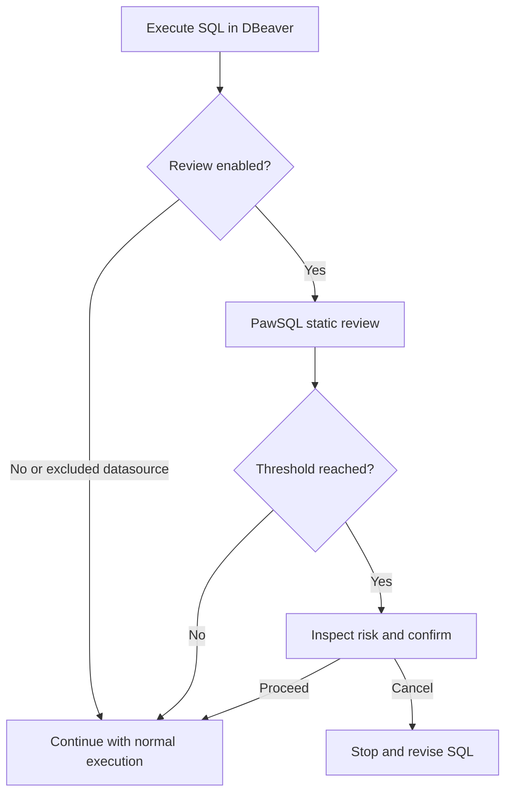

PawSQL Client for DBeaver inserts a review step into the SQL execution path. Before DBeaver sends a statement to the database, the extension requests a static PawSQL review and uses the configured mode and severity threshold to decide whether to proceed, request confirmation, or stop.

## When to use it

- Catch `UPDATE` or `DELETE` statements that lack required safeguards.
- Surface operational risk before running DDL.
- Detect scans, ineffective predicates, and risky joins.
- Apply a consistent pre-execution check to production datasources.
- Give developers immediate feedback on team SQL standards.

## Prerequisites

- A compatible DBeaver installation.
- The official PawSQL DBeaver package or installation endpoint.
- Network access to PawSQL Cloud or PawSQL Server.
- Permission to use the intended project, workspace, and review policy.
- A reliable classification of development, test, and production datasources in DBeaver.

## Install the extension

<Steps>
  <Step title="Obtain the official release">
    Download or access the extension through a PawSQL release channel and read the bundled `INSTALL.md` or version-specific instructions.
  </Step>
  <Step title="Install it in DBeaver">
    Add the package or update site as instructed. Trust only verified PawSQL artifacts and signing information.
  </Step>
  <Step title="Restart DBeaver">
    Save open work and restart the client when prompted.
  </Step>
  <Step title="Verify activation">
    Open Preferences and confirm that **PawSQL Client** settings are available.
  </Step>
</Steps>

<Note>
Installation entry points and compatible versions can change with DBeaver and PawSQL releases. Follow the instructions shipped with the extension package you are installing.
</Note>

## Connect to PawSQL

Under **Preferences > PawSQL Client**, configure the endpoint and authentication required by your deployment. Select or verify the project, workspace, and review policy used for analysis. Test the integration with a read-only statement in a non-production environment before enabling enforcement on production datasources.

<Frame caption="PawSQL Client settings in Preferences">
  Screenshot placeholder · /images/dev-tools/dbeaver-preferences.png
</Frame>

## Choose a review mode

| Mode | Behavior | Typical use |
| --- | --- | --- |
| Off | Keeps DBeaver’s original execution path without a PawSQL pre-check | Temporary disablement or explicitly unmanaged environments |
| Prompt | Asks whether to review, execute directly, or cancel | Individual development and phased adoption |
| Enforce | Reviews automatically and requests confirmation when the threshold is reached | Production access, team standards, and guardrails for new users |

Start with Prompt mode on test datasources to validate policy behavior and latency. Move critical datasources to Enforce mode after the policy and exclusions are reviewed.

## Set the severity threshold

Review findings use the following levels:

| Severity | Typical meaning | Example |
| --- | --- | --- |
| Critical | A condition with potentially severe data or operational impact | Destructive DDL or a critical table change without required safeguards |
| Warning | A condition that normally needs evaluation before execution | A filter that cannot use an effective index |
| Info | A convention or improvement suggestion | `SELECT *` or an unbounded result set |

The threshold determines which levels require confirmation. With **Warning** as the threshold, both `Critical` and `Warning` findings require confirmation, while `Info` findings can proceed.

<Warning>
After changing the threshold, validate the effective behavior with representative SQL. Use the configuration page’s displayed interception scope instead of inferring strictness from the label alone.
</Warning>

## Exclude trusted datasources

Datasource exclusions are intended for environments where pre-execution review is deliberately unnecessary, such as an isolated local database. An excluded datasource follows DBeaver’s normal execution path regardless of the selected review mode.

Before adding an exclusion:

- make sure the name and connection identity uniquely identify the datasource;
- avoid broad naming or matching patterns;
- verify that copied production and staging connections are not excluded accidentally;
- assign an owner and review the exclusion list regularly.

## Execute and review

<Steps>
  <Step title="Run the statement">
    Use the normal execution action in the DBeaver SQL editor.
  </Step>
  <Step title="Wait for static review">
    The extension sends the SQL and required context to PawSQL. This check does not execute the statement or create a candidate index.
  </Step>
  <Step title="Inspect the findings">
    Review the highest severity, triggered rules, affected fragments, and any available rewrite or index guidance.
  </Step>
  <Step title="Make an execution decision">
    Revise and review the SQL again, cancel the operation, or proceed after confirming that the residual risk is acceptable.
  </Step>
</Steps>

<Frame caption="Risk prompt from the pre-execution review">
  Screenshot placeholder · /images/dev-tools/dbeaver-review.png
</Frame>

Proceeding acknowledges the current prompt; it is not a substitute for formal change approval in a controlled environment.

## Pre-execution review versus deep optimization

| Capability | Pre-execution review | Full optimization |
| --- | --- | --- |
| Objective | Identify execution risk quickly | Build and evaluate an optimization candidate |
| Executes the submitted SQL | No | Depends on validation settings |
| Creates What-If indexes | No | May do so when configured and supported |
| Typical output | Rule findings and severity | Review, rewrites, indexes, and performance evidence |

Pre-execution review is intentionally low-latency and side-effect free. Use full optimization when you need plan comparison, index-benefit analysis, or runtime measurements.

## Troubleshooting

| Symptom | Check first |
| --- | --- |
| PawSQL Client is missing from Preferences | Installation status, version compatibility, and whether DBeaver restarted |
| Execution never triggers a review | Review mode, datasource exclusions, and extension status |
| Risky SQL proceeds without a prompt | Threshold, policy, database context, and rule status |
| Review requests fail | PawSQL endpoint, network, TLS trust, authentication, and service health |
| Objects or indexes are misidentified | Workspace, schema resolution, and metadata freshness |
| Review latency disrupts work | Network latency, service load, input size, and script boundaries |

## Rollout guidance

1. Validate connectivity and findings against development or test datasources.
2. Run Prompt mode with representative SQL and collect feedback.
3. Refine the policy, severity threshold, and exclusions.
4. Enable Enforce mode on selected critical datasources.
5. Define bypass, outage fallback, and audit-record requirements.
6. Review exclusions and high-risk dispositions regularly.

## Related documentation

<CardGroup cols={2}>
  <Card title="SQL Review" href="/en/user-guide/sql-audit" />
  <Card title="Review Policy" href="/en/user-guide/sql-audit/select-audit-policy" />
  <Card title="Read Review Results" href="/en/user-guide/sql-audit/read-audit-results" />
  <Card title="Control High-Risk SQL" href="/en/user-guide/sql-audit/high-risk-sql-control" />
</CardGroup>
