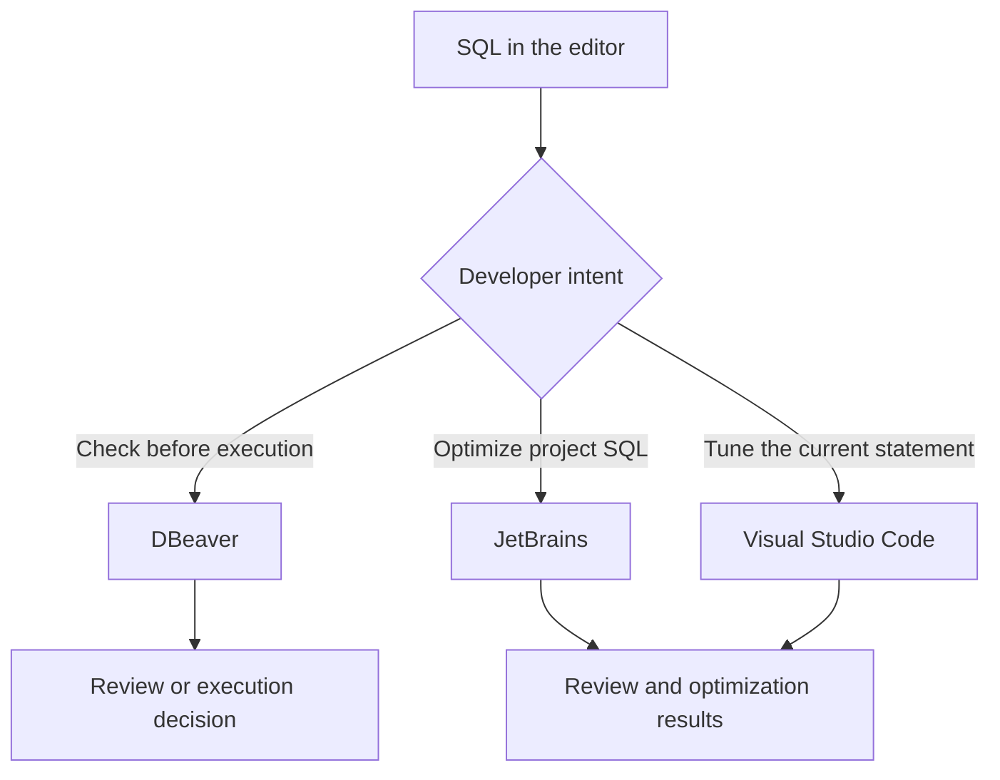

PawSQL Client brings SQL review and optimization into the tools developers already use. Depending on the integration, PawSQL can review a statement before DBeaver executes it or return rewrites, index recommendations, and validation evidence from a code editor.

## Available integrations

| Integration | Environment | Primary workflow |
| --- | --- | --- |
| PawSQL Client for DBeaver | DBeaver | Pre-execution SQL review and risk confirmation |
| PawSQL Client for JetBrains | IntelliJ IDEA, DataGrip, PyCharm, GoLand, WebStorm, PhpStorm, DataSpell, Android Studio, and compatible IntelliJ-based IDEs | Optimize selected SQL, files, or folders |
| PawSQL Client for VS Code | Visual Studio Code | Optimize SQL within source and SQL files |

<Note>
Earlier documentation and some commands use the name **PawSQL Advisor** for the JetBrains plugin. This guide uses **PawSQL Client for JetBrains** for the product family and retains legacy command names where they appear in the interface.
</Note>

## Choose an integration

| Goal | Recommended integration |
| --- | --- |
| Inspect risk immediately before a statement runs in a database client | DBeaver |
| Tune an individual query in DataGrip or IntelliJ IDEA | JetBrains |
| Analyze SQL files, folders, or MyBatis Mapper input in batches | JetBrains |
| Tune SQL in a lightweight editor or polyglot repository | VS Code |
| Expose PawSQL tools to an AI coding environment | Use [PawSQL MCP](/en/user-guide/dev-tools/mcp) |

## How the integrations differ

## How extensions connect to PawSQL

All three extensions connect to PawSQL Cloud or PawSQL Server and operate within the projects and workspaces available to the authenticated user. Installation, endpoint configuration, and commands are documented separately for each platform.

Before you begin, obtain the PawSQL endpoint, an authorized account, and a workspace that represents the target database. See [Authentication](/en/user-guide/installation/authentication) and [Workspaces and Database Context](/en/user-guide/workspaces) for shared concepts.

## In this section

<CardGroup cols={2}>
  <Card title="DBeaver integration" href="/en/user-guide/dev-tools/dbeaver" icon="database">
    Configure pre-execution review, severity thresholds, and datasource exclusions.
  </Card>
  <Card title="JetBrains integration" href="/en/user-guide/dev-tools/jetbrains" icon="code">
    Optimize selected SQL, files, folders, and MyBatis Mapper input.
  </Card>
  <Card title="Visual Studio Code integration" href="/en/user-guide/dev-tools/vscode" icon="code">
    Tune the current statement in source code or a SQL file.
  </Card>
  <Card title="PawSQL MCP" href="/en/user-guide/dev-tools/mcp" icon="bot">
    Optimize SQL through natural language in an MCP-compatible coding assistant.
  </Card>
</CardGroup>

## Shared security boundaries

- Install packages only from a trusted PawSQL release channel and verify the publisher and version.
- Keep credentials in the client’s secure storage and out of source control.
- Match the workspace to the SQL target and deployment environment.
- Exclude a DBeaver datasource only when bypassing pre-execution review is intentional.
- Treat rewritten SQL and index DDL as candidates that require engineering validation.
- Assess resource and locking impact before enabling live execution or What-If validation against production.

<Warning>
An extension does not replace database authorization, change approval, backups, or rollback controls. Use PawSQL results as technical evidence within those processes.
</Warning>

## Next step

Open the guide for your client and complete its platform-specific installation. For the first check, use a sanitized, read-only statement with a predictable result to verify the endpoint, permissions, and workspace.
