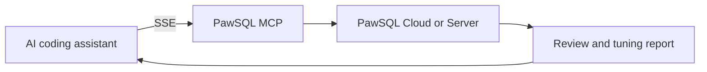

PawSQL MCP makes PawSQL optimization capabilities available as tools inside MCP-compatible coding assistants. From a conversation, a developer can submit a query, attach schema definitions, or select an existing PawSQL workspace and receive query rewrites, index recommendations, execution-plan analysis, and performance findings.

PawSQL MCP is neither an IDE extension nor a replacement for PawSQL Cloud or PawSQL Server. It is enabled exclusively as a remote SSE service and acts as the integration layer between an MCP client and PawSQL.

## How the integration works



| Component | Responsibility |
| --- | --- |
| AI coding assistant | Collects the request and context, invokes MCP tools, and presents the response |
| PawSQL MCP | Translates MCP calls into optimization requests understood by PawSQL |
| PawSQL Cloud or Server | Parses SQL, evaluates rewrites and indexes, and performs validation when the selected environment supports it |
| User | Confirms the context, reviews the evidence, and decides whether a change should be applied |

<Warning>
Treat MCP responses as analysis and recommendations. Do not allow the coding assistant to execute rewritten SQL, `CREATE INDEX`, or other database changes automatically.
</Warning>

## What you can do

- Discover PawSQL workspaces available to your account.
- Analyze a query by supplying only its database type.
- Improve analysis quality by including table definitions, indexes, and constraints.
- Tune SQL against the metadata of an existing workspace.
- Receive query rewrite and index recommendations.
- Inspect execution plans when the workspace has a live database connection.
- Review a detailed report, analysis context, and available performance evidence.

The current public release lists MySQL, PostgreSQL, Oracle, KingbaseES, openGauss, MogDB, GaussDB, and DWS. The effective compatibility set is determined by both the MCP server version and the PawSQL service it connects to.

## Choose the right analysis mode

| Mode | Required context | Best for | Limitation |
| --- | --- | --- | --- |
| Query-only | Database type and SQL | Early development and quick checks | PawSQL cannot see the actual schema or existing indexes |
| DDL-assisted | Database type, DDL, and SQL | Environments where direct database access is unavailable | Quality depends on the completeness and freshness of the DDL |
| Workspace-based | Workspace name or ID and SQL | Metadata-aware tuning, plan analysis, and performance validation | Depends on workspace permissions, connectivity, and validation support |

<Tip>
Prefer a correctly scoped workspace when one is available. Otherwise, include the database product and version together with complete DDL for every referenced table.
</Tip>

## Prerequisites

- You can access PawSQL Cloud, PawSQL Server, or PawSQL Community Edition.
- Your coding assistant supports remote MCP servers over SSE.
- You have received the MCP SSE URL from your PawSQL administrator or service provider.
- You have the authentication details required by the deployment.
- Your PawSQL account can access the intended organization, project, and workspace.
- Corporate network policy permits HTTPS access to the PawSQL MCP SSE service.

## Configure PawSQL MCP

### 1. Obtain the SSE connection details

PawSQL MCP is available only through SSE. Before configuring a client, obtain the following details from your administrator or PawSQL service provider:

| Setting | Purpose | Sensitive |
| --- | --- | --- |
| Service name | Display name in the MCP client; `pawsql` is recommended | No |
| SSE URL | Complete HTTPS URL of the PawSQL MCP SSE endpoint | Usually no |
| Authentication | Credentials or request headers required by the deployment | Yes |
| Network requirements | Internal network, VPN, proxy, certificate, or access-control requirements | No |

<Note>
SSE endpoints may differ across PawSQL Cloud, Server, and Community Edition deployments. Use the complete URL supplied for the target environment; do not infer its port or path from an example.
</Note>

### 2. Register the remote service

Configuration locations and field names vary by client. For clients that use an `mcpServers` object for remote SSE connections, the structure typically looks like this:

```json
{
  "mcpServers": {
    "pawsql": {
      "url": "<pawsql-mcp-sse-url>"
    }
  }
}
```

Replace `<pawsql-mcp-sse-url>` with the actual endpoint. If authentication is required, configure the credentials or request headers according to the instructions for your PawSQL deployment and MCP client.

<Warning>
Never commit SSE credentials, access tokens, or authentication headers to Git, paste them into shared conversations, or distribute them in project templates. Protect authentication values with client secret storage or an approved enterprise secrets solution.
</Warning>

### 3. Reload and verify the connection

<Steps>
  <Step title="Save the configuration">
    Validate the JSON syntax, SSE URL, and authentication settings.
  </Step>
  <Step title="Restart or reload MCP servers">
    Let the client reread the configuration and connect to the PawSQL MCP SSE service.
  </Step>
  <Step title="Confirm tool discovery">
    Open the client's MCP status or tool list and verify that PawSQL is connected.
  </Step>
  <Step title="Run a sanitized test">
    Use a non-production query to confirm dialect selection, workspace discovery, and report delivery.
  </Step>
</Steps>

## Run your first optimization

### Option 1: Supply the query and database type

Use this mode for a quick first pass. Always name the database product and, when relevant, its version.

```text
Use PawSQL to optimize the following query for MySQL 8.0.
Before running the tool, state the database context. Return the rewrite,
index recommendations, and any limitations separately.

SELECT order_id, customer_id, order_date
FROM orders
WHERE customer_id = 1001
ORDER BY order_date DESC;
```

### Option 2: Include schema definitions

When no workspace is available, provide complete table definitions, indexes, and constraints for the objects used by the query.

```text
Optimize this query for MySQL 8.0 using the DDL below.
Do not execute any DDL. Return recommendations and explain the evidence.

CREATE TABLE orders (
  order_id BIGINT PRIMARY KEY,
  customer_id BIGINT NOT NULL,
  order_date DATETIME NOT NULL
);

SELECT order_id, customer_id, order_date
FROM orders
WHERE customer_id = 1001
ORDER BY order_date DESC;
```

### Option 3: Use a PawSQL workspace

Ask the assistant to list available workspaces first, then identify the target by name or ID.

```text
Optimize the query below in workspace <workspace-name-or-id>.
Confirm the workspace and database type before calling PawSQL. Return the
rewrite, index recommendations, execution-plan changes, and validation result.

SELECT order_id, customer_id, order_date
FROM orders
WHERE customer_id = 1001
ORDER BY order_date DESC;
```

<Note>
If workspace names are similar, use the workspace ID and verify the organization, project, database type, and environment before the call. Never infer production or test scope from a name alone.
</Note>

## Review the response

Use the following order to avoid accepting a plausible-looking result with the wrong context:

1. **Analysis environment** — database product, version, workspace, and schema.
2. **Resolved objects** — tables, columns, indexes, and constraints.
3. **Query rewrite** — predicates, joins, aggregation, ordering, null behavior, and duplicate-row semantics.
4. **Index advice** — overlap with existing indexes, key order, write overhead, and storage impact.
5. **Execution plan** — access paths, join methods, estimated rows, and cost.
6. **Performance evidence** — measured or estimated results and the representativeness of test parameters.
7. **Detailed report** — retain the report link or exported evidence for review and traceability.

## Apply recommendations safely

<Steps>
  <Step title="Prove semantic equivalence">
    Compare the original and rewritten query with boundary values, nulls, duplicates, and representative business data.
  </Step>
  <Step title="Assess index impact">
    Check for redundant indexes, DML overhead, storage requirements, locking, and database-specific online build options.
  </Step>
  <Step title="Validate outside production">
    Test repeatedly with realistic data volumes, parameter distributions, and statistics.
  </Step>
  <Step title="Complete change review">
    Put query and index changes through code review, database change approval, and rollback planning.
  </Step>
  <Step title="Release under observation">
    Monitor latency, throughput, resource usage, and plan stability after deployment.
  </Step>
</Steps>

## Troubleshooting

### PawSQL tools do not appear

Check the JSON syntax, configuration location, remote SSE support in the client, and whether the client was reloaded after the change.

### The SSE connection fails or repeatedly disconnects

Confirm that the complete SSE URL and protocol are correct. Then review DNS, TLS certificates, proxy or VPN settings, gateway idle timeouts, and firewall policy. Do not substitute the regular PawSQL web URL for the MCP SSE endpoint.

### PawSQL is unreachable

Review the SSE URL, TLS certificates, proxy settings, and network policy. For an enterprise deployment, confirm that the client can resolve and reach the internal hostname.

### Authentication fails

Verify that the authentication values match the SSE service requirements, then check credential expiry, account status, and workspace access. Never paste live credentials into logs or support tickets.

### The intended workspace is missing

Check organization and project membership, workspace permissions, and workspace status. Confirm that the MCP server points to the PawSQL environment where the workspace was created.

### The response has no plan or validation evidence

Execution-plan analysis and performance validation generally require a database-connected workspace with those capabilities enabled. Query-only and DDL-assisted requests are primarily static analyses.

### The recommendation uses the wrong dialect

Resubmit the request with an explicit database product, version, schema, or workspace. For DDL-assisted analysis, ensure the schema definitions are complete and current.

## PawSQL MCP compared with client extensions

| Area | PawSQL MCP | IDE and database client extensions |
| --- | --- | --- |
| Interaction | Natural-language requests and MCP tool calls | Editor commands, menus, or pre-execution interception |
| Host tools | MCP-compatible coding assistants | DBeaver, JetBrains IDEs, and Visual Studio Code |
| Context source | Prompt, DDL, or PawSQL workspace | Editor selection, file, project, or data source |
| Orchestration | The client may plan and combine tool calls | The user normally starts a predefined action |
| Shared boundary | Results require human review and must not bypass database change control | Results require human review and must not bypass database change control |

## Next steps

<CardGroup cols={2}>
  <Card title="Workspaces and database context" href="/en/user-guide/workspaces" icon="database" />
  <Card title="Read optimization recommendations" href="/en/user-guide/optimization/explain-output" icon="list-check" />
  <Card title="Validate performance" href="/en/user-guide/optimization/apply-suggestions" icon="gauge-high" />
  <Card title="IDE and database client integrations" href="/en/user-guide/dev-tools" icon="code" />
</CardGroup>

## Related resources

- [PawSQL MCP source repository](https://github.com/PawSQL/pawsql-mcp)
