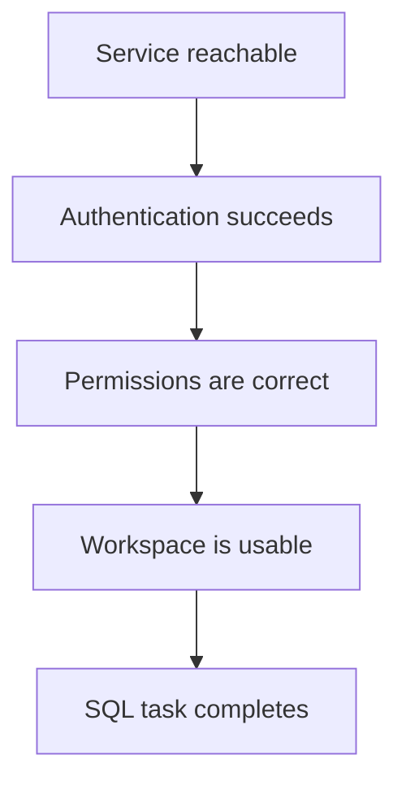

A successful page load is not a complete installation test. Validate the chain in order: service, identity, permissions, workspace context, and SQL task processing.

## 1. Service access

- [ ] The expected URL opens.
- [ ] TLS is trusted and the hostname matches.
- [ ] No proxy, gateway, or browser error appears.
- [ ] IDE and MCP hosts can reach the same endpoint.
- [ ] PawSQL Server operators confirm that required services are healthy.

## 2. Authentication

- [ ] A web user can sign in.
- [ ] The displayed account is correct.
- [ ] Client credentials are active and unexpired.
- [ ] Authentication errors do not disclose credentials in logs.

## 3. Authorization

- [ ] The intended organization and project are visible.
- [ ] Menus match the test user’s role.
- [ ] The user can view or create a test workspace.
- [ ] The user can create an SQL optimization task.
- [ ] Restricted administrative features remain unavailable to standard users.

<Tip>
Successful sign-in with missing resources is usually an authorization issue. A complete sign-in failure points to authentication or connectivity.
</Tip>

## 4. Workspace context

- [ ] Database engine and version are correct.
- [ ] DDL import or database connection testing succeeds.
- [ ] Required schemas, tables, and columns are visible.
- [ ] Index metadata is present where required.
- [ ] The test account can use the workspace.

## 5. SQL analysis

<Steps>
  <Step title="Select a non-production workspace">Verify engine, version, and schema.</Step>
  <Step title="Submit a sanitized query">Use a complete read-only statement.</Step>
  <Step title="Wait for completion">Confirm normal queued, running, and completed states.</Step>
  <Step title="Inspect the result">Verify parsing, object resolution, and result details.</Step>
  <Step title="Record acceptance evidence">Capture version, workspace, task ID, date, and outcome.</Step>
</Steps>

## Client-specific checks

<Tabs>
  <Tab title="IDE">
    - Extension enabled and compatible
    - Connection test successful
    - Project and workspace selectable
    - Selected SQL returns results
  </Tab>
  <Tab title="MCP">
    - MCP process starts
    - PawSQL tools are discoverable
    - The correct service identity is used
    - A sanitized tool call succeeds
  </Tab>
  <Tab title="API">
    - Authentication succeeds
    - A test task can be created
    - Task status and results can be retrieved
    - Errors do not expose secrets
  </Tab>
</Tabs>

## Diagnostic map

| Symptom | Investigate first |
| --- | --- |
| Page unavailable | Service, URL, DNS, proxy, firewall, TLS |
| Sign-in failure | Account, identity provider, system time, environment |
| No menus | Role, project, entitlement, feature enablement |
| Client connection failure | Endpoint, token, proxy, certificate trust |
| No workspace | Membership, permissions, project scope |
| Parsing failure | Dialect, version, statement completeness, placeholders |
| Objects unresolved | Schema, DDL, metadata refresh, identifier case |
| Task remains queued | Analysis service, queue, concurrency, resources |

<Warning>
Acceptance records must not include passwords, complete tokens, connection strings, or unsanitized production SQL.
</Warning>

## Next steps

<CardGroup cols={2}>
  <Card title="Create a workspace" href="/en/user-guide/workspaces/index" />
  <Card title="One-minute SQL optimization" href="/en/getting-started/quickstart" />
  <Card title="Troubleshooting" href="/en/faq" />
</CardGroup>
