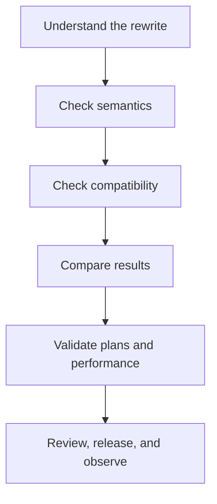

PawSQL rewrites are optimization candidates. Adoption requires three independent checks: the statement still means the same thing, it is valid for the target database, and it delivers a meaningful improvement under representative conditions.

## Understand the candidate

Identify the rule, changed query region, required constraints or engine features, known exclusions, and any validation evidence already available. If the workspace lacks keys, types, or constraints used by the rule, correct the context before deciding.

## Semantic checklist

| Area | Verify |
| --- | --- |
| Projection | Column count, order, aliases, and data types |
| Row set | Duplicate preservation or elimination |
| `NULL` | Three-valued logic, comparisons, and aggregate behavior |
| Joins | Join type, unmatched rows, and predicates |
| Filters | Predicate scope and evaluation position |
| Aggregation | Grouping keys, aggregate functions, and HAVING semantics |
| Ordering and pagination | Determinism, row limits, and offsets |
| DML | Target object, affected rows, and assigned values |

<Warning>
Apply additional scrutiny to `NULL`, outer joins, duplicates, nondeterministic functions, implicit conversions, and data-modification statements.
</Warning>

## Compatibility checklist

- Target engine and version support the syntax.
- Functions and conversions preserve equivalent behavior.
- Identifier quoting and case behavior remain correct.
- Pagination, locking, hints, and vendor-specific clauses are preserved where required.
- Distribution keys and data movement remain acceptable in distributed systems.
- The application framework accepts the new query and placeholder layout.

## Validate results

Test empty, single-row, multi-row, duplicate, `NULL`, boundary-date, boundary-number, and parameter-selectivity cases. For queries, compare row counts, key columns, set differences, or checksums. Validate DML only in an isolated or safely reversible environment.

## Validate performance

Use the same engine, data, statistics, parameters, session settings, and comparable cache state. Compare plans, estimates, runtime, scanned rows, CPU, I/O, temporary work, and distributed data movement. One faster execution is not a stable result.

## Apply to source code

<Steps>
  <Step title="Copy the complete candidate">Verify that no clause or delimiter was truncated.</Step>
  <Step title="Restore application binding">Preserve placeholder types and parameter order.</Step>
  <Step title="Submit for review">Include original SQL, rule, test evidence, and rollback.</Step>
  <Step title="Test and release">Run functional, regression, and performance validation.</Step>
  <Step title="Observe production">Monitor latency, errors, resources, and plan stability.</Step>
</Steps>

## Do not adopt when

- parsing or object resolution is incomplete;
- workspace context does not match the target;
- the rewrite condition cannot be explained;
- result-equivalence testing fails;
- benefit appears only for an unrepresentative parameter;
- the framework does not support the new form;
- the release has no safe observation and rollback plan.

## Next steps

<CardGroup cols={2}>
  <Card title="Validate performance" href="/en/user-guide/optimization/verify-result" />
  <Card title="Compare execution plans" href="/en/user-guide/optimization/compare-plans" />
  <Card title="Optimizer rules" href="/en/reference/optimizer-rules/index" />
  <Card title="History and export" href="/en/user-guide/optimization/history-export" />
</CardGroup>
