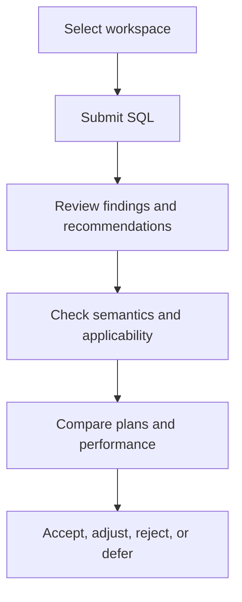

PawSQL combines parsing, quality checks, automatic rewrite, index recommendation, execution-plan analysis, and performance validation in a traceable workflow. Tasks can originate from the web console, IDE extensions, PawSQL MCP, or the API.

## Workflow

<Steps>
  <Step title="Establish context">Match the target engine, version, schema, and metadata.</Step>
  <Step title="Submit SQL">Provide a complete statement and any representative parameter context.</Step>
  <Step title="Review the evidence">Inspect findings, rewrites, index candidates, and plan observations together.</Step>
  <Step title="Validate correctness and value">Confirm semantic equivalence, compatibility, and measurable benefit.</Step>
  <Step title="Record the decision">Preserve acceptance status, rationale, evidence, owner, and rollback path.</Step>
</Steps>

## Pages in this section

<CardGroup cols={2}>
  <Card title="Optimize a SQL statement" href="/en/user-guide/optimization/submit-sql" />
  <Card title="Read recommendations" href="/en/user-guide/optimization/review-suggestions" />
  <Card title="Apply a SQL rewrite" href="/en/user-guide/optimization/apply-rewrite" />
  <Card title="Apply an index recommendation" href="/en/user-guide/optimization/apply-index" />
  <Card title="Validate performance" href="/en/user-guide/optimization/verify-result" />
  <Card title="Compare execution plans" href="/en/user-guide/optimization/compare-plans" />
  <Card title="History and export" href="/en/user-guide/optimization/history-export" />
</CardGroup>

## Choose an entry point

| Entry point | Best suited for | Strength |
| --- | --- | --- |
| Web console | Ad hoc or complex analysis | Full result inspection and export |
| IDE extension | Development-time feedback | Analysis without leaving the editor |
| PawSQL MCP | AI-assisted coding workflows | Structured tool invocation with development context |
| API | Automation and platform integration | Repeatable, orchestrated execution |

## Adoption criteria

| Dimension | Question |
| --- | --- |
| Semantic correctness | Does the candidate preserve the required result and behavior? |
| Compatibility | Does the target engine and version support it? |
| Performance | Do plans, cost, or measured metrics improve? |
| Operational cost | What changes in writes, storage, locking, and maintenance? |
| Release risk | Are testing, review, rollout, observation, and rollback ready? |

<Warning>
Generated SQL and index DDL are candidates, not production deployment instructions. Validate every change through your organization’s engineering and release controls.
</Warning>

## Next steps

- Configure analysis context in [Workspaces and Database Context](/en/user-guide/workspaces).
- Review the capabilities behind [Automatic SQL Rewrite](/en/features/automatic-sql-rewrite) and [Index Recommendation](/en/features/index-recommendation).
- Consult [Optimizer Rules](/en/reference/optimizer-rules/index) for rule-level behavior.
