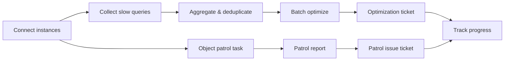

The Performance Patroller continuously collects slow queries and patrols database objects on connected instances, turning scattered performance problems into a measurable, trackable, batch-optimizable governance backlog. It is separate from the single-SQL optimization flow on the Optimize platform and targets the ongoing governance of hundreds of slow SQL and object defects across an instance.

<Frame caption="Performance Patroller overview: instance metrics, 7-day slow SQL, and database patrol Top 5">
  
</Frame>

## Governance workflow

Connecting database instances is the starting point, followed by two tracks — Slow query governance and Object patrol — converging on progress tracking:

<Steps>
  <Step title="Connect database instances">
    Add an instance, fill in connection details, and complete slow query and patrol configuration.
  </Step>
</Steps>

### Slow query governance

<Steps>
  <Step title="Collect slow queries">
    Collect slow SQL from the database slow query log, manually or on a schedule.
  </Step>
  <Step title="Aggregate and deduplicate SQL">
    Aggregate collected SQL by structure, filter to business SQL, and form the governance backlog.
  </Step>
  <Step title="Batch analyze and optimize">
    Run optimization or AI optimization on selected slow SQL to generate rewrite and index recommendations.
  </Step>
  <Step title="Create an optimization ticket">
    Bundle selected slow SQL into an optimization ticket, configure settings, and submit for tracking.
  </Step>
</Steps>

### Object patrol

<Steps>
  <Step title="Object patrol task">
    Assign a patrol template to the instance and patrol database objects manually or on a schedule.
  </Step>
  <Step title="Patrol task report">
    Review risk distribution and top issues from the database-object perspective.
  </Step>
  <Step title="Create a patrol issue ticket">
    Bundle objects with anomalies into a remediation ticket.
  </Step>
</Steps>

Track governance progress runs throughout: track each SQL and object via optimization status, disposition stage, and performance improvement.

## Core objects

| Object | Purpose |
| --- | --- |
| Instance | A connected target database with connection info, slow query threshold, and patrol template config |
| Slow query | SQL collected and aggregated from the slow query log, with latency, execution count, and governance status |
| Patrol template | Defines the audit rules and severities applied during patrol |
| Database object | Tables in the instance, with column count, row count, index count, and patrol anomalies |
| Patrol report | Summarizes object count, severity distribution, and top rules/objects |
| Optimization ticket | A trackable optimization record bundling a batch of slow SQL with optimization settings |
| Patrol issue ticket | A trackable remediation record bundling objects with patrol findings |

## In this section

### Onboarding and tracking

<CardGroup cols={2}>
  <Card title="Connect Database Instances" href="/en/user-guide/performance/connect-instance" />
  <Card title="Track Governance Progress" href="/en/user-guide/performance/track-progress" />
</CardGroup>

### Slow query governance

<CardGroup cols={2}>
  <Card title="Collect Slow Queries" href="/en/user-guide/performance/collect-slow-sql" />
  <Card title="SQL Aggregation and Deduplication" href="/en/user-guide/performance/aggregate-dedup" />
  <Card title="Batch Analysis and Optimization" href="/en/user-guide/performance/batch-optimize" />
  <Card title="Create an Optimization Ticket" href="/en/user-guide/performance/create-optimize-ticket" />
</CardGroup>

### Object patrol

<CardGroup cols={2}>
  <Card title="Object Patrol Task" href="/en/user-guide/performance/patrol-task" />
  <Card title="Patrol Task Report" href="/en/user-guide/performance/reports" />
  <Card title="Create a Patrol Issue Ticket" href="/en/user-guide/performance/create-patrol-ticket" />
</CardGroup>

## Start by role

| Role | Recommended pages | Main responsibilities |
| --- | --- | --- |
| DBA | Instance onboarding, patrol reports | Maintain connections and patrol templates, judge structural risk |
| Performance engineer | Slow queries, batch optimization | Analyze slow SQL, run batch optimization, track improvement |
| Developer | Slow queries, governance progress | Handle slow SQL and object defects owned by the team |
| Project admin | Instance overview, configuration | Maintain instance list, collection/patrol schedules, and team ownership |

## Before you start

- The target database is reachable from the PawSQL server (connection validation runs server-side);
- You have the host, port, username, password, and target database name;
- The database slow query log is enabled and readable before collecting slow SQL;
- The patrol template matches the target database type;
- Your account has permission to add instances and view patrol data.

<Warning>
Patrol and optimization recommendations assist analysis; they do not replace business review, test validation, backup, approval, or release controls.
</Warning>

## Related reading

- Single-SQL optimization on the Optimize platform: [Optimization workflow](/en/user-guide/optimization/)
- Audit rule definitions: [Audit rules](/en/reference/audit-rules/)
- Database context: [Workspaces and context](/en/user-guide/workspaces/)
