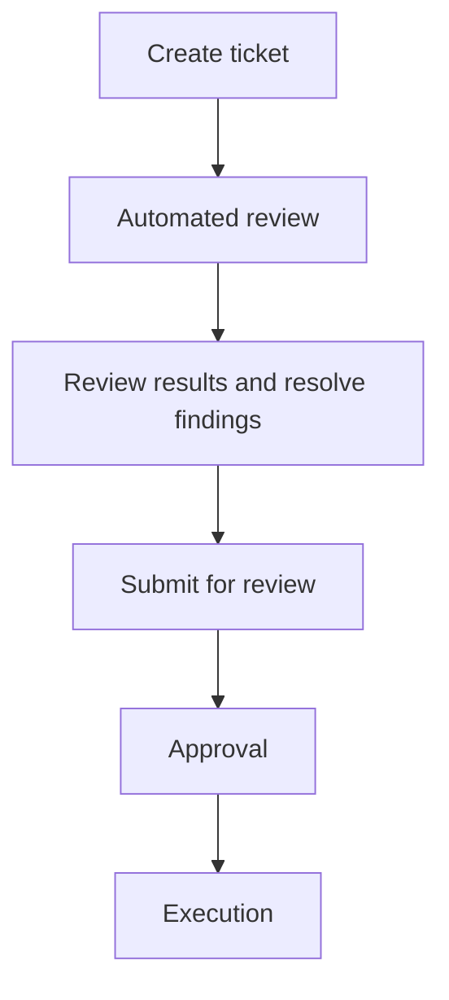

PawSQL SQL Review applies database-aware static analysis and policy checks before SQL reaches a target environment. Each review produces structured findings with severity, rule context, affected objects, and recommended action—giving developers, DBAs, and release teams a shared basis for remediation and approval.

## Review lifecycle

A ticket moves through the following states from creation to execution:

To complete your first review, follow these operating steps (the first three prepare the inputs to ticket creation):

<Steps>
  <Step title="Define the review target">
    Identify the database engine, version, project, and environment where the SQL will run.
  </Step>
  <Step title="Choose a policy">
    Select a policy built for the target database and verify its rules, severities, and thresholds.
  </Step>
  <Step title="Prepare SQL and context">
    Paste statements or upload a script, and attach a workspace when object metadata is needed.
  </Step>
  <Step title="Create the review ticket">
    Fill in the title and priority, submit, and wait for the automated review to finish.
  </Step>
  <Step title="Resolve and disposition findings">
    Address the highest-risk items first, run the review again, and document any accepted exceptions.
  </Step>
  <Step title="Submit for review and approval">
    Submit the ticket for human review, have an approver decide, and track execution through the execution records after approval.
  </Step>
</Steps>

## Key concepts

| Concept | Purpose |
| --- | --- |
| Review ticket | Captures the submitted SQL, review configuration, status, and results |
| Review policy | Defines enabled rules, severity assignments, and configurable thresholds |
| Workspace | Supplies the engine, version, schema scope, and database object metadata |
| Finding | Identifies the rule, risk, source location, and affected database objects |
| Review report | Summarizes statement coverage, risk distribution, rule activity, and disposition |

<Note>
This guide uses **review policy** throughout. The interface's navigation and form display **review template**, and the template page's create button reads **create rule template**—all the same reusable collection of rules, severities, thresholds, and exceptions.
</Note>

## In this section

### Run a review

<CardGroup cols={2}>
  <Card title="Create a review ticket" href="/en/user-guide/sql-audit/create-review-task" />
  <Card title="Read review results" href="/en/user-guide/sql-audit/read-audit-results" />
  <Card title="Resolve findings" href="/en/user-guide/sql-audit/resolve-findings" />
  <Card title="Manual review and approval" href="/en/user-guide/sql-audit/manual-review-and-approval" />
  <Card title="History, reports, and export" href="/en/user-guide/sql-audit/history-reports-and-export" />
</CardGroup>

### Configuration and governance

<CardGroup cols={2}>
  <Card title="Review policy" href="/en/user-guide/sql-audit/select-audit-policy" />
  <Card title="Workspace and review context" href="/en/user-guide/sql-audit/configure-review-context" />
  <Card title="Control high-risk SQL" href="/en/user-guide/sql-audit/high-risk-sql-control" />
</CardGroup>

## Recommended paths by role

| Role | Start with | Primary objective |
| --- | --- | --- |
| Developer | Create a ticket, submit SQL, resolve findings | Catch issues before code review or release |
| DBA | Policy, context, and result interpretation | Assess database impact and remediation options |
| Reviewer | High-risk control and manual approval | Govern exceptions and make release decisions |
| Project administrator | Policies, permissions, and reports | Maintain standards and an auditable process |

## Before you begin

- Confirm the target database engine and version.
- Use a review policy designed for that database.
- Verify script encoding, dialect, and statement delimiters.
- Prepare a workspace when the review depends on object metadata.
- Remove or mask sensitive values in SQL, DDL, comments, and logs.
- Confirm that your account can create and view review tickets.

<Warning>
Automated review improves coverage and consistency. It does not replace business validation, testing, backup planning, change approval, or rollback preparation.
</Warning>

## Related resources

- Product capability: [SQL Review](/en/features/sql-review)
- Rule reference: [Review Rules](/en/reference/audit-rules/)
- Database metadata: [Workspaces and Database Context](/en/user-guide/workspaces/)
- Automated enforcement: [SQL Quality Gate for CI/CD](/en/use-cases/sql-quality-gate-cicd)
