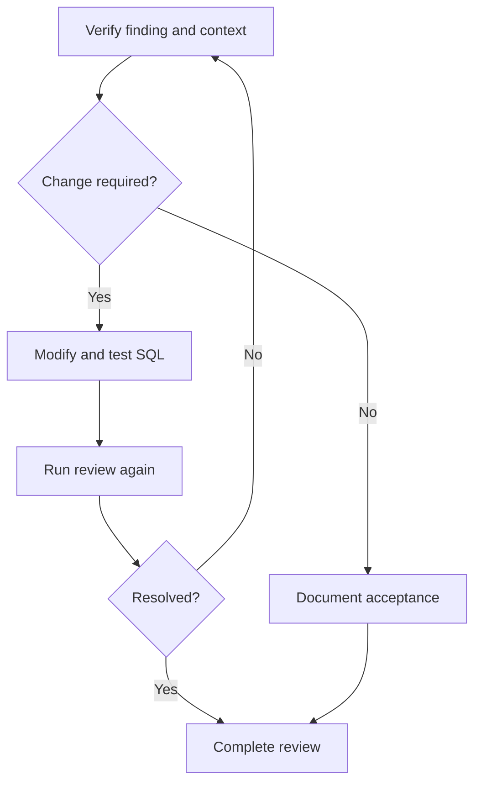

The goal of remediation is not merely to reduce the number of findings. Each decision should remove or consciously accept the underlying risk, preserve required SQL behavior, and leave enough evidence for another reviewer to understand the outcome.

## Goal

Investigate, remediate, re-review, and document SQL findings so that each risk is removed or consciously accepted with evidence.

## Prerequisites

A review ticket with findings to resolve, and access to modify and re-review the SQL.

## Remediation loop

## Work through a finding

<Steps>
  <Step title="Verify the trigger">
    Read the rule, SQL location, and related objects. Confirm the database version and workspace context.
  </Step>
  <Step title="Assess actual impact">
    Determine whether the issue affects correctness, performance, security, maintainability, or release safety.
  </Step>
  <Step title="Choose a disposition">
    Modify the SQL, correct incomplete context, fix ticket configuration, or request an authorized exception.
  </Step>
  <Step title="Validate the change">
    Test semantics and, where appropriate, performance so that results and data effects remain correct.
  </Step>
  <Step title="Run the review again">
    Reuse the same policy and workspace unless a deliberate revision is part of the change. Compare the new result with the original.
  </Step>
  <Step title="Record the outcome">
    Preserve the change, evidence, residual risk, owner, and related ticket or approval.
  </Step>
</Steps>

## Common dispositions

| Situation | Recommended response |
| --- | --- |
| SQL genuinely violates the rule | Correct it, test it, and request re-review |
| Missing metadata caused a misleading result | Refresh the workspace and run the review again |
| The wrong database version was selected | Correct the target configuration and repeat the review |
| A rule does not apply to this case | Document the technical basis and use the exception process |
| One issue repeats across many statements | Fix the shared pattern in controlled batches and sample the results |
| A recommendation may change semantics | Do not apply it automatically; obtain developer and DBA review |

## Validate remediated SQL

Confirm at least the following:

- the target database can parse the SQL;
- query results or data-change semantics remain correct;
- transaction, locking, and concurrency behavior is acceptable;
- index or rewrite candidates provide value under representative conditions;
- the original issue is gone and no new high-risk finding has appeared;
- required testing, approval, deployment, and rollback controls are complete.

<Warning>
Do not deploy generated or recommended SQL without validation. DDL, wide-impact DML, locking-sensitive changes, and data repair must follow your organization’s database change process.
</Warning>

## Accept a finding as an exception

When remediation is not appropriate, use the exception process in [Manual Review and Approval](/en/user-guide/sql-audit/manual-review-and-approval): record the business rationale, impact, and compensating controls, and keep the exception to the narrowest scope. Do not weaken a global policy to accommodate one isolated case.

## Remediate at scale

- Prioritize by severity, system criticality, and execution frequency.
- Group findings by rule to expose reusable fixes.
- Change SQL in small batches with regression coverage.
- Compare risk distribution and performance evidence before and after remediation.
- Feed proven patterns back into engineering standards and review policies.

## Expected Result

After remediation and re-review, the resolved findings no longer trigger, no new high-risk finding appears, and the outcome is recorded with evidence.

## Next steps

For blocking issues, see [Control High-Risk SQL](/en/user-guide/sql-audit/high-risk-sql-control). When a person must make the final disposition, continue to [Manual Review and Approval](/en/user-guide/sql-audit/manual-review-and-approval).
