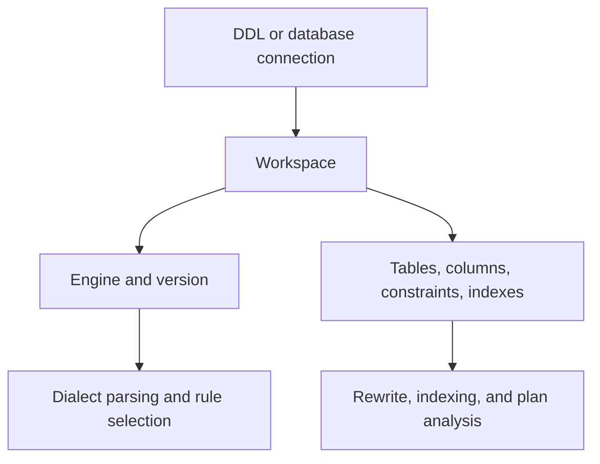

A workspace is the primary container for SQL analysis context in PawSQL. It records the database engine, version, schema scope, and available metadata—such as tables, columns, constraints, and indexes—used by review, rewrite, index recommendation, plan analysis, and validation features.

<Note>
A workspace is not a business database. Creating one does not create, modify, or delete objects in the target database.
</Note>

## Goal

Build the database context PawSQL needs for SQL review and optimization using DDL or a live database connection.

## Prerequisites

To create a workspace you need either the DDL definitions or a database connection that provides the engine, version, schema, and object metadata used for analysis.

## How a workspace participates in analysis



The same SQL can parse and optimize differently under a different engine, version, schema, or index set. Confirm that the selected workspace matches the environment where the SQL actually runs.

## Two ways to create a workspace

| Consideration | DDL | Database connection |
| --- | --- | --- |
| Direct database access | Not required | Required |
| Metadata source | User-supplied definitions | Target database |
| Refresh model | Reimport or edit DDL | Resynchronize |
| Existing indexes | Must be included in DDL | Retrieved when permitted |
| Statistics and online plans | Usually limited | Depends on database and permissions |
| Best suited for | Isolated or limited analysis | Ongoing governance and richer validation |

By scenario:

| Scenario | Recommended source |
| --- | --- |
| One-off analysis | DDL |
| Database is isolated from PawSQL | DDL |
| Credentials cannot be provided | DDL |
| No deployed database yet, but design-stage DDL exists | DDL |
| A separate context for demos, training, or testing | DDL |
| Team repeatedly analyzes the same database | Database connection |
| Schema and index changes should be synchronized | Database connection |
| Online plans or validation are required | Database connection with approved permissions |

For a quick one-off analysis, a DDL workspace is usually enough; for ongoing review, batch governance, or performance validation, prefer a database connection. Steps are in [Create from DDL](/en/user-guide/workspaces/create-from-ddl) and [Create from a database](/en/user-guide/workspaces/create-from-database).

## Configuration guidance

Use names that distinguish the system, database, and environment:

```text
orders-mysql-test
customer-oracle-production
warehouse-hive-development
```

Avoid generic names such as `database-1` or `test`.

| Field | Recommendation |
| --- | --- |
| Name | Include system, database, and environment |
| Description | Record purpose, source, and owner |
| Engine | Match the real database product |
| Version | Use the deployed version, not a default latest version |
| Default schema | Select the schema for unqualified names |
| Metadata scope | Include only what the project needs |

## Expected Result

A workspace configured with the correct engine, version, schema, and imported metadata that PawSQL uses for review, rewrite, index, and plan analysis.

## Verification

Confirm the workspace matches the target environment by checking that the engine, version, schema, and imported metadata reflect where the SQL actually runs; creation steps are in the create-from-ddl and create-from-database guides.

## Operating principles

- Refresh metadata after structural changes.
- Review task and user dependencies before retiring a workspace.
- Validate any proposed database change in the real target conditions.

## Next steps

<CardGroup cols={2}>
  <Card title="Create from DDL" href="/en/user-guide/workspaces/create-from-ddl" />
  <Card title="Create from a database" href="/en/user-guide/workspaces/create-from-database" />
  <Card title="SQL optimization" href="/en/user-guide/optimization" />
  <Card title="Supported databases" href="/en/getting-started/supported-databases" />
</CardGroup>
