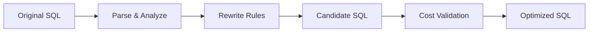

PawSQL 自动化重新优化通过 SQL 解析、语义分析与优化规则，将低效 SQL 自动转换为语义等价、但更有利于数据库优化器生成高效执行计划的形式。

与仅输出文字建议不同，PawSQL 的目标是直接生成可执行的优化 SQL，并进一步通过性能验证判断重写是否有效。


## 概览

SQL 性能问题往往并不是“数据库没有索引”，而是 SQL 结构本身限制了优化器可选择的执行路径。

例如：

- 相关子查询重复执行
- 谓词无法下推
- OR 条件导致索引利用率下降
- 不必要的 DISTINCT 或 GROUP BY
- 深分页产生大量扫描与排序
- 分布式数据库中发生跨分片数据移动

Automatic SQL Rewrite 针对这些结构性问题自动寻找等价改写方案。



## 为什么 SQL 重写很重要

数据库优化器能够在给定 SQL 表达式范围内寻找最优执行计划，但不会总是主动改变 SQL 的业务表达形式。

某些 SQL 写法从语义上等价，却会产生完全不同的优化空间。

PawSQL 的 SQL Rewrite 用于扩展优化器可利用的搜索空间。

## 核心能力

### 子查询重写

针对 IN、EXISTS、Scalar Subquery 等结构进行分析，寻找更适合目标数据库执行的等价形式。

### 谓词优化

优化 WHERE / JOIN 条件，包括：

- Predicate Pushdown
- 恒等条件与冗余条件消除
- OR 条件改写
- 表达式简化
- 可索引条件恢复

### Join 优化

识别并处理：

- 冗余 Join
- Join Elimination
- Join 顺序相关结构问题
- 可转化的子查询 Join
- 分布式环境中的跨分片 Join 风险

### 聚合优化

针对 DISTINCT、GROUP BY、COUNT、MIN/MAX 等聚合结构进行改写或简化。

### 分页优化

对 OFFSET / LIMIT 等深分页场景生成更适合大数据量访问的改写方案。

### 分布式 SQL 优化

针对分布式数据库进一步考虑：

- 分布键
- 数据移动
- 跨节点 Join
- 复制表 / 广播表
- Global / Local Index

### 大数据 SQL 优化

针对 Hive 等大数据 SQL 场景分析：

- Partition Pruning
- Bucket Join
- Data Skew
- COUNT DISTINCT
- GROUP BY Skew
- Window Skew
- Global Sort

## 示例

原始 SQL：

```sql
SELECT *
FROM orders
WHERE customer_id = 100
   OR customer_id = 200
   OR customer_id = 300;
```

可能的等价重写：

```sql
SELECT *
FROM orders
WHERE customer_id IN (100, 200, 300);
```

实际是否采用该重写，需要结合数据库类型、索引、数据分布和执行计划进一步判断。

这也是 PawSQL 与静态“改写模板”的区别：**重写只是候选方案，验证决定最终价值。**

## 语义安全性

SQL 重写首先必须保证语义正确。

因此，PawSQL 在应用重写规则时需要考虑：

- NULL 语义
- 聚合语义
- DISTINCT
- 外连接语义
- 数据类型与隐式转换
- 数据库方言差异
- 函数与表达式行为

对于无法可靠证明等价性的场景，不应仅为了追求性能而强制改写。

## 重写分类

| Category | Typical examples |
|---|---|
| Predicate | OR → IN, predicate pushdown |
| Subquery | EXISTS / IN / scalar subquery |
| Join | Join elimination, subquery decorrelation |
| Aggregation | DISTINCT / GROUP BY simplification |
| Pagination | Deep pagination rewrite |
| Distributed SQL | Cross-shard and data movement optimization |
| Big Data | Partition, bucket, skew, global sort optimization |

## 相关能力

<CardGroup cols={2}>
<Card title="SQL Review" icon="list-check" href="/features/sql-review" />
<Card title="Index Recommendation" icon="layers" href="/features/index-recommendation" />
<Card title="Performance Validation" icon="gauge" href="/features/performance-validation" />
<Card title="Execution Plan Analysis" icon="route" href="/features/execution-plan-visualization" />
</CardGroup>

## 相关场景

<CardGroup cols={2}>
  <Card title="Developer SQL Copilot" icon="code" href="/use-cases/developer-sql-copilot" />
  <Card title="DBA Batch Slow SQL Governance" icon="gauge" href="/use-cases/slow-sql-optimization" />
  <Card title="Database Migration SQL Governance" icon="arrow-right-left" href="/use-cases/database-migration-sql-governance" />
  <Card title="Enterprise SQL Governance Platform" icon="building-2" href="/use-cases/enterprise-sql-governance" />
</CardGroup>
