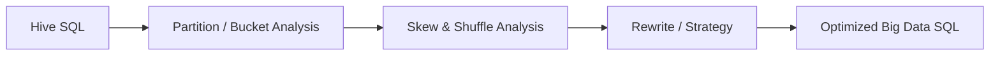
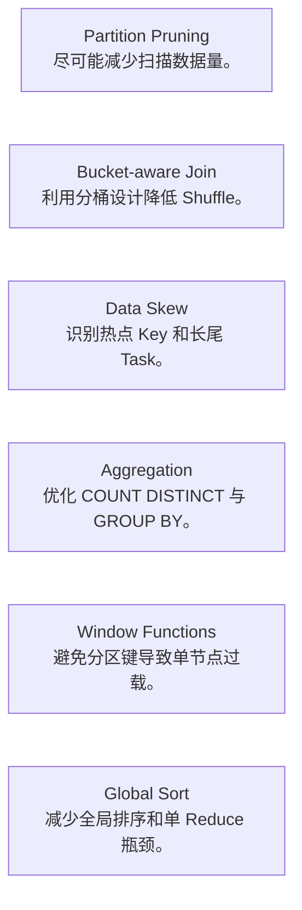

PawSQL Big Data SQL Optimization 面向 Hive 等大数据 SQL 场景，识别传统关系型数据库中不常见、但在大规模分布式计算中影响显著的性能问题。

分析重点包括分区裁剪、分桶 Join、数据倾斜、聚合倾斜、窗口函数、全局排序以及大规模 Shuffle。

## 概览

在大数据 SQL 中，性能问题往往不是由单个算子决定，而是由数据扫描量、Shuffle、分区设计以及数据倾斜共同决定。

一条 SQL 可能只写了几十行，却触发：

- 扫描数 TB 数据
- 大规模网络 Shuffle
- 单个 Reduce Task 长时间运行
- COUNT DISTINCT 数据倾斜
- Window Function 热点分区
- 全局排序阻塞整个任务

PawSQL 针对这些问题建立大数据 SQL 专项规则与优化模型。



## 为什么大数据 SQL 需要专项规则

传统数据库中的主要瓶颈往往是：

- 随机 IO
- 索引访问
- Join 选择
- 单机内存与 CPU

而 Hive 等大数据平台中的核心成本通常来自：

- 数据扫描量
- Shuffle
- Task 数量
- 数据倾斜
- 分区与分桶设计
- 全局排序和聚合

因此，大数据 SQL 需要不同于 OLTP 数据库的优化方法。

## 核心能力

### 分区裁剪分析

识别是否因为分区字段使用函数、计算或不合理条件，导致分区裁剪失效。

例如：

```sql
WHERE date_format(dt, 'yyyy-MM-dd') = '2026-09-09'
```

可能阻止引擎直接使用分区字段 `dt` 进行裁剪。

### 分桶 Join 分析

分析 Join 字段与 Bucket 设计是否匹配，并识别：

- 分桶字段不一致
- Bucket 数量不满足倍数关系
- 可以使用 SMB Join 但条件不满足
- 可使用 Map Join 的小表未被利用

### COUNT DISTINCT 数据倾斜

识别 `COUNT(DISTINCT ...)` 在热点值或高基数场景下可能造成的 Reduce 倾斜，并给出分阶段聚合或其他改写建议。

### GROUP BY 数据倾斜

分析 Group Key 数据分布，识别某些 Key 聚集导致单个 Reduce Task 过载的风险。

### 窗口函数数据倾斜

对 `ROW_NUMBER()`、`RANK()`、`SUM() OVER (...)` 等窗口函数，识别 Partition Key 不均衡导致的数据倾斜。

### 全局排序优化

识别 `ORDER BY` 触发的全局排序风险。

对于只需要 Top-N 的场景，可考虑局部排序、窗口函数或其他等价改写减少全局排序成本。

### UNION 与聚合优化

识别：

- 可替换为 `UNION ALL` 的场景
- UNION 去重造成的额外 Shuffle
- 无分组聚合数据倾斜
- 多阶段聚合优化机会

## 典型优化领域



## 示例：分区裁剪

假设表：

```text
sales
PARTITIONED BY (dt STRING)
```

低效写法：

```sql
SELECT *
FROM sales
WHERE substr(dt, 1, 7) = '2026-09';
```

更适合分区裁剪的形式可能是：

```sql
SELECT *
FROM sales
WHERE dt >= '2026-09-01'
  AND dt <  '2026-10-01';
```

后者更容易让执行引擎直接识别需要读取的分区范围。

## 示例：全局 Top-N

原始 SQL：

```sql
SELECT *
FROM events
ORDER BY score DESC
LIMIT 100;
```

在大规模数据集上，全局排序可能非常昂贵。

PawSQL 可以根据引擎能力分析是否能够使用：

- 局部 Top-N
- 分区排序
- 两阶段 Top-N
- 窗口函数

减少全量全局排序压力。

## 大数据优化本质是数据移动

对于大数据 SQL，最关键的优化问题之一通常不是：

> “哪一个索引更好？”

而是：

<Note>
**需要扫描多少数据？需要移动多少数据？最慢的 Task 为什么慢？**
</Note>

因此 PawSQL 会将扫描量、Shuffle、分区、分桶与数据倾斜作为核心分析对象。

## 相关能力

<CardGroup cols={2}>
<Card title="Automatic SQL Rewrite" icon="wand-sparkles" href="/features/automatic-sql-rewrite" />
<Card title="Distributed SQL Optimization" icon="waypoints" href="/features/distributed-sql-optimization" />
<Card title="Performance Validation" icon="gauge" href="/features/performance-validation" />
<Card title="Supported Databases" icon="database" href="/getting-started/supported-databases" />
</CardGroup>

## 相关场景

<CardGroup cols={2}>
  <Card title="DBA Batch SQL Governance" icon="gauge" href="/use-cases/slow-sql-optimization" />
  <Card title="Big Data SQL Quality Governance" icon="compass" href="/use-cases/index" />
  <Card title="Enterprise SQL Governance Platform" icon="building-2" href="/use-cases/enterprise-sql-governance" />
</CardGroup>
