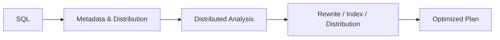
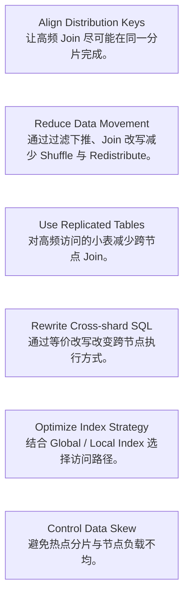

PawSQL Distributed SQL Optimization 面向分布式数据库中的 SQL 性能问题，分析分布策略、跨节点数据移动、Join 路径、分布键和索引设计，并生成更适合分布式执行模型的优化建议与改写方案。

与传统单机数据库相比，分布式数据库的 SQL 性能不仅取决于访问路径，还高度依赖数据分布方式以及计算是否能够下推到数据所在节点。

## 概览

在分布式数据库中，一条 SQL 即使语法和逻辑都正确，也可能因为数据分布方式不合理而产生高昂的网络和计算成本。

常见问题包括：

- Join 字段不是分布键，导致跨分片 Join
- 大量数据在节点之间 Shuffle / Redistribute
- 小表未设计为复制表
- 过滤条件没有有效下推
- 分布键选择导致数据倾斜
- Global / Local Index 使用不合理

PawSQL 从 SQL 结构与数据库分布元数据两个维度进行分析。



## 为什么分布式 SQL 需要专项优化

传统 SQL 优化重点关注：

- 索引
- Join 算法
- Scan 类型
- 谓词下推
- 聚合与排序

在分布式数据库中，还必须进一步回答：

- 数据存在哪个节点？
- Join 是否发生在同一分片？
- 是否需要跨节点搬运数据？
- 哪一侧数据更适合广播？
- 分布键是否与核心访问模式一致？
- 数据是否严重倾斜？

因此，单机数据库中的“最优 SQL”并不一定是分布式数据库中的最优 SQL。

## 核心能力

### 分布键分析

分析表的分布键是否与常见过滤条件、Join 条件和访问模式匹配。

典型问题包括：

- 高频 Join 未使用相同分布键
- 过滤字段与分布键完全无关
- 分布键基数过低
- 分布键造成节点数据倾斜

### 跨分片 Join 检测

识别需要跨分片或跨节点执行的 Join。

对于大型业务表，跨分片 Join 往往会带来：

- 网络传输
- Shuffle
- 中间结果膨胀
- Coordinator 压力

PawSQL 可以进一步分析可能的优化路径。

### 数据移动分析

识别执行计划中的：

- Redistribute
- Broadcast
- Exchange
- Motion
- Shuffle

等数据移动操作，并判断是否存在可避免的数据传输。

### 复制表推荐

对于体量较小、频繁参与 Join 的配置表、维度表或参数表，可以评估是否适合设计为复制表或广播表。

典型收益：

- 减少跨节点 Join
- 降低网络传输
- 提升 Join 下推概率

### 谓词与 Join 下推

分析过滤和 Join 是否可以更早下推到数据节点，减少中间数据量。

### 全局与本地索引分析

针对支持全局/局部索引的分布式数据库，分析：

- 索引覆盖范围
- 分区 / 分片访问路径
- 全局索引维护成本
- 局部索引是否满足查询模式

## 常见优化策略



## 示例

假设两个大型分布表：

```text
orders       DISTRIBUTED BY customer_id
payments     DISTRIBUTED BY payment_id
```

SQL：

```sql
SELECT *
FROM orders o
JOIN payments p
  ON o.customer_id = p.customer_id;
```

因为两个表的分布键不同，数据库可能需要重新分布其中一侧数据后才能完成 Join。

可能的优化方向包括：

1. 调整表的分布键
2. 根据过滤条件缩小参与 Join 的数据范围
3. 对较小一侧进行广播
4. 将 SQL 拆解或改写以减少跨节点数据移动
5. 设计额外的数据副本或复制表

具体策略取决于数据规模、数据库能力和业务模型。

## 支持场景

Distributed SQL Optimization 适用于多种分布式数据库场景，例如：

- TDSQL PostgreSQL
- TDSQLx-MySQL
- OceanBase
- GaussDB
- openGauss
- PolarDB-X
- GoldenDB
- Greenplum

具体功能支持情况请参阅 [Supported Databases](/getting-started/supported-databases)。

## 相关能力

<CardGroup cols={2}>
<Card title="Automatic SQL Rewrite" icon="wand-sparkles" href="/features/automatic-sql-rewrite" />
<Card title="Index Recommendation" icon="database" href="/features/index-recommendation" />
<Card title="Performance Validation" icon="gauge" href="/features/performance-validation" />
<Card title="Execution Plan Visualization" icon="chart-line" href="/features/execution-plan-visualization" />
<Card title="Big Data SQL Optimization" icon="layers" href="/features/big-data-sql-optimization" />
</CardGroup>

## 相关场景

<CardGroup cols={2}>
  <Card title="DBA Batch Slow SQL Governance" icon="gauge" href="/use-cases/slow-sql-optimization" />
  <Card title="Database Migration SQL Governance" icon="arrow-right-left" href="/use-cases/database-migration-sql-governance" />
  <Card title="Enterprise SQL Governance Platform" icon="building-2" href="/use-cases/enterprise-sql-governance" />
</CardGroup>
