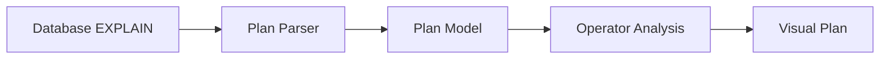

PawSQL Execution Plan Visualization 将数据库原生执行计划转换为更直观的图形结构，帮助开发者和 DBA 更快理解 SQL 的执行路径。

它不仅展示“有哪些算子”，还用于辅助识别 SQL 性能瓶颈、解释优化结果，并比较优化前后的执行计划差异。


## 概览

数据库执行计划通常包含大量层级信息、成本估算、行数估算和算子属性。

对于复杂 SQL，直接阅读原生文本计划往往非常困难。

PawSQL 将执行计划转换为可视化结构：



## 为什么执行计划可视化很重要

SQL 性能优化本质上是在理解数据库“准备如何执行 SQL”。

仅看 SQL 文本无法回答很多关键问题：

- 数据库是否使用索引？
- 哪个表发生了全表扫描？
- Join 使用 Hash Join 还是 Nested Loop？
- 哪个节点成本最高？
- Sort 或 Aggregate 是否成为瓶颈？
- 预计行数是否发生明显膨胀？
- 分布式数据库是否发生数据重分布？

执行计划提供这些信息，而可视化可以显著降低阅读复杂计划的成本。

## 核心能力

### 执行计划树可视化

以树形或图形方式展示执行计划节点以及父子关系。

典型算子包括：

- Table Scan
- Index Scan
- Index Seek
- Nested Loop
- Hash Join
- Merge Join
- Sort
- Aggregate
- Materialize
- Exchange / Redistribute

### 代价可视化

在执行计划节点上展示：

- Node Cost
- Total Cost
- Estimated Rows
- Actual Rows（如果数据库提供）
- Width / Data Volume
- Execution Time（如果计划包含）

### 瓶颈识别

帮助快速定位：

- 高成本节点
- 全表扫描
- 大规模 Sort
- 行数膨胀
- Nested Loop 大表循环
- Join 数据倾斜
- 分布式数据移动

### 优化前后对比

与 Performance Validation 配合，可比较：

- 原始执行计划
- SQL Rewrite 后执行计划
- Index Recommendation 后执行计划

从而直观看到访问路径发生了什么变化。

## 示例

假设原始执行计划：

```text
Nested Loop
├── Seq Scan orders
└── Index Scan customers
```

优化后：

```text
Hash Join
├── Index Scan orders
└── Index Scan customers
```

可视化不仅帮助用户看到算子变化，还应帮助解释：

- 为什么访问路径变化
- 哪个节点 Cost 降低
- 扫描数据量是否下降
- 新索引是否真正生效

## 执行计划可视化不只是漂亮的树

一个专业的执行计划工具不应该只把文本转成图。

真正有价值的执行计划可视化还应帮助用户回答：

<Note>
**Where is the cost? Why is it expensive? What changed after optimization?**
</Note>

因此 PawSQL 可以将可视化与以下能力结合：


## 数据库感知的执行计划解析

不同数据库的 EXPLAIN 输出结构差异很大。

PawSQL 需要将不同数据库执行计划映射到统一模型，同时保留数据库专项信息，例如：

- MySQL access type
- PostgreSQL plan nodes
- Oracle operations
- SQL Server physical operators
- DB2 explain operators
- Distributed database exchange / motion nodes

## 相关能力

<CardGroup cols={2}>
<Card title="SQL Review" icon="list-check" href="/features/sql-review" />
<Card title="Automatic SQL Rewrite" icon="wand-sparkles" href="/features/automatic-sql-rewrite" />
<Card title="Index Recommendation" icon="layers" href="/features/index-recommendation" />
<Card title="Performance Validation" icon="gauge" href="/features/performance-validation" />
<Card title="Supported Databases" icon="database" href="/getting-started/supported-databases" />
</CardGroup>

## 相关场景

<CardGroup cols={2}>
  <Card title="Developer SQL Copilot" icon="code" href="/use-cases/developer-sql-copilot" />
  <Card title="DBA Batch Slow SQL Governance" icon="gauge" href="/use-cases/slow-sql-optimization" />
  <Card title="Enterprise SQL Governance Platform" icon="building-2" href="/use-cases/enterprise-sql-governance" />
</CardGroup>
