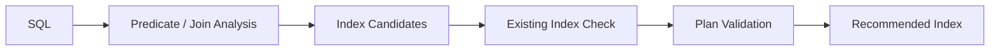

PawSQL 智能索引推荐用于识别 SQL 的索引优化机会，并生成更符合查询访问路径的候选索引。

推荐过程不仅考虑 WHERE 条件，还会综合分析 Join、ORDER BY、GROUP BY、列选择性、已有索引以及目标数据库的执行计划。


## 概览

“给 WHERE 条件中的字段建索引”并不是可靠的索引优化方法。

一个有效索引通常需要同时考虑：

- 哪些条件具有较高过滤能力
- 哪些字段用于 Join
- 哪些字段适合作为联合索引 leading columns
- 是否可以覆盖排序或分组
- 是否已存在等价或重复索引
- 新索引是否会真正改变执行计划

PawSQL 将智能索引推荐分为候选生成、筛选、模拟和验证多个阶段。



## 核心能力

### 谓词驱动的候选生成

分析 WHERE 条件中的等值、范围、IN、LIKE 等谓词，识别可能适合作为索引列的字段。

### 感知 Join 的索引

分析 Join 条件，识别连接键上的索引机会。

对于频繁 Join 的业务表，这通常比单纯分析 WHERE 条件更重要。

### 复合索引设计

在多个索引列之间分析顺序，并结合：

- 选择性
- 等值与范围谓词
- Join 条件
- ORDER BY
- GROUP BY

生成更合理的联合索引候选。

### 存量索引分析

推荐新索引之前，应检查现有索引，避免：

- 重复索引
- 前缀重复索引
- 功能高度重叠的索引
- 不必要的索引膨胀

### 数据库感知的索引语法

不同数据库的索引能力差异较大。

PawSQL 可根据目标数据库考虑：

- B-tree / bitmap 等索引类型
- INCLUDE / covering index
- local / global index
- concurrently / online
- 分区表索引
- 分布式数据库索引限制

### 索引有效性验证

智能索引推荐的最终目标不是“生成 CREATE INDEX”，而是确认：

<Note>
新索引是否真的能改变执行路径，并降低 SQL 成本。
</Note>

## 示例

原始 SQL：

```sql
SELECT order_id, order_date, amount
FROM orders
WHERE customer_id = ?
  AND order_date >= ?
ORDER BY order_date DESC;
```

可能的索引候选：

```sql
CREATE INDEX idx_orders_customer_date
ON orders(customer_id, order_date);
```

该索引之所以可能有效，是因为：

- `customer_id` 用于等值过滤
- `order_date` 用于范围过滤
- `order_date` 同时参与排序

实际推荐仍需要结合现有索引、数据分布和执行计划验证。

## 推荐 → 模拟 → 验证

PawSQL 的索引优化理念可以概括为：


如果目标数据库支持虚拟索引、Hypothetical Index 或类似机制，推荐结果可以在不立即创建真实索引的情况下进行执行计划验证。

## PawSQL 会避免什么

一个好的智能索引推荐系统不仅需要知道“应该加什么索引”，也需要知道“不应该加什么索引”。

例如：

- 对低选择性字段机械建索引
- 为每条 SQL 单独创建大量相似索引
- 忽略已有联合索引
- 只优化查询而忽略写入成本
- 创建不会改变执行计划的索引

## 相关能力

<CardGroup cols={2}>
<Card title="SQL质量检查" icon="list-check" href="/features/sql-review" />
<Card title="查询重写优化" icon="wand-sparkles" href="/features/automatic-sql-rewrite" />
<Card title="自动化性能验证" icon="gauge" href="/features/performance-validation" />
<Card title="执行计划分析" icon="route" href="/features/execution-plan-visualization" />
</CardGroup>

## 相关场景

<CardGroup cols={2}>
  <Card title="Developer SQL Copilot" icon="code" href="/use-cases/developer-sql-copilot" />
  <Card title="DBA Batch Slow SQL Governance" icon="gauge" href="/use-cases/slow-sql-optimization" />
  <Card title="Enterprise SQL Governance Platform" icon="building-2" href="/use-cases/enterprise-sql-governance" />
</CardGroup>
