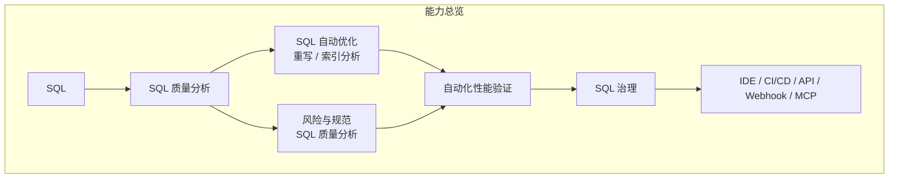
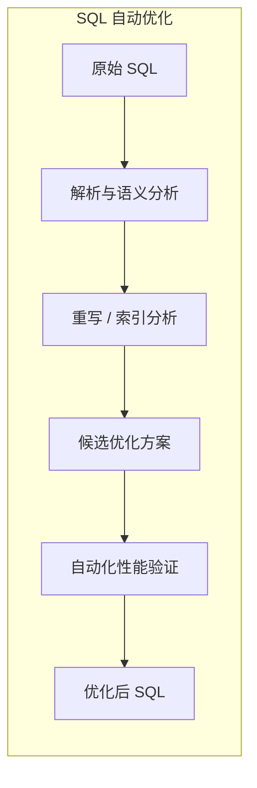
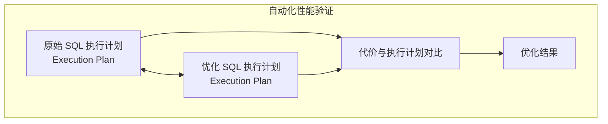
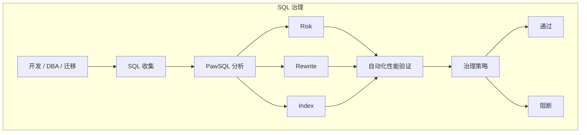
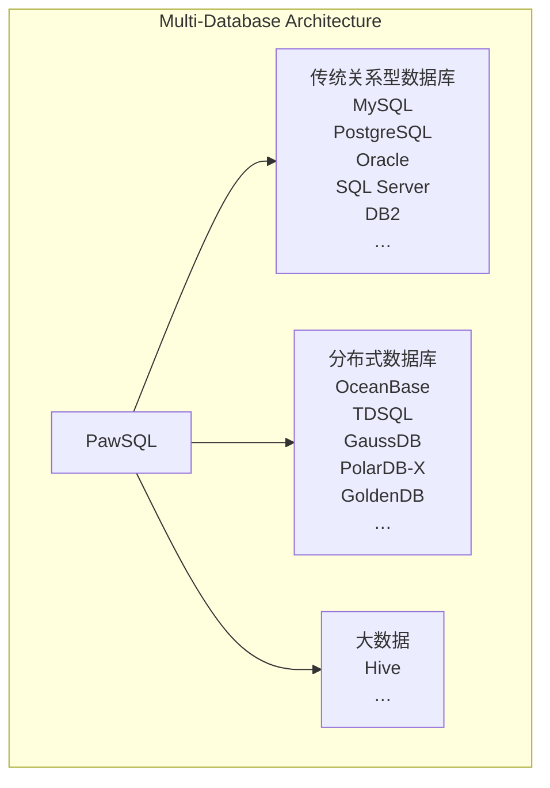
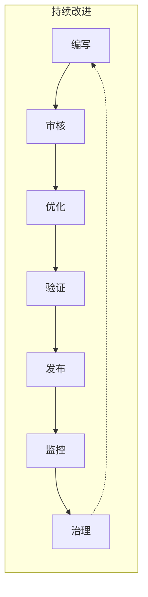

PawSQL 是面向开发、测试、DBA 与企业数据库治理团队的 **SQL 工程与治理平台**。

它围绕 SQL 的完整生命周期提供统一能力：从开发阶段的规范审核与实时优化，到上线前的质量门禁，再到生产环境中的慢 SQL 治理、自动化性能验证与持续优化。

PawSQL 的核心能力由五个部分组成：

- **SQL 质量**：发现语法、规范、风险和潜在性能问题
- **SQL 优化**：自动进行查询重写优化、智能索引推荐与专项性能优化
- **性能智能**：通过执行计划、代价与数据库优化器验证优化效果
- **SQL 治理**：将 SQL 质量与性能治理扩展到 CI/CD、生产巡检和企业级管理流程
- **平台与集成**：连接 IDE、CI/CD、API、Webhook、MCP 与企业内部平台

---

## 从 SQL 分析到企业治理

PawSQL 不只回答“这条 SQL 有什么问题”，还进一步回答：

- 是否存在规范或高风险操作？
- SQL 是否有更高效的等价写法？
- 是否需要创建或调整索引？
- 优化后的执行计划是否真正改善？
- 是否可以自动纳入研发、发布和生产治理流程？

---

## SQL 质量

在 SQL 进入测试、发布或生产环境之前识别问题。

PawSQL 基于 SQL 解析、语义分析、数据库元数据和规则引擎，对 SQL 进行结构化审核，而不是仅依赖文本匹配或正则规则。

### 主要能力

- SQL 语法与兼容性检查
- SQL 规范审核
- 高风险 DDL / DML 检测
- 潜在性能问题检测
- 数据库专项规则
- 企业自定义规则
- 存储过程 SQL 分析

### 适用场景

开发自检、代码评审、上线审核、数据库变更审核、企业 SQL 规范治理。

<CardGroup cols={2}>
  <Card title="SQL质量检查" icon="list-check" href="/features/sql-review">
    在 SQL 上线前识别规范、安全与性能风险。
  </Card>
</CardGroup>

---

## SQL 优化

自动寻找更高效的 SQL 写法与索引方案。

PawSQL 通过 SQL 解析、语义等价性分析、重写规则、索引分析和数据库优化器能力，对 SQL 进行自动优化。

### 主要能力

- 查询重写优化
- 子查询优化
- Join 优化
- 谓词下推
- 聚合与排序优化
- 深分页优化
- 智能索引推荐
- 分布式 SQL 专项优化
- 大数据 SQL 专项优化

PawSQL 的目标不是简单给出“优化建议”，而是尽可能形成可执行的优化方案。

<CardGroup cols={2}>
  <Card title="查询重写优化" icon="git-compare" href="/features/automatic-sql-rewrite">
    自动生成语义等价的查询重写优化方案。
  </Card>
  <Card title="智能索引推荐" icon="scan-search" href="/features/index-recommendation">
    根据查询访问模式推荐候选索引。
  </Card>
  <Card title="Distributed SQL Optimization" icon="network" href="/features/distributed-sql-optimization">
    面向分片键、分布式 Join 与跨节点访问的专项优化。
  </Card>
  <Card title="Big Data SQL Optimization" icon="hard-drive" href="/features/big-data-sql-optimization">
    面向 Hive 等大数据引擎的数据倾斜与执行优化。
  </Card>
</CardGroup>

---

## 性能智能

判断优化是否真正有效。

SQL 优化不能只依赖经验规则。PawSQL 结合目标数据库优化器、执行计划和代价信息，对优化前后的 SQL 进行比较。

### 主要能力

- 优化前后执行计划对比
- SQL Cost 对比
- 索引效果验证
- 执行计划分析
- 高代价算子识别
- 全表扫描与大数据量操作识别
- 慢 SQL 分析
- 优化收益评估

这使 PawSQL 可以形成完整闭环：

<Note>
**发现问题 → 生成优化方案 → 验证优化效果**
</Note>

<CardGroup cols={2}>
  <Card title="自动化性能验证" icon="gauge" href="/features/performance-validation">
    用数据库优化器验证优化是否真正更快。
  </Card>
  <Card title="执行计划分析" icon="list-tree" href="/features/execution-plan-visualization">
    把文本执行计划还原为可视化执行树。
  </Card>
</CardGroup>

两者分工不同：**自动化性能验证回答"是否更好"**——比较优化前后的执行计划与代价，给出可采信的判定；**执行计划分析回答"计划长什么样"**——呈现计划结构与指标，用于定位瓶颈与理解变化。前者产出结论，后者提供依据。

---

## SQL 治理

将单条 SQL 优化扩展为持续、规模化的 SQL 治理。

当 SQL 数量从几十条增长到几千、几万甚至更多时，人工审核和优化无法满足持续交付与生产治理要求。

PawSQL 支持将 SQL 分析、风险控制和性能优化能力嵌入企业研发与运维流程。

### 主要能力

- CI/CD SQL Quality Gate
- 批量 SQL 审核与优化
- SQL 指纹归并
- 慢 SQL 批量治理
- 数据库迁移 SQL 治理
- SQL 风险分级
- 优化优先级分析
- 企业 SQL Governance Dashboard

### 典型流程

<CardGroup cols={2}>
  <Card title="SQL Quality Gate" icon="shield-check" href="/use-cases/sql-quality-gate-cicd">
    把 SQL 质量门禁接入 CI/CD 流水线。
  </Card>
  <Card title="Batch SQL Governance" icon="gauge" href="/use-cases/slow-sql-optimization">
    批量治理生产环境慢 SQL。
  </Card>
</CardGroup>

---

## 平台与集成

让 SQL 能力进入开发者和企业现有工具链。

PawSQL 可以运行在开发 IDE、CI/CD Pipeline、企业内部平台和 AI Agent 工作流中，而不仅仅作为一个独立 SQL 工具。

### 集成方式

| 集成方式 | 典型用途 |
|---|---|
| IDE | 开发阶段 SQL 自检与优化 |
| CI/CD | SQL 上线质量门禁 |
| REST API | 企业平台与自动化系统集成 |
| Webhook | DevOps 流程触发 |
| MCP | AI Agent 调用 SQL质量检查与优化能力 |
| Web Console | DBA 与企业 SQL 治理 |

支持场景包括：

- JetBrains
- Visual Studio Code
- Jenkins
- GitLab CI/CD
- Coding
- 企业 DevOps 平台
- AI Coding Agent
- 内部数据库管理平台

<CardGroup cols={2}>
  <Card title="IDE 插件" icon="code" href="/user-guide/installation/ide-plugins">
    在 IntelliJ IDEA、DataGrip 或 VS Code 中自检与优化 SQL。
  </Card>
  <Card title="CI/CD 集成" icon="git-merge" href="/user-guide/cicd/index">
    把 SQL 质量门禁接入流水线。
  </Card>
  <Card title="PawSQL MCP" icon="bot" href="/user-guide/dev-tools/mcp">
    让 AI 编程助手调用 SQL质量检查与优化能力。
  </Card>
  <Card title="API 参考" icon="plug" href="/api-reference/list-workspaces">
    通过 API 集成到企业平台与自动化系统。
  </Card>
</CardGroup>

---

## 一个统一平台，支持多种数据库环境

现代企业通常同时运行传统关系型数据库、国产数据库、分布式数据库以及大数据平台。

PawSQL 通过统一 SQL 分析模型，为不同数据库提供一致的审核、优化和治理体验。

具体数据库、版本与功能支持情况，请参阅：

[Supported Databases →](/getting-started/supported-databases)

---

## 典型使用方式

不同角色可以从不同入口使用 PawSQL。

| 角色 | 典型需求 | 推荐能力 |
|---|---|---|
| Developer | 在编码阶段发现并优化 SQL | SQL质量检查、查询重写优化、开发工具集成 |
| DBA | 批量治理慢 SQL 与索引问题 | 批量 SQL 治理、智能索引推荐、自动化性能验证 |
| DevOps | 在发布流程中阻断高风险 SQL | SQL Quality Gate、CI/CD Integration |
| Migration Team | 迁移后检查兼容性与性能 | Database Migration Governance |
| Database Platform Team | 建设统一 SQL 治理平台 | API、Policy、Dashboard、Multi-Database Support |
| AI Agent | 生成 SQL 后进行专业校验与优化 | MCP、SQL质量检查、SQL 优化 |

---

## PawSQL 能力闭环

PawSQL 将 SQL 质量和性能治理组织成一个持续闭环：

↺ 持续改进

这意味着 SQL 优化不再是上线后的临时性能救火，而可以成为软件研发与数据库治理流程中的标准能力。

---

## 下一步

如果你刚开始使用 PawSQL，可以从以下内容继续：

<CardGroup cols={2}>
  <Card title="使用场景" icon="compass" href="/use-cases/index">
    查看 PawSQL 在真实研发与数据库治理流程中的使用方式。
  </Card>
  <Card title="支持的数据库" icon="database" href="/getting-started/supported-databases">
    确认数据库、版本与能力的支持范围。
  </Card>
</CardGroup>
