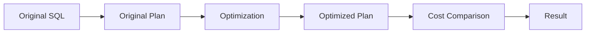
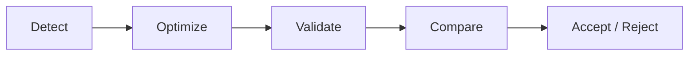

PawSQL Performance Validation 用于验证 SQL 优化是否真正改善执行计划，而不是仅依赖静态规则、经验判断或语言模型推测。

它把 SQL 优化从“推荐”推进到“验证”。


## 概览

一条 SQL 看起来更简洁，并不代表执行更快。

一个索引看起来合理，也不代表数据库优化器一定会使用它。

因此，PawSQL 在生成 SQL Rewrite 或 Index Recommendation 后，可以进一步比较优化前后的执行计划与 Cost，以判断候选方案是否真正带来收益。



## 为什么验证很重要

SQL 优化中最常见的问题之一，是把“理论上可能更快”误认为“实际上更快”。

以下情况都可能导致优化建议无效：

- 优化器仍然选择原来的访问路径
- 数据选择性与预期不同
- 新索引成本高于收益
- 重写 SQL 导致额外排序或物化
- 数据库版本或统计信息改变优化结果
- 分布式数据库产生额外数据移动

Performance Validation 用真实数据库优化器的信息降低这种不确定性。

## 核心能力

### 优化前后执行计划对比

比较原始 SQL 与优化 SQL 的执行计划。

重点关注：

- Scan 类型变化
- Join 算法变化
- Join 顺序变化
- Sort / Aggregate 变化
- 数据访问量变化
- 分布式数据移动变化

### 代价对比

比较数据库优化器给出的 Cost 或等价估算指标。

Cost 并不等同于真实执行时间，但可以作为优化候选筛选与自动验证的重要信号。

### 索引验证

判断推荐索引是否：

- 被优化器实际使用
- 改变访问路径
- 降低扫描行数
- 降低排序或 Join 成本

### 重写验证

判断 SQL Rewrite 是否真正改善执行策略，而不仅仅是代码形式变化。

### 优化评分

在批量 SQL 治理场景中，可以基于：

- Cost 改善幅度
- SQL 执行频率
- SQL 当前成本
- 风险等级

形成优化优先级。

## 示例

原始 SQL：

```sql
SELECT *
FROM orders
WHERE customer_id = 100;
```

优化建议：

```sql
CREATE INDEX idx_orders_customer
ON orders(customer_id);
```

验证时需要回答：

1. 优化器是否从 Full Table Scan 转为 Index Scan？
2. Cost 是否下降？
3. 预计扫描行数是否明显减少？
4. 是否已有等价索引？
5. 新索引是否值得承担写入与维护成本？

只有这些问题得到合理答案，索引建议才真正具有工程价值。

## 验证闭环



这使 SQL 优化形成闭环，而不是停留在建议列表。

## 代价是证据，不是绝对真理

数据库 Cost 是优化器内部估算值，并不等于真实耗时。

因此：

- Cost 适合用于候选方案比较
- 执行计划结构应与 Cost 一起分析
- 对关键生产 SQL，可进一步结合真实执行数据
- 统计信息不准确时，应谨慎解释 Cost

## 相关功能

<CardGroup cols={2}>
  <Card title="SQL Review" icon="list-check" href="/features/sql-review" />
  <Card title="Automatic SQL Rewrite" icon="wand-sparkles" href="/features/automatic-sql-rewrite" />
  <Card title="Index Recommendation" icon="layers" href="/features/index-recommendation" />
  <Card title="Execution Plan Visualization" icon="list-tree" href="/features/execution-plan-visualization" />
</CardGroup>

## 相关用户场景

- Developer SQL Copilot
- DBA Batch Slow SQL Governance
- SQL Quality Gate
- Enterprise SQL Governance Platform

## 下一步

继续了解：

<CardGroup cols={2}>
  <Card title="Execution Plan Visualization" icon="list-tree" href="/features/execution-plan-visualization" />
  <Card title="Supported Databases" icon="database" href="/getting-started/supported-databases" />
</CardGroup>
