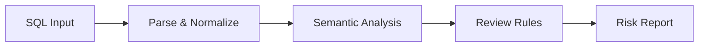

PawSQL SQL Review 用于在 SQL 生命周期的早期阶段发现问题，包括语法与兼容性问题、企业规范违规、高风险 DDL/DML，以及可能导致性能退化的 SQL 写法。

它不仅对 SQL 文本进行规则匹配，还结合 SQL 解析、语义分析、数据库元数据与数据库专项规则，对 SQL 进行结构化审核。


## 概览

传统 SQL 审核通常依赖人工 DBA 评审、正则表达式或简单规则匹配。这类方式很难准确理解 SQL 的结构、对象关系和数据库语义，也难以覆盖复杂 SQL、存储过程以及多数据库环境。

PawSQL 通过统一 SQL 分析引擎，将审核过程拆分为多个阶段：



## 为什么 SQL 审核很重要

SQL 问题越晚被发现，修复成本通常越高。

在开发阶段发现一条全表扫描 SQL，开发者可以直接修改；如果同一条 SQL 已进入生产环境，则可能进一步引发 CPU 抖动、IO 压力、锁等待或发布回滚。

因此，SQL Review 的目标不是“找错误”，而是把 SQL 质量控制前移到研发和交付流程中。

## 核心能力

### SQL 语法与兼容性检查

识别 SQL 语法错误、数据库方言差异以及目标数据库不支持的写法。

适用于：

- 数据库迁移后的兼容性检查
- 多数据库产品的 SQL 适配
- 开发阶段 SQL 自检

### SQL 编码规范审核

检查 SQL 是否符合企业或团队规范，例如：

- 不推荐使用的 SQL 写法
- 表、字段与索引相关规范
- SELECT / UPDATE / DELETE 使用约束
- DDL 变更规范
- SQL 可维护性规则

### 高风险 DDL/DML 检测

识别可能对数据安全或生产稳定性产生较大影响的操作，例如：

- 无过滤条件的 UPDATE / DELETE
- TRUNCATE
- DROP TABLE
- 高风险 ALTER TABLE
- 可能导致大范围锁定的操作

### 性能问题检测

在 SQL 上线前识别潜在性能风险，例如：

- 全表扫描风险
- 非 SARGable 条件
- 无效或低效索引使用
- 不必要的排序与聚合
- 笛卡尔积
- 子查询与 Join 的潜在低效写法

### 数据库专项规则

针对不同数据库实现专项审核，而不是使用同一套通用规则覆盖所有数据库。

这对于 Oracle、MySQL、PostgreSQL、SQL Server、DB2，以及国产和分布式数据库尤其重要。

### 存储过程分析

PawSQL 可以进一步分析存储过程中的 SQL，而不仅限于单条 SQL 文本，从而把 SQL Review 扩展到 T-SQL、PL/pgSQL 等过程化代码场景。

## 示例

以下 SQL 在语法上可以执行，但存在明显风险：

```sql
UPDATE orders
SET status = 'CLOSED';
```

PawSQL 可以识别：

- UPDATE 缺少过滤条件
- 可能影响大范围数据
- 可能产生较长事务与锁影响

审核结果可以进一步映射为不同级别，例如：

| Level | Meaning | Typical action |
|---|---|---|
| Info | 建议性规范 | 开发者确认 |
| Warning | 潜在风险 | 建议修改 |
| Critical | 高风险操作 | 阻断发布 |

## 开发周期中的审核

SQL Review 可以运行在多个入口：

- IDE：开发者编写 SQL 时即时检查
- Web Console：手工提交 SQL 审核
- CI/CD：作为 SQL Quality Gate
- API：集成企业数据库平台
- Webhook：接入 DevOps 流程
- MCP：供 AI Agent 调用 SQL 审核能力

## SQL 审核与简单 SQL Lint 的差异

| Capability | Simple SQL Lint | PawSQL SQL Review |
|---|---|---|
| Syntax check | ✓ | ✓ |
| AST analysis | Limited | ✓ |
| Database metadata | Usually no | ✓ |
| Database-specific rules | Limited | ✓ |
| Performance rules | Limited | ✓ |
| Risk classification | Limited | ✓ |
| Stored procedure analysis | Usually no | ✓ |
| CI/CD governance | Depends | ✓ |

## 相关功能

<CardGroup cols={2}>
  <Card title="Automatic SQL Rewrite" icon="wand-sparkles" href="/features/automatic-sql-rewrite" />
  <Card title="Index Recommendation" icon="layers" href="/features/index-recommendation" />
  <Card title="Performance Validation" icon="chart-line" href="/features/performance-validation" />
  <Card title="Execution Plan Visualization" icon="list-tree" href="/features/execution-plan-visualization" />
</CardGroup>

## 相关用户场景

- Developer SQL Copilot
- SQL Quality Gate for CI/CD
- DBA Batch SQL Governance
- Database Migration SQL Governance

## 下一步

继续了解：

<CardGroup cols={2}>
  <Card title="SQL Quality Gate" icon="git-merge" href="/features/sql-quality-gate" />
  <Card title="Supported Databases" icon="database" href="/getting-started/supported-databases" />
</CardGroup>
