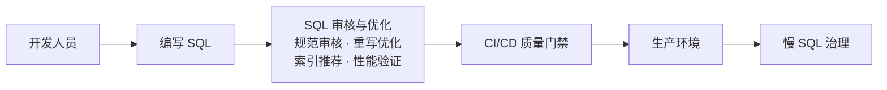
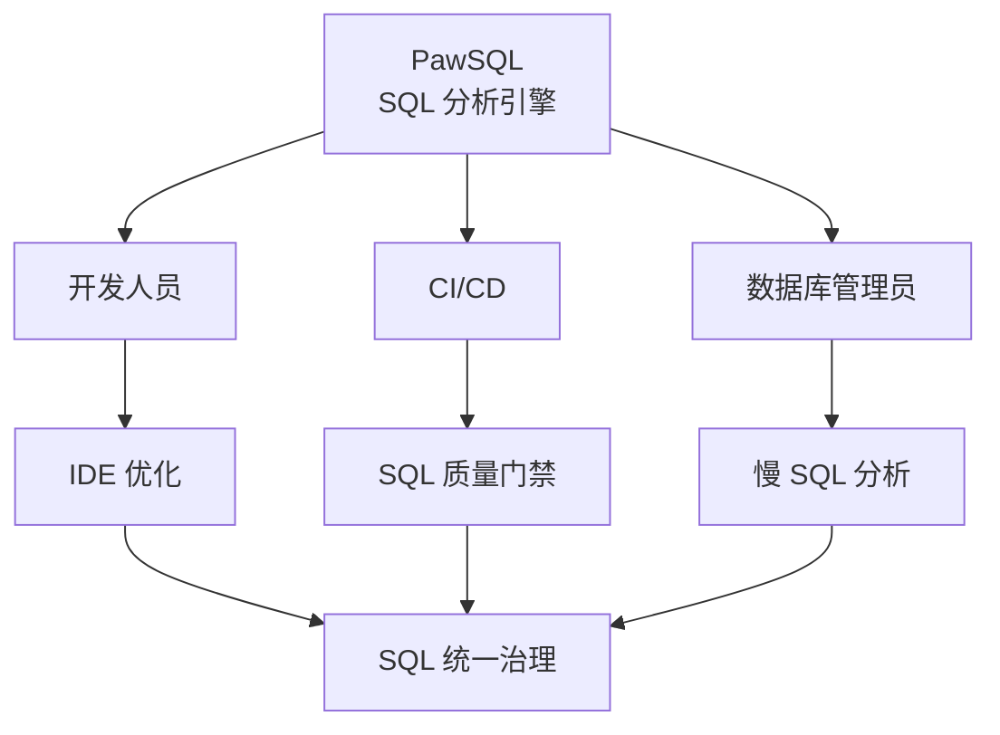
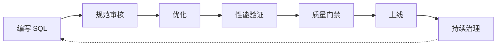

SQL 性能问题通常并不是在生产环境中突然出现的。低效的写法、不合理的索引、数据库迁移后的执行计划变化，都可能在开发阶段被引入，最终演变为生产环境中的性能或稳定性问题。


<CardGroup cols={2}>
  <Card title="用户场景" icon="users" href="/use-cases/index">
    按开发、CI/CD、DBA 与企业治理场景查看完整流程。
  </Card>
  <Card title="快速开始" icon="bolt" href="/getting-started/quickstart">
    用一条 SQL 完成第一次 SQL质量检查、查询重写优化与智能索引推荐。
  </Card>
  <Card title="支持的数据库" icon="database" href="/getting-started/supported-databases">
    查看数据库、版本与能力支持矩阵。
  </Card>
  <Card title="选择使用方式" icon="route" href="/getting-started/choose-access">
    公网使用、私有部署，或 IDE / API / MCP 接入。
  </Card>
</CardGroup>


## 覆盖 SQL 全生命周期

| 阶段 | 典型问题 | PawSQL 能力 |
|---|---|---|
| **开发阶段** | SQL 编写质量依赖个人经验 | 在 IDE 中进行 SQL 检查与优化 |
| **代码评审** | 人工评审难以完整发现 SQL 问题 | 自动执行规范审核与优化分析 |
| **CI/CD** | 高风险 SQL 可能进入生产环境 | 建立 SQL 上线质量门禁 |
| **数据库迁移** | 数据库差异可能导致兼容性和性能变化 | 对迁移 SQL 进行统一扫描与治理 |
| **生产环境** | 慢 SQL 数量大，依赖人工逐条分析 | 批量分析和治理慢 SQL |
| **企业治理** | 不同团队、数据库和规则体系难以统一 | 建立统一的企业 SQL 治理平台 |



> **让 SQL 质量与性能成为软件工程流程的一部分。**

## 核心能力

PawSQL 不仅帮助团队发现 SQL 问题，还进一步给出可执行的优化方案。

<CardGroup cols={2}>
  <Card title="SQL质量检查" icon="list-check" href="/features/sql-review">
    在 SQL 上线前，按开发规范与数据库最佳实践自动识别风险。
  </Card>
  <Card title="查询重写优化" icon="git-compare" href="/features/automatic-sql-rewrite">
    基于语义等价约束调整查询结构，为优化器提供更优的执行方案。
  </Card>
  <Card title="智能索引推荐" icon="layers" href="/features/index-recommendation">
    结合过滤、关联、排序与统计信息，设计候选索引方案。
  </Card>
  <Card title="自动化性能验证" icon="chart-line" href="/features/performance-validation">
    借助数据库优化器比较优化前后的代价、访问路径与执行计划。
  </Card>
  <Card title="执行计划分析" icon="list-tree" href="/features/execution-plan-visualization">
    把文本执行计划还原为可视化执行树，快速定位瓶颈。
  </Card>
</CardGroup>


### 各项能力的关键检查项

<AccordionGroup>
  <Accordion title="SQL质量检查">
    - SQL 编写规范
    - DDL 与 DML 风险
    - 查询性能风险
    - 索引使用问题
    - 数据库最佳实践
    - 企业自定义 SQL 规则
  </Accordion>
  <Accordion title="查询重写优化">
    - 子查询与关联改写
    - 聚合与分组优化
    - 谓词下推
    - OR 条件、UNION 等结构改写
    - 语义等价性校验
  </Accordion>
  <Accordion title="智能索引推荐">
    - 过滤条件与关联条件
    - 排序与分组字段
    - 已有索引与冗余索引
    - 字段选择率
    - 联合索引设计
    - 数据库优化器行为
  </Accordion>
  <Accordion title="自动化性能验证">
    - 优化器代价
    - 访问路径与关联方式
    - 预估行数
    - 索引使用情况
    - 优化前后的执行计划
  </Accordion>
  <Accordion title="执行计划分析">
    - 全表扫描
    - 高代价算子
    - 关联策略
    - 索引使用情况
    - 基数估算与代价分布
  </Accordion>
</AccordionGroup>

## 一个产品，多种交付形态

PawSQL 是**一个产品**。`Cloud` 指公网部署形态；Engine、Optimizer、Auditor、Advisor、Patroller 是同一产品的不同**组件或交付形态**，并不是五套彼此独立的产品。

选择时先确定要完成的任务，再对照环境要求查阅接入方式。详见[选择使用方式](/getting-started/choose-access)。

## 融入现有研发流程

SQL 不只存在于数据库客户端中，它可能出现在 IDE、代码仓库、CI/CD 流水线、SQL 审核平台、迁移项目、慢查询日志或企业内部研发平台中。



根据使用场景，可以通过 IDE 插件、API、Webhook、MCP 或 PawSQL Server 把 PawSQL 集成进现有流程。详见[选择使用方式](/getting-started/choose-access)。

## 按角色或场景选择起点

<Tabs>
  <Tab title="开发人员">
    希望在编写 SQL 时直接获得提示与优化建议。

    ```mermaid
    flowchart LR
        A[编写 SQL] --> B[分析] --> C[查看建议] --> D[应用优化]
    ```

    从[在 IDE 中自助优化 SQL](/use-cases/developer-sql-copilot)开始。
  </Tab>
  <Tab title="研发效能与平台团队">
    希望阻止存在质量问题的 SQL 进入生产环境。

    ```mermaid
    flowchart LR
        A[代码提交] --> B[CI 流水线]
        B --> C[SQL 质量门禁]
        C -->|通过| D[部署]
        C -->|拒绝| E[修复 SQL]
    ```

    从[在 CI/CD 中建立上线门禁](/use-cases/sql-quality-gate-cicd)开始。
  </Tab>
  <Tab title="数据库管理员">
    面对大量生产慢 SQL，需要批量分析与治理。

    ```mermaid
    flowchart LR
        A[慢 SQL] --> B[归并去重] --> C[批量分析]
        C --> D["重写 / 索引推荐"] --> E[性能验证] --> F[优化任务]
    ```

    从[批量治理生产慢 SQL](/use-cases/slow-sql-optimization)开始。
  </Tab>
  <Tab title="企业平台团队">
    目标是建立统一的 SQL 管理与治理能力。

    <Note>
    PawSQL 可作为企业统一的 SQL 分析与治理能力层，向上承接开发、CI/CD、迁移与生产监控，向下适配多数据库环境。
    </Note>

    从[企业统一 SQL 治理平台](/use-cases/enterprise-sql-governance)开始。
  </Tab>
  <Tab title="数据库迁移与信创改造">
    SQL 能在目标数据库上运行，并不代表它还能跑得足够快。

    ```mermaid
    flowchart LR
        A[SQL 盘点] --> B[兼容性分析] --> C[性能风险分析]
        C --> D["重写 / 索引推荐"] --> E[性能验证] --> F[迁移治理]
    ```

    从[信创 / 数据库迁移中的 SQL 治理](/use-cases/database-migration-sql-governance)开始。
  </Tab>
</Tabs>

## 面向多数据库环境设计

现实中的企业环境通常同时运行多种关系型数据库、分布式数据库、国产数据库与数据仓库，它们的 SQL 方言、优化器、索引机制与执行计划各不相同。

PawSQL 从设计之初就面向**多数据库 SQL 治理**：通过统一的分析入口处理不同数据库的 SQL，同时保留针对每种数据库的优化逻辑。[查看支持的数据库 →](/getting-started/supported-databases)

## 从 SQL 优化走向 SQL 工程化治理

传统 SQL 优化通常发生在生产问题出现之后；PawSQL 希望把 SQL 治理提前，并让它持续发生。

| 维度 | 传统方式 | 使用 PawSQL |
|---|---|---|
| 触发时机 | 生产出现性能问题后 | 从编写第一行 SQL 开始 |
| 处理方式 | 人工逐条分析 | 自动审核、重写与索引推荐 |
| 方案判断 | 依赖个人经验 | 结合数据库优化器验证 |
| 结果 | 一次性修复 | 持续治理与改进 |



SQL 因此不再只是应用中的一段字符串，而是可以被**分析、验证、治理和持续改进的工程资产**。

## 三步开始使用

<Steps>
  <Step title="选择使用方式">
    确定服务部署在哪里、如何接入日常工作流。参见[选择使用方式](/getting-started/choose-access)。
  </Step>
  <Step title="创建工作空间">
    指定数据库类型与版本，通过 DDL 或数据库连接，为 SQL 分析提供所需的数据库上下文。参见[工作空间和上下文](/user-guide/workspaces/index)。
  </Step>
  <Step title="完成第一次优化">
    提交一条 SQL，查看审核问题、重写建议、索引推荐与性能验证结果。参见[快速开始](/getting-started/quickstart)。
  </Step>
</Steps>

## 按目标查找文档

<CardGroup cols={2}>
  <Card title="支持的数据库" icon="database" href="/getting-started/supported-databases">
    确认数据库、版本与能力的支持范围。
  </Card>
  <Card title="选择使用方式" icon="route" href="/getting-started/choose-access">
    安装、部署与接入方式。
  </Card>
  <Card title="API 参考" icon="plug" href="/api-reference/list-workspaces">
    通过 API 集成 PawSQL。
  </Card>
</CardGroup>

---

[Read the documentation in English →](/en/getting-started/index)
