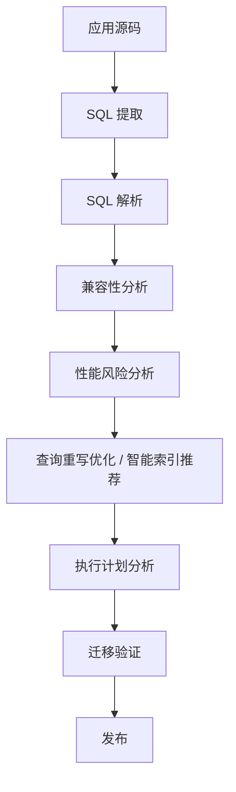
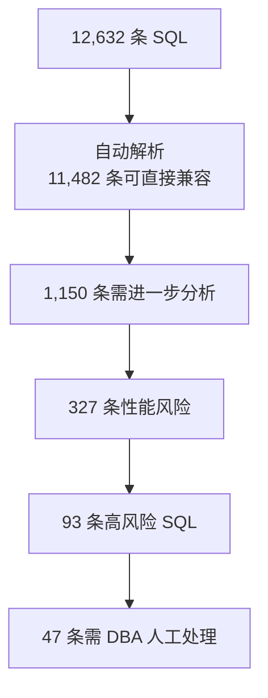
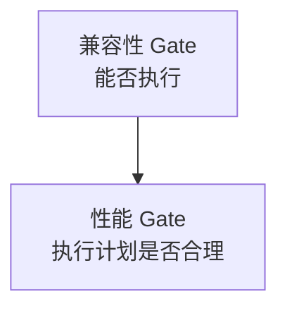

## 用户

数据库迁移团队——迁移负责人、DBA、架构师、应用开发团队与项目经理，负责信创改造或数据库迁移中的 SQL 治理。

## 问题

数据库迁移项目通常首先回答「SQL 能不能在目标数据库上运行」，但进入生产后会遇到更难的问题——「SQL 还能不能跑得足够快」。

一条 SQL 从 Oracle 迁移到 PostgreSQL、openGauss、GaussDB、Kingbase、DM、TDSQL 或 OceanBase 后，即使语法转换成功，也可能因为优化器行为、索引机制、数据类型、Hint 失效、分页实现、分布式执行机制等差异而产生新的性能问题。

因此迁移不能只解决「语法兼容性」，还需要解决「性能兼容性」。

## 目标

让迁移从「能运行」进一步走向「稳定、高效运行」——从语法迁移升级为 SQL Migration Engineering，把历史遗留的性能问题挡在新数据库之外。

## 流程

PawSQL 把迁移 SQL 治理拆成一条端到端流水线：



## 依赖能力

由以下能力组合而成，具体检查项与改写逻辑见各能力页：

<CardGroup cols={2}>
  <Card title="SQL质量检查" icon="list-check" href="/features/sql-review" />
  <Card title="查询重写优化" icon="git-compare" href="/features/automatic-sql-rewrite" />
  <Card title="智能索引推荐" icon="layers" href="/features/index-recommendation" />
  <Card title="执行计划分析" icon="route" href="/features/execution-plan-visualization" />
  <Card title="自动化性能验证" icon="gauge" href="/features/performance-validation" />
  <Card title="分布式 SQL 优化" icon="network" href="/features/distributed-sql-optimization" />
</CardGroup>

## 成功标准

| 指标 | 目标 |
|---|---|
| SQL 自动解析覆盖率 | 提升 |
| SQL 自动兼容比例 | 提升 |
| 需要人工迁移的 SQL 比例 | 降低 |
| 迁移前性能风险发现率 | 提升 |
| 执行计划回退数量 | 降低 |
| 生产上线后慢 SQL 数量 | 降低 |
| DBA 人工审核量 | 降低 |

---

## 迁移中的四类 SQL 风险

迁移项目的 SQL 风险通常分四类：

1. **语法兼容性风险**——数据库专有函数、关键字、Hint、分页语法、DDL、存储过程语法（如 `NVL` → `COALESCE`）
2. **语义兼容性风险**——SQL 能执行但结果不一致（NULL 处理、空字符串、日期精度、排序规则、隐式转换）
3. **性能兼容性风险**——语法转换后访问路径失效，例如 `TRUNC(create_time)` 转为 `DATE(create_time)` 后索引无法被有效利用
4. **分布式执行风险**——从集中式迁到分布式后新增跨节点 Join、数据重分布、分布键不匹配、Shuffle

其中性能兼容性风险是很多项目到后期才暴露、也最难排查的一类。

## 从 SQL 清单到两个 Gate

迁移的第一个困难是「到底有多少 SQL 要迁」。SQL 散落在 Java、MyBatis Mapper、XML、存储过程、ETL、发布脚本里。批量解析后，可形成一张可量化的迁移清单：



迁移团队不再逐条人工翻代码，而是聚焦几十个真正需要人工决策的案例。

更完整的迁移应设两个 Gate：



只有两个 Gate 都通过，SQL 才真正具备进入生产的条件。

## 在迁移工具链中的定位

PawSQL 不需要替代厂商迁移工具——Schema 转换、数据迁移、SQL 语法转换仍由迁移工具负责。PawSQL 聚焦传统工具薄弱的一环：

```text
迁移工具：Convert（转换）
PawSQL：  Analyze + Optimize + Validate（分析 + 优化 + 验证）
```

两者是「迁移工具 + PawSQL」的互补关系，而非替代。

<CardGroup cols={2}>
  <Card title="了解查询重写优化" icon="wand-sparkles" href="/features/automatic-sql-rewrite" />
  <Card title="了解执行计划分析" icon="route" href="/features/execution-plan-visualization" />
  <Card title="了解分布式 SQL 优化" icon="network" href="/features/distributed-sql-optimization" />
  <Card title="申请迁移评估" icon="plug" href="https://www.pawsql.com" />
</CardGroup>
