## 迁移成功，不等于性能成功

数据库迁移项目通常首先关注一个问题：

> SQL 能不能在目标数据库上运行？

但真正进入生产环境后，企业很快会遇到第二个、更难的问题：

> SQL 在目标数据库上还能不能跑得足够快？

一条 SQL 从 Oracle 迁移到 PostgreSQL、openGauss、GaussDB、Kingbase、DM、TDSQL 或 OceanBase 后，即使已经完成语法转换，也可能因为：

- 优化器行为不同
- 索引机制不同
- 数据类型不同
- SQL Hint 失效
- 分页实现不同
- 子查询优化策略不同
- Join 策略不同
- 分布式执行机制不同

而产生新的性能问题。

因此，数据库迁移不能只解决：

```text
Syntax Compatibility
```

还需要解决：

```text
Performance Compatibility
```

**PawSQL 帮助企业在数据库迁移和信创改造过程中，对大规模 SQL 进行批量解析、兼容性检查、性能风险分析、查询重写优化、智能索引推荐以及执行计划验证，让迁移从“能运行”进一步走向“能稳定、高效运行”。**

---

## 一个典型的数据库迁移项目

假设一家大型金融机构正在推进核心业务系统数据库迁移。

原数据库：

```text
Oracle
```

目标数据库：

```text
openGauss / GaussDB / Kingbase / DM
```

应用规模包括：

```text
80+ Business Systems

10,000+ SQL Statements

2,000+ Mapper Files

500+ Stored Procedures
```

迁移团队通常会完成：

- Schema 转换
- 数据迁移
- SQL 语法转换
- 存储过程迁移
- 数据校验
- 应用适配

从表面上看，这似乎已经完成了数据库迁移。

但应用真正进入目标数据库后，可能出现：

```text
SQL 可以执行

但性能明显下降
```

---

## 为什么“语法迁移”还不够？

考虑一条 Oracle SQL：

```sql
SELECT /*+ INDEX(o IDX_ORDER_DATE) */
       o.order_id,
       o.customer_id,
       o.create_time,
       o.total_amount
FROM orders o
WHERE TRUNC(o.create_time) = DATE '2026-09-04'
  AND o.customer_id = 10086
ORDER BY o.create_time DESC;
```

在 Oracle 环境中：

- SQL Hint 可能影响优化器选择
- `TRUNC(create_time)` 属于 Oracle 常见写法
- 原数据库可能存在特定索引
- 原执行计划已经经过多年运行验证

迁移到目标数据库以后，SQL 即使经过语法转换，也可能发生：

```text
Hint 不再生效

函数行为发生变化

索引选择发生变化

执行计划发生变化

原有访问路径不再成立
```

因此：

> SQL 转换成功，只证明“语法问题解决了”。

并不能证明：

> “性能问题也解决了”。

---

## 数据库迁移中的四类 SQL 风险

迁移项目中的 SQL 风险通常可以分为四类。

### 1. 语法兼容性风险

典型问题包括：

- 数据库专有函数
- 专有关键字
- Hint
- 分页语法
- 日期函数
- 字符串函数
- DDL 语法
- 特殊数据类型
- 存储过程语法

例如 Oracle：

```sql
NVL(amount, 0)
```

迁移到其他数据库时可能需要转换为：

```sql
COALESCE(amount, 0)
```

这属于典型的：

> Syntax Migration

---

### 2. 语义兼容性风险

更复杂的问题是：

> SQL 虽然能够执行，但执行结果是否仍然完全一致？

例如：

- NULL 处理差异
- 空字符串语义
- 日期精度
- 字符排序规则
- 隐式类型转换
- 大小写规则
- 数据类型比较行为

这类问题往往比单纯语法错误更隐蔽。

---

### 3. 性能兼容性风险

这是很多迁移项目后期才会暴露的问题。

例如原 SQL：

```sql
WHERE TRUNC(create_time) = DATE '2026-09-04'
```

迁移后如果转换为：

```sql
WHERE DATE(create_time) = '2026-09-04'
```

虽然语义看似正确，但在目标数据库中可能导致：

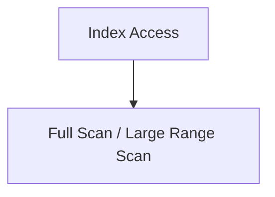

最终出现明显性能下降。

---

### 4. 分布式数据库执行风险

如果目标数据库从集中式数据库迁移到分布式数据库，还会新增：

- 跨节点 Join
- 数据重分布
- 分布键不匹配
- 大表 Broadcast
- Shuffle
- 分片裁剪失败
- 全局排序
- 分布式聚合

此时迁移已经不再只是：

> Database A → Database B

而是：

> Centralized Database → Distributed Database Architecture

SQL 的执行模型也发生了变化。

---

## PawSQL 的迁移治理流程

PawSQL 可以将迁移 SQL 治理划分为几个阶段：

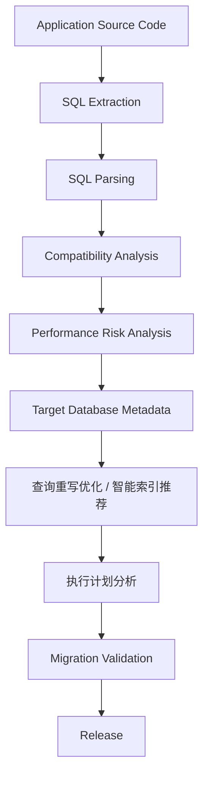

这使迁移项目从单纯的：

```text
SQL Conversion
```

升级为：

```text
SQL Migration Engineering
```

---

## 第一步：批量发现迁移 SQL

数据库迁移的第一个困难通常不是优化 SQL。

而是：

> 企业到底有多少 SQL 需要迁移？

SQL 可能散落在：

- Java 代码
- MyBatis Mapper
- XML
- SQL 文件
- Shell 脚本
- ETL
- 存储过程
- 数据库对象
- 发布脚本

例如一个大型系统可能包含：

```text
12,632 SQL Statements
```

PawSQL 可以将这些 SQL 统一纳入分析范围。

---

## 第二步：建立 SQL 迁移清单

经过批量解析后，可以形成类似：

| 分类 | 数量 |
|---|---:|
| SQL 总量 | 12,632 |
| 可直接兼容 | 11,482 |
| 需要语法调整 | 698 |
| 存在性能风险 | 327 |
| 高风险 SQL | 125 |

迁移团队不再依赖：

```text
人工翻代码找 SQL
```

而是拥有一个完整的：

> SQL Migration Inventory

也就是：

> SQL 迁移资产清单。

---

## 第三步：发现数据库专有 SQL

例如 Oracle SQL：

<Tabs>
  <Tab title="ROWNUM 分页">
    ```sql
    SELECT *
    FROM orders
    WHERE ROWNUM <= 20;
    ```

    迁移到 PostgreSQL 体系后，分页机制需要调整。
  </Tab>
  <Tab title="NVL 空值函数">
    ```sql
    SELECT NVL(total_amount, 0)
    FROM orders;
    ```
  </Tab>
  <Tab title="CONNECT BY 层级查询">
    ```sql
    SELECT *
    FROM orders
    START WITH parent_id IS NULL
    CONNECT BY PRIOR id = parent_id;
    ```
  </Tab>
</Tabs>

这些 SQL 都包含明显的数据库专有能力。

PawSQL 可以帮助团队批量识别：

```text
Database-Specific SQL
```

并按照：

- 自动转换
- 需要人工调整
- 高风险

进行分类。

---

## 第四步：迁移后重新检查 SQL 性能

这是 PawSQL 相比单纯 SQL 转换工具更重要的一步。

假设原 SQL：

```sql
SELECT
    order_id,
    customer_id,
    create_time
FROM orders
WHERE TRUNC(create_time) = DATE '2026-09-04'
  AND customer_id = 10086;
```

迁移工具可能转换为：

```sql
SELECT
    order_id,
    customer_id,
    create_time
FROM orders
WHERE DATE(create_time) = '2026-09-04'
  AND customer_id = 10086;
```

SQL 已经可以执行。

但 PawSQL 进一步分析发现：

```text
Performance Risk

DATE(create_time)

may prevent efficient index access
```

于是可以建议改写为：

```sql
SELECT
    order_id,
    customer_id,
    create_time
FROM orders
WHERE create_time >= '2026-09-04 00:00:00'
  AND create_time <  '2026-09-05 00:00:00'
  AND customer_id = 10086;
```

这一步解决的是：

<Note>
SQL 性能迁移。
</Note>

而不是单纯 SQL 语法迁移。

---

## 第五步：重新设计目标数据库索引

数据库迁移时，一个常见误区是：

> 把原数据库索引原样复制到目标数据库。

实际上，不同数据库：

- 优化器不同
- 索引结构不同
- Statistics 不同
- Join 策略不同
- 扫描代价模型不同

因此原数据库的索引设计，并不一定是目标数据库的最佳方案。

例如原有：

```sql
CREATE INDEX idx_orders_customer
ON orders(customer_id);

CREATE INDEX idx_orders_create_time
ON orders(create_time);
```

而迁移后的核心查询模式为：

```sql
WHERE customer_id = ?
  AND create_time >= ?
  AND create_time < ?
```

PawSQL 可以根据目标数据库查询模式重新分析是否适合：

```sql
CREATE INDEX idx_orders_customer_create_time
ON orders(customer_id, create_time);
```

这里优化的不是：

> Index Migration

而是：

> Index Redesign for Target Database

---

## 第六步：用目标数据库执行计划验证

迁移完成后的真正标准，不应该是：

```text
SQL executed successfully
```

而应该进一步验证：

```text
Execution Plan is acceptable
```

假设 Oracle 原执行计划：

```text
INDEX RANGE SCAN
Estimated Rows: 280
```

迁移后的目标数据库最初执行计划：

```text
SEQ SCAN
Estimated Rows: 2,800,000
```

这已经说明：

<Note>
SQL 语法迁移成功，但性能迁移失败。
</Note>

经过查询重写优化和索引调整后：

```text
INDEX RANGE SCAN
Estimated Rows: 196
```

迁移团队才能真正确认：

<Note>
这条 SQL 不只是“能跑”，而且具备合理的执行路径。
</Note>

---

## 示例二：Oracle Hint 迁移

考虑：

```sql
SELECT /*+ LEADING(a b) USE_NL(b) */
       ...
FROM customer a
JOIN orders b
  ON a.customer_id = b.customer_id;
```

在 Oracle 中，Hint 可能强制：

```text
Join Order
+
Nested Loop
```

迁移到目标数据库后：

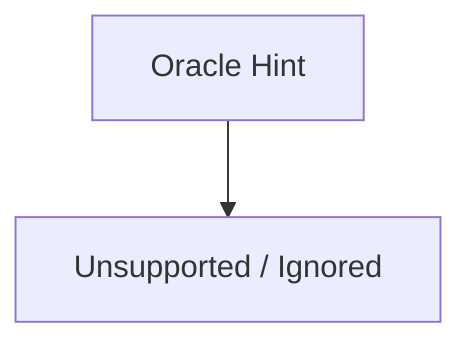

执行计划可能变为：

```text
Hash Join
```

这并不一定意味着目标执行计划更差。

因此迁移工作不应该简单做：

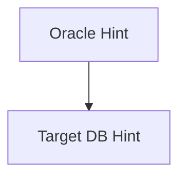

更合理的方式是：

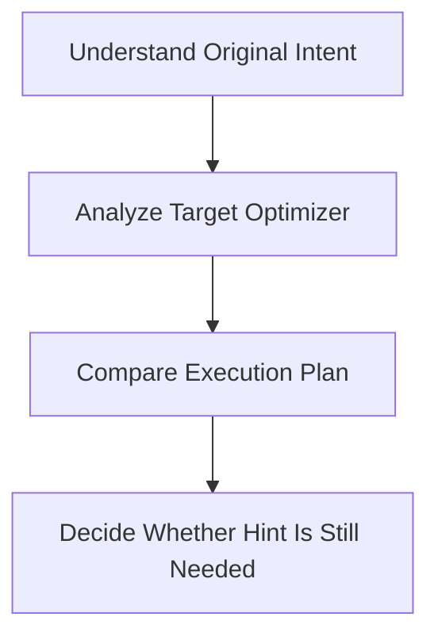

PawSQL 可以帮助迁移团队从：

> Hint Translation

转向：

> Execution Strategy Validation

---

## 示例三：分页 SQL 迁移

Oracle 传统分页可能类似：

```sql
SELECT *
FROM (
    SELECT t.*, ROWNUM rn
    FROM orders t
    WHERE ROWNUM <= 100020
)
WHERE rn > 100000;
```

迁移后可能变成：

```sql
SELECT *
FROM orders
ORDER BY create_time DESC
LIMIT 20 OFFSET 100000;
```

从语法上看：

```text
Migration Success
```

但性能问题依然存在：

```text
Deep Pagination
```

如果生产表达到：

```text
100,000,000 rows
```

大 OFFSET 仍可能带来明显成本。

PawSQL 可以进一步提示评估：

```text
Keyset Pagination
```

例如：

```sql
SELECT
    order_id,
    customer_id,
    create_time
FROM orders
WHERE create_time < ?
ORDER BY create_time DESC
LIMIT 20;
```

这再次说明：

<Note>
SQL 转换只是迁移的第一步。
</Note>

---

## 示例四：从集中式数据库迁移到分布式数据库

假设原 Oracle 系统有：

```sql
SELECT
    o.order_id,
    c.customer_name
FROM orders o
JOIN customers c
  ON o.customer_id = c.customer_id;
```

集中式数据库中：

```text
orders
+
customers
+
Local Join
```

目标数据库如果采用分布式架构：

```text
orders
Shard Key = order_id

customers
Shard Key = customer_id
```

那么 Join：

```sql
o.customer_id = c.customer_id
```

可能无法在同一节点直接完成。

执行过程可能变为：

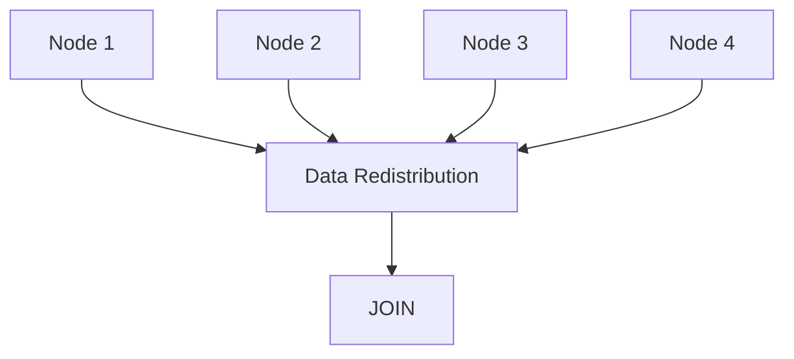

这会产生：

- 网络传输
- Shuffle
- 节点间数据交换
- 更高 CPU
- 更高延迟

因此迁移到分布式数据库后，PawSQL 的分析需要进一步关注：

```text
SQL
+
Schema
+
Distribution Key
+
Execution Plan
```

而不仅仅是 SQL 本身。

---

## 对分布式数据库迁移的优化建议

对于跨分片 Join，可能需要评估：

### 调整分布键

让经常 Join 的大表基于相同业务字段分布。

例如：

```text
orders.customer_id
customers.customer_id
```

---

### 使用复制表

如果某个维度表足够小，可以考虑：

```text
Replicated Table
```

让每个节点都拥有完整副本。

从：

```text
Redistribute Large Table
```

变为：

```text
Local Join
```

---

### 提前过滤数据

将高选择率条件尽可能下推：

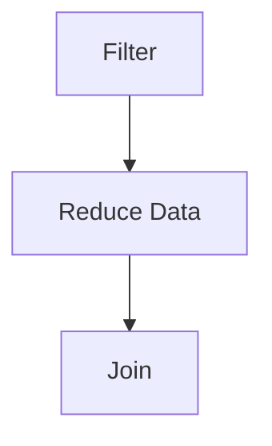

而不是：

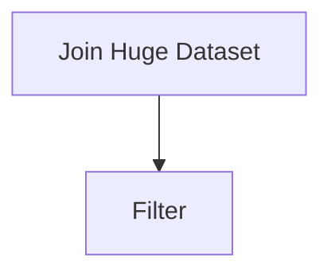

---

## 存储过程迁移中的 SQL 治理

大型传统系统往往不仅存在普通 SQL。

还包含大量：

- Oracle PL/SQL
- SQL Server T-SQL
- PostgreSQL PL/pgSQL

例如：

```sql
CREATE PROCEDURE batch_process()
BEGIN

    UPDATE ...

    SELECT ...

    IF ... THEN

        DELETE ...

    END IF;

END;
```

迁移存储过程时，挑战包括：

```text
Procedure Syntax
+
Control Flow
+
Embedded SQL
+
Database-Specific Functions
+
Performance
```

因此不能只把整个 Procedure 当作一个文本文件转换。

更好的治理方式是：

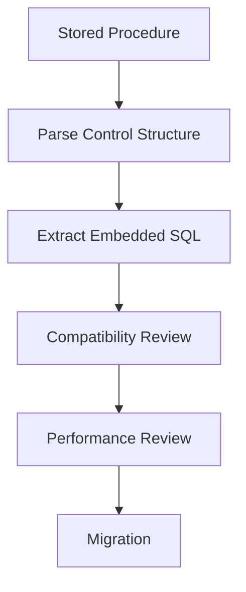

这样才能发现隐藏在存储过程中的性能问题。

---

## 给迁移团队一个清晰的风险视图

最终，PawSQL 可以帮助建立类似这样的迁移 Dashboard：

| Risk Category | SQL Count | Status |
|---|---:|---|
| Syntax Compatible | 11,482 | Pass |
| Syntax Conversion Required | 698 | Review |
| Performance Risk | 327 | Warning |
| 智能索引推荐 | 186 | Action |
| Execution Plan Regression | 93 | Critical |
| Manual DBA Review | 47 | Pending |

迁移负责人可以快速回答：

```text
还有多少 SQL 没迁完？

多少 SQL 存在兼容性风险？

多少 SQL 可能出现性能回退？

哪些 SQL 必须 DBA 人工处理？
```

---

## 从 10,000 条 SQL 中找到真正需要人工处理的部分

数据库迁移项目最大的效率问题之一，是：

> 所有 SQL 都按同样的方式人工处理。

实际上，大量 SQL 可以自动通过。

一个典型过程可以是：

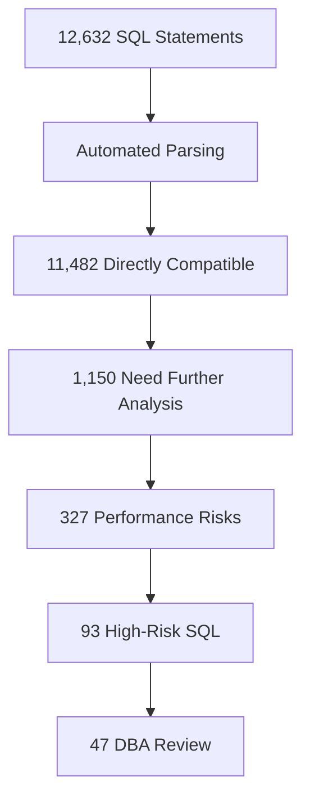

迁移专家最终不需要：

```text
Review 12,632 SQL manually
```

而是重点处理：

```text
47 High-Value Cases
```

这也是规模化数据库迁移的关键。

---

## 数据库迁移应该有两个 Gate

传统迁移通常只有：

```text
Compatibility Gate
```

即：

> SQL 是否可以在目标数据库执行？

更完整的迁移流程应该增加第二个 Gate：

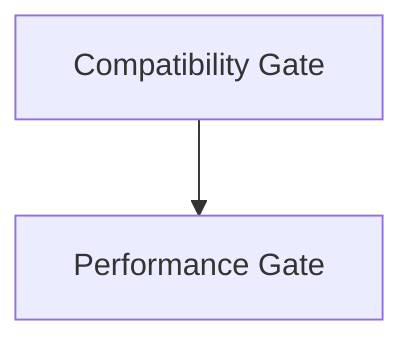

即：

<Steps>
  <Step title="Gate 1 — Compatibility">
    检查：

    - 语法
    - 函数
    - 数据类型
    - 数据库对象
    - 存储过程
  </Step>
  <Step title="Gate 2 — Performance">
    检查：

    - 查询重写优化
    - Index
    - Execution Plan
    - Cost
    - Distribution
    - Scan Strategy
  </Step>
</Steps>

只有两个 Gate 都通过：

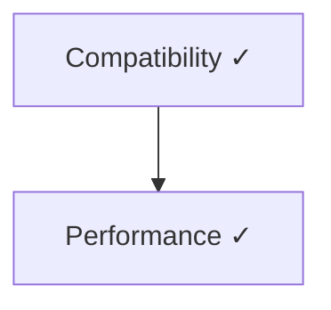

才能真正进入生产。

---

## 为什么迁移后的性能回退很难排查？

数据库迁移完成后，如果接口开始变慢，团队通常需要重新定位：

```text
Application?
Database?
Network?
SQL?
Index?
Optimizer?
Statistics?
```

如果问题直到生产阶段才发现：

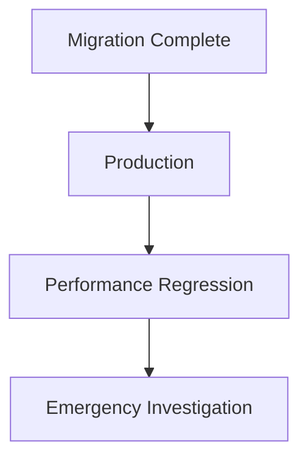

处理成本会明显增加。

更合理的方式是：

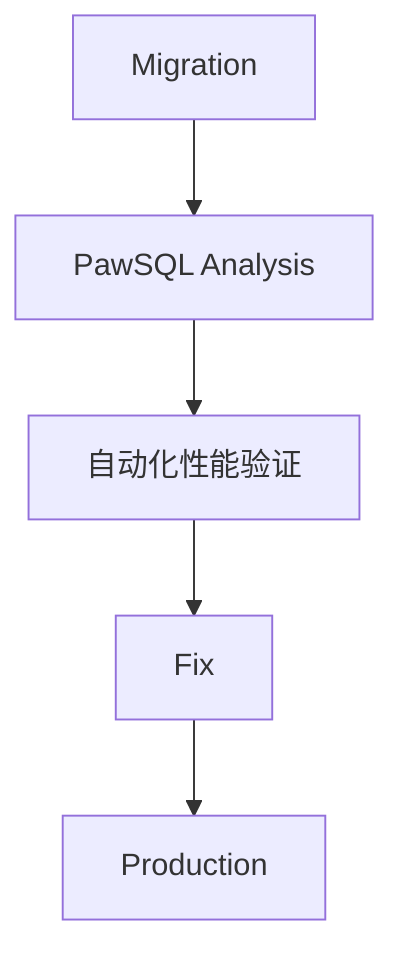

即：

<Note>
在正式切换之前发现性能风险。
</Note>

---

## PawSQL 在迁移工具链中的位置

PawSQL 不需要替代数据库厂商提供的迁移工具。

一个完整迁移平台通常包括：

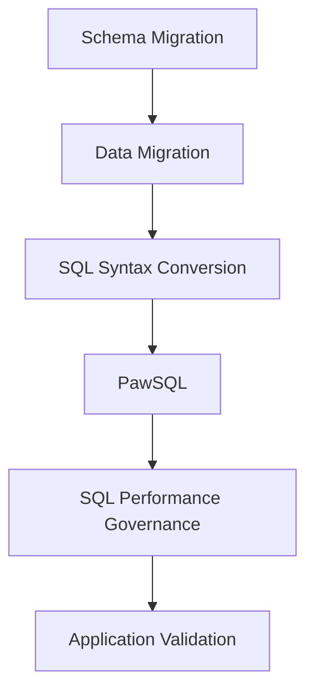

传统迁移工具擅长：

> Convert

PawSQL 更关注：

> Analyze + Optimize + Validate

因此可以形成互补。

---

## 数据库迁移工具 vs PawSQL

| 能力 | 传统迁移工具 | PawSQL |
|---|---|---|
| Schema 转换 | ✓ | - |
| 数据迁移 | ✓ | - |
| SQL 语法转换 | ✓ | 辅助 |
| SQL 兼容性分析 | ✓ | ✓ |
| SQL 性能风险分析 | Limited | ✓ |
| SQL 自动重写 | Limited | ✓ |
| 索引推荐 | Limited | ✓ |
| 执行计划分析 | Limited | ✓ |
| 优化前后验证 | Limited | ✓ |
| 批量 SQL 治理 | 部分 | ✓ |

两者关系并不是：

```text
Migration Tool VS PawSQL
```

而是：

```text
Migration Tool
+
PawSQL
```

---

## 建议关注的迁移质量指标

企业可以建立以下指标：

| 指标 | 目标 |
|---|---|
| SQL 自动解析覆盖率 | 提升 |
| SQL 自动兼容比例 | 提升 |
| 需要人工迁移的 SQL 比例 | 降低 |
| 迁移前性能风险发现率 | 提升 |
| Execution Plan Regression 数量 | 降低 |
| 生产上线后慢 SQL 数量 | 降低 |
| DBA 人工审核量 | 降低 |
| SQL 迁移平均处理时间 | 降低 |

更成熟的项目还可以建立：

```text
SQL Migration Readiness Score
```

综合衡量：

```text
Syntax Compatibility
+
Performance Readiness
+
Plan Stability
+
Manual Review Completion
```

---

## 哪些迁移项目最适合这个 User Case？

这一场景特别适合：

- Oracle → 国产数据库
- MySQL → 国产数据库
- PostgreSQL → 国产数据库
- SQL Server → 国产数据库
- 集中式 → 分布式数据库
- 信创替代项目
- 数据库国产化项目
- 数据库版本大升级
- 多数据库整合项目
- 云数据库迁移项目

特别是：

> SQL 数量大、业务复杂、上线后性能要求高的关键系统。

---

## 哪些角色会使用 PawSQL？

<AccordionGroup>
  <Accordion title="数据库迁移负责人">
    关注：

    - 迁移进度
    - SQL 风险
    - 上线 Ready 状态
  </Accordion>
  <Accordion title="DBA">
    关注：

    - 查询重写优化
    - Index
    - Execution Plan
  </Accordion>
  <Accordion title="应用开发团队">
    关注：

    - SQL Compatibility
    - Code Modification
  </Accordion>
  <Accordion title="架构师">
    关注：

    - Distributed SQL
    - Schema Design
    - Distribution Strategy
  </Accordion>
  <Accordion title="项目经理">
    关注：

    - Remaining Risks
    - Migration Workload
    - Go-Live Readiness
  </Accordion>
</AccordionGroup>

---

## 从数据库迁移升级为 SQL Migration Engineering

传统数据库迁移通常可以概括为：

```text
Schema
+
Data
+
SQL Conversion
```

但对于大型企业来说，这远远不够。

真正完整的迁移应该是：

```text
Schema Migration
        +
Data Migration
        +
SQL Compatibility
        +
SQL Performance
        +
Execution Plan Validation
```

也就是：

<Note>
**SQL Migration Engineering**
</Note>

---

## 建立迁移前、迁移中、迁移后的完整闭环

PawSQL 可以贯穿多个阶段：

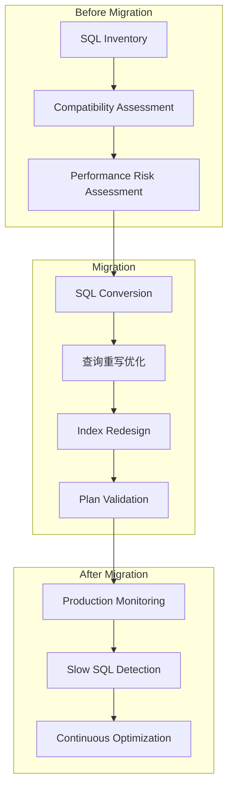

这样迁移就不再是一锤子买卖。

而是完整的：

<Note>
**Database Migration SQL Lifecycle**
</Note>

---

## 不要把旧数据库的性能问题一起迁过去

数据库迁移通常被视为一次技术替换项目。

但它实际上也是一次重新审视 SQL 质量的机会。

原数据库中可能已经存在：

- 历史遗留 SQL
- 低效子查询
- 深分页
- 冗余 Join
- 不合理索引
- 过时 Hint
- 大量技术债务

如果只是机械转换：

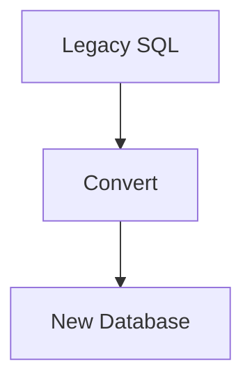

这些问题也会一起迁过去。

更合理的方式是：

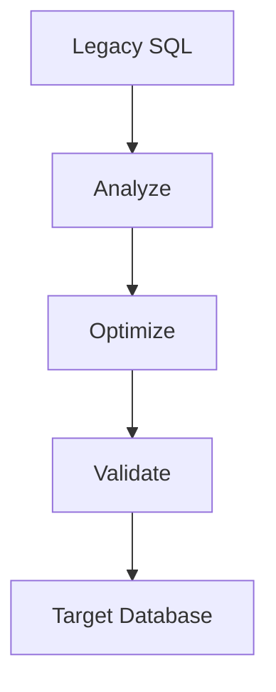

因此，数据库迁移不应该只是：

<Note>
**Move the SQL.**
</Note>

而应该是：

<Note>
**Move it, optimize it, and validate it.**
</Note>

---

## 让数据库迁移不仅“能跑”，更要“跑得好”

信创和数据库迁移的最终目标，并不是：

```text
Migration Completed
```

而应该是：

```text
Application Stable
+
SQL Compatible
+
Performance Acceptable
```

PawSQL 帮助迁移团队把：

```text
SQL Inventory
+
Compatibility Analysis
+
Performance Analysis
+
查询重写优化
+
智能索引推荐
+
Execution Plan Validation
```

连接起来，建立一套可批量执行、可验证、可持续的 SQL 迁移治理流程。

<Note>
**迁移成功，不只是 SQL 能运行，而是 SQL 在新数据库上依然能够高效运行。**
</Note>

[了解 PawSQL SQL 优化 →](/features/automatic-sql-rewrite)

[了解执行计划分析 →](/features/execution-plan-visualization)

了解分布式数据库 SQL 优化 →

[申请迁移评估 →](https://www.pawsql.com)

---

### 相关 User Cases

<CardGroup cols={2}>
  <Card title="Developer SQL Copilot" icon="code" href="/use-cases/developer-sql-copilot" />
  <Card title="CI/CD SQL Quality Gate" icon="git-merge" href="/use-cases/sql-quality-gate-cicd" />
  <Card title="DBA 批量治理生产慢 SQL" icon="gauge" href="/use-cases/slow-sql-optimization" />
  <Card title="企业级 SQL 全生命周期治理" icon="building-2" href="/use-cases/enterprise-sql-governance" />
</CardGroup>

分布式数据库 SQL 优化
