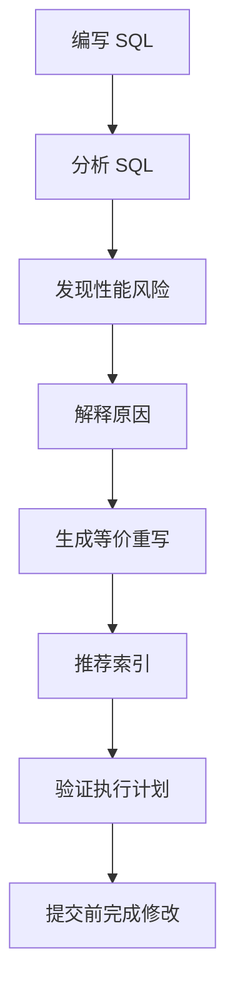
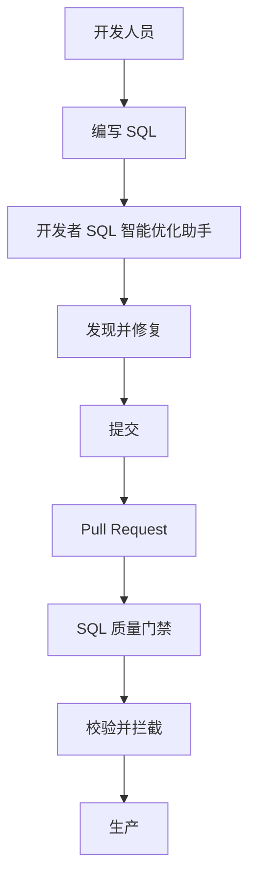

## 用户

后端开发人员（Java / Go 等），每天编写 SQL，但没有必要成为数据库优化专家。

## 问题

一条 SQL 在开发环境（几万行数据）能毫秒级返回，但在生产环境（数千万到上亿行数据）可能变成性能瓶颈。

以订单查询为例：

```sql
SELECT order_id, customer_id, order_status, create_time, total_amount
FROM orders
WHERE DATE(create_time) = '2026-09-04'
  AND customer_id = 10086
ORDER BY create_time DESC;
```

`DATE(create_time)` 把函数作用在过滤字段上，导致 `create_time` 上的索引无法被有效利用，扫描范围被放大。

开发人员通常不会在写 SQL 时主动检查这类问题——执行计划、索引结构、优化器行为、谓词选择性等都不是他们的日常职责。

## 目标

在代码提交之前发现并解决 SQL 性能风险，让性能问题止步于开发阶段，而不是几个月后在线上暴露。

## 流程

开发者 SQL 智能优化助手把数据库性能分析能力直接带入开发流程：



整个过程在现有研发流程内完成，开发人员不需要切换工具。

## 依赖能力

由以下能力组合而成，具体改写规则与索引设计逻辑见各能力页：

<CardGroup cols={2}>
  <Card title="SQL质量检查" icon="list-check" href="/features/sql-review" />
  <Card title="查询重写优化" icon="git-compare" href="/features/automatic-sql-rewrite" />
  <Card title="智能索引推荐" icon="layers" href="/features/index-recommendation" />
  <Card title="执行计划分析" icon="route" href="/features/execution-plan-visualization" />
  <Card title="自动化性能验证" icon="gauge" href="/features/performance-validation" />
</CardGroup>

## 成功标准

| 指标 | 目标 |
|---|---|
| 开发阶段 SQL 问题发现率 | 提升 |
| 上线后 SQL 问题数量 | 降低 |
| SQL 优化平均处理时间 | 降低 |
| 开发向 DBA 咨询次数 | 降低 |
| 新版本引入慢 SQL 数量 | 降低 |

---

## 不只是“帮你生成 SQL”

很多 AI 编程助手主要解决“SQL 怎么写”。但生产级 SQL 还需要继续回答：

> 这条 SQL 能用索引吗？一亿行数据还跑得动吗？是否存在更优的查询重写方案？应该加什么索引？执行计划是否合理？优化后是否真的更快？

开发者 SQL 智能优化助手的价值就在这里——不仅生成 SQL，还基于数据库语义与优化器完成分析、重写与验证。

## 与 SQL 质量门禁的分工

开发者 SQL 智能优化助手解决**写 SQL 时**的问题，SQL 质量门禁解决**提交和发布时**的问题，两者衔接形成“性能左移”：



<CardGroup cols={2}>
  <Card title="立即体验" icon="bolt" href="/getting-started/quickstart">
    用一条 SQL 完成第一次质量检查、重写与智能索引推荐。
  </Card>
  <Card title="了解 SQL 质量门禁" icon="git-merge" href="/use-cases/sql-quality-gate-cicd">
    在 CI/CD 中拦截有风险的 SQL。
  </Card>
  <Card title="了解查询重写优化" icon="wand-sparkles" href="/features/automatic-sql-rewrite">
    查看等价重写能力。
  </Card>
  <Card title="申请产品演示" icon="building-2" href="https://www.pawsql.com">
    联系 PawSQL 团队获取演示。
  </Card>
</CardGroup>
