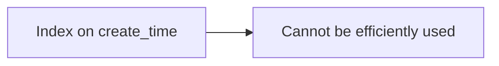
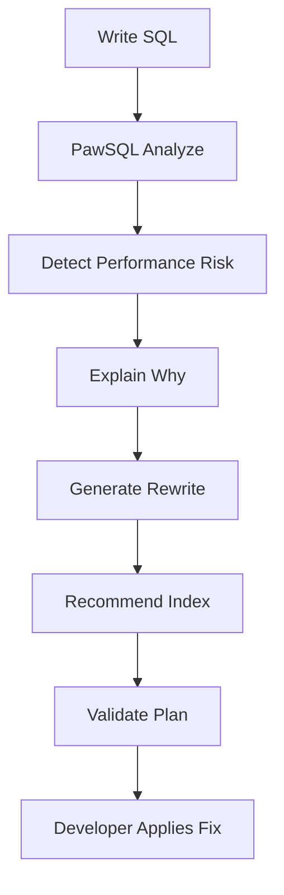
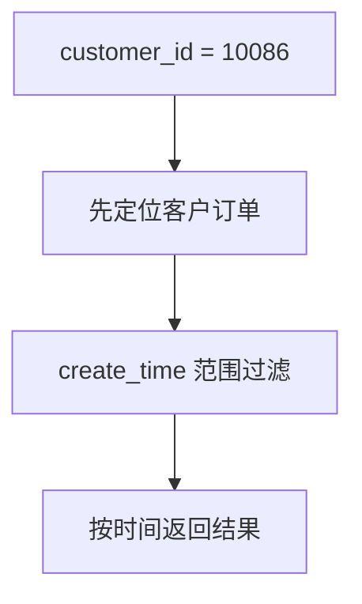
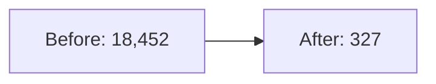
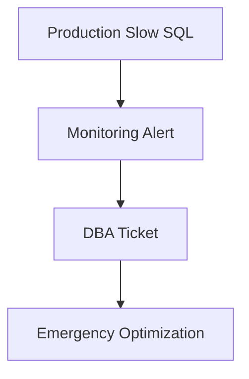
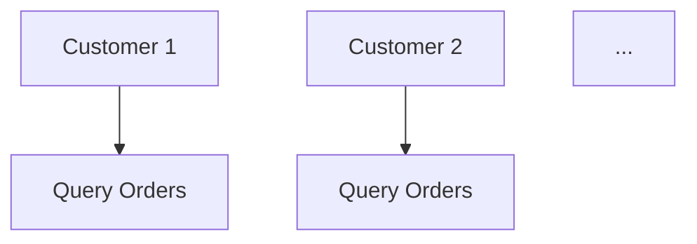
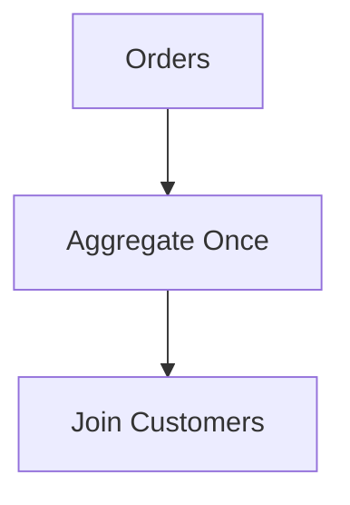
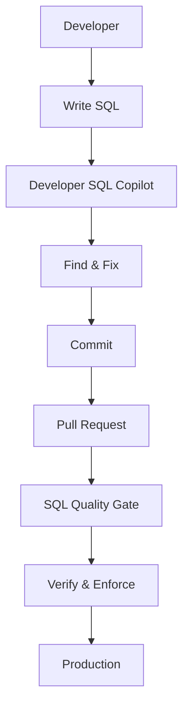

## 在写 SQL 的时候，就把性能问题解决掉

开发人员每天都在写 SQL。

但：

> SQL 能正确执行

和：

> SQL 能长期高效执行

是完全不同的两件事。

一条 SQL 在开发环境中面对：

```text
50,000 rows
```

可能毫秒级返回。

当生产数据增长到：

```text
80,000,000+ rows
```

同一条 SQL 可能变成系统性能瓶颈。

而大多数开发人员并没有必要成为专业 DBA，去逐条研究：

- 执行计划
- 索引结构
- 优化器行为
- Join 算法
- SQL 重写
- Predicate Selectivity

**PawSQL Developer SQL Copilot 将数据库性能分析能力直接带入开发流程，让开发人员在写 SQL 的时候就发现问题并完成优化。**

---

## 一个典型的开发场景

假设一名 Java 后端开发人员正在开发订单查询接口。

技术栈：

```text
Java
Spring Boot
MyBatis
MySQL
IntelliJ IDEA
```

需求：

> 查询某客户某一天产生的订单。

开发人员写下：

```sql
SELECT
    order_id,
    customer_id,
    order_status,
    create_time,
    total_amount
FROM orders
WHERE DATE(create_time) = '2026-09-04'
  AND customer_id = 10086
ORDER BY create_time DESC;
```

开发环境中：

```text
orders
50,000 rows
```

执行很快。

但生产环境：

```text
orders
80,000,000+ rows
```

问题开始出现。

---

## 功能正确，不代表性能正确

从业务逻辑上，这条 SQL 没有问题。

但：

```sql
DATE(create_time)
```

将函数作用在过滤字段上。

这可能导致：



或者产生更大的扫描范围。

问题是：

开发人员通常不会在写 SQL 时主动检查这一点。

---

## PawSQL 的开发者工作流

Developer SQL Copilot 将过程变成：



开发人员不需要离开当前研发流程。

<Steps>
<Step title="第一步：发现问题">

PawSQL 分析：

```sql
DATE(create_time)
```

并提示：

```text
性能风险

过滤字段被函数包裹：

DATE(create_time)

潜在影响：

create_time 上的普通索引
可能无法被充分利用。
```

重点不是只告诉开发人员：

> SQL 可能很慢。

而是明确告诉他：

> 哪个表达式有问题，以及为什么。

</Step>

<Step title="第二步：生成等价 SQL 重写">

原条件：

```sql
DATE(create_time) = '2026-09-04'
```

可以改写为：

```sql
create_time >= '2026-09-04 00:00:00'
AND create_time < '2026-09-05 00:00:00'
```

完整 SQL：

```sql
SELECT
    order_id,
    customer_id,
    order_status,
    create_time,
    total_amount
FROM orders
WHERE create_time >= '2026-09-04 00:00:00'
  AND create_time <  '2026-09-05 00:00:00'
  AND customer_id = 10086
ORDER BY create_time DESC;
```

这样数据库优化器有更好的机会使用索引范围扫描。

</Step>

<Step title="第三步：推荐索引">

假设当前已有：

```sql
CREATE INDEX idx_orders_customer
ON orders(customer_id);

CREATE INDEX idx_orders_create_time
ON orders(create_time);
```

而 SQL 的访问模式是：

```text
customer_id = ?
        +
create_time range
        +
ORDER BY create_time
```

PawSQL 可以进一步建议评估：

```sql
CREATE INDEX idx_orders_customer_create_time
ON orders(customer_id, create_time);
```

推荐不只是：

> 给 WHERE 字段加索引。

而是根据：

- 等值条件
- 范围条件
- 排序
- 已有索引
- 查询结构

进行综合分析。

</Step>

<Step title="第四步：解释为什么推荐这个索引">

查询逻辑可以理解为：



因此：

```text
(customer_id, create_time)
```

与这类访问模式更加匹配。

一个好的 SQL Copilot 不应该只告诉开发人员：

```text
Create this index.
```

还应该解释：

> Why?

</Step>

<Step title="第五步：执行计划验证">

如果连接数据库，PawSQL 可以继续验证。

原 SQL：

```text
Access Path:
Large Scan

Estimated Rows:
1,820,000

Estimated Cost:
18,452
```

优化后：

```text
Access Path:
Composite Index Range Scan

Estimated Rows:
124

Estimated Cost:
327
```

开发人员可以直接看到：



而不是只凭经验判断优化是否有效。

</Step>

<Step title="第六步：在代码提交前完成修改">

MyBatis 原 SQL：

```sql
WHERE DATE(create_time) = #{queryDate}
  AND customer_id = #{customerId}
```

修改为：

```sql
WHERE create_time >= #{startTime}
  AND create_time < #{endTime}
  AND customer_id = #{customerId}
```

问题在开发阶段就被解决。

它不会继续演变成：



</Step>

</Steps>

---

## 示例二：相关子查询优化

例如：

```sql
SELECT
    c.customer_id,
    c.customer_name,
    (
        SELECT COUNT(*)
        FROM orders o
        WHERE o.customer_id = c.customer_id
          AND o.order_status = 'PAID'
    ) AS paid_orders
FROM customers c;
```

在大数据量情况下，相关子查询可能产生重复访问。

PawSQL 可以分析是否可以解关联。

例如：

```sql
SELECT
    c.customer_id,
    c.customer_name,
    COALESCE(o.paid_orders, 0) AS paid_orders
FROM customers c
LEFT JOIN (
    SELECT
        customer_id,
        COUNT(*) AS paid_orders
    FROM orders
    WHERE order_status = 'PAID'
    GROUP BY customer_id
) o
    ON c.customer_id = o.customer_id;
```

执行逻辑从：



转变为：



---

## 示例三：深分页

开发人员写：

```sql
SELECT
    order_id,
    customer_id,
    create_time
FROM orders
ORDER BY create_time DESC
LIMIT 1000000, 20;
```

返回：

```text
20 rows
```

但数据库可能需要处理：

```text
1,000,020 rows
```

PawSQL 可以识别：

```text
Deep Pagination Risk

OFFSET:
1,000,000
```

并提示评估：

```text
Keyset Pagination
```

例如：

```sql
SELECT
    order_id,
    customer_id,
    create_time
FROM orders
WHERE create_time < #{lastCreateTime}
ORDER BY create_time DESC
LIMIT 20;
```

真正重要的是：

> 问题在 API 设计阶段被发现。

而不是几个月后在生产环境暴露。

---

## Developer SQL Copilot 能发现哪些问题？

<AccordionGroup>
  <Accordion title="Predicate">
    例如：

    ```sql
    WHERE YEAR(create_time) = 2026
    ```

    ```sql
    WHERE amount + 100 > 1000
    ```
  </Accordion>

  <Accordion title="Subquery">
    例如：

    - Correlated Subquery
    - Scalar Subquery
    - 可解关联子查询
    - 低效 `IN` / `EXISTS`
  </Accordion>

  <Accordion title="JOIN">
    例如：

    - 冗余 Join
    - Join 条件缺失
    - 中间结果集过大
    - Predicate Pushdown 受阻
  </Accordion>

  <Accordion title="Aggregation">
    例如：

    - 不必要 `DISTINCT`
    - 冗余 GROUP BY
    - 低效聚合
  </Accordion>

  <Accordion title="Pagination">
    例如：

    ```sql
    LIMIT 500000, 20
    ```
  </Accordion>

  <Accordion title="Index">
    例如：

    - 缺失索引
    - 索引前导列不合理
    - 查询条件与索引不匹配
    - 重复索引
  </Accordion>
</AccordionGroup>

---

## 不只是“帮你生成 SQL”

很多 AI 编程助手主要解决：

> SQL 怎么写？

例如：

```text
帮我写一个查询客户最近 20 笔订单的 SQL
```

AI 可以快速生成查询。

但生产级 SQL 还需要继续回答：

```text
这条 SQL 能使用索引吗？

1 亿行数据还能跑得动吗？

是否存在更优的 SQL Rewrite？

应该增加什么索引？

执行计划是否合理？

优化之后是否真的更快？
```

Developer SQL Copilot 的价值就在这里。

---

## Developer SQL Copilot + SQL Quality Gate

Developer SQL Copilot 解决：

> 写 SQL 时的问题。

SQL Quality Gate 解决：

> 提交和发布时的问题。

两者结合：



形成：

<Note>
**Shift Left SQL Performance**
</Note>

即：

> SQL 性能左移。

---

## 对开发人员的价值

- 更快获得 SQL 优化建议
- 减少等待 DBA 的时间
- 在编码过程中学习 SQL 优化
- 减少生产环境性能风险
- 对 SQL 修改更有信心

---

## 对 DBA 的价值

<Tabs>
  <Tab title="传统模式">
    ```mermaid
    flowchart TD
        A[100 Developers] --> B[Hundreds of SQL Questions]
        B --> C[DBA Team]
    ```
  </Tab>
  <Tab title="使用 PawSQL">
    ```mermaid
    flowchart TD
        A[100 Developers] --> B[PawSQL First-Line Analysis]
        B --> C[Complex Cases Only]
        C --> D[DBA Team]
    ```
  </Tab>
</Tabs>

DBA 可以更多关注：

- 数据库架构
- Schema 设计
- 核心 SQL
- 容量规划
- 生产故障
- 分布式数据库设计

---

## 建议关注的效果指标

| 指标 | 目标 |
|---|---|
| 开发阶段 SQL 问题发现率 | 提升 |
| 上线后 SQL 问题数量 | 降低 |
| SQL 优化平均处理时间 | 降低 |
| 开发向 DBA 咨询次数 | 降低 |
| 发布前 SQL 分析覆盖率 | 提升 |
| 新版本引入慢 SQL 数量 | 降低 |

---

## 适合哪些团队？

特别适合：

- Java / Go 后端团队
- MyBatis 等显式 SQL 开发团队
- 大型数据库应用
- 高频 SQL 开发项目
- DBA 人力有限的企业
- 多数据库研发环境
- DevOps 团队
- 希望实施 SQL 性能左移的组织

---

## 在 SQL 上线之前，把问题解决掉

最容易解决的 SQL 性能问题，是：

> 从来没有进入生产环境的问题。

开发人员不需要成为 DBA。

他们真正需要的是：

> 在写 SQL 的那个时刻，获得专业的数据库性能智能。

**PawSQL Developer SQL Copilot 帮助开发人员在编码阶段完成 SQL 分析、问题解释、SQL 重写、索引推荐和执行计划验证。**

<Note>
**写 SQL。理解 SQL。优化 SQL。然后再上线。**
</Note>

<CardGroup cols={2}>
  <Card title="立即体验 PawSQL" icon="bolt" href="/getting-started/quickstart">
    用一条 SQL 完成第一次审核、重写与索引推荐。
  </Card>
  <Card title="了解 SQL 优化" icon="wand-sparkles" href="/features/automatic-sql-rewrite">
    查看自动 SQL 重写能力。
  </Card>
  <Card title="了解 SQL Quality Gate" icon="git-merge" href="/use-cases/sql-quality-gate-cicd">
    在 CI/CD 中拦截有风险的 SQL。
  </Card>
  <Card title="申请产品演示" icon="building-2" href="https://www.pawsql.com">
    联系 PawSQL 团队获取演示。
  </Card>
</CardGroup>
