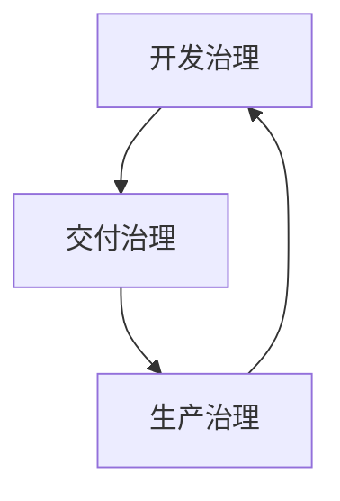

## 用户

工程负责人、CIO / CTO、架构师、数据库平台主管与技术治理委员会——需要跨团队、跨数据库、跨研发流程统一 SQL 治理的组织。

## 问题

大型企业的 SQL 治理往往不是「缺工具」，而是「碎片化」：不同团队各自维护规范文档、依赖 DBA 人工审核、使用自研脚本；SQL 分散在 IDE、代码仓库、CI/CD、迁移脚本、生产慢日志等各个阶段；问题往往到生产环境才暴露。

治理能力已经存在，但缺乏统一体系。

## 目标

把分散的 SQL 工具与人工流程沉淀为统一、可执行、可度量的治理平台，形成跨团队、跨数据库、跨研发流程的 SQL 全生命周期治理。

## 流程

企业 SQL 治理可划分为三个核心层次，彼此形成闭环：



三个层次分别对应一个使用场景（点击查看各自端到端流程）：

| 层次 | 回答的问题 | 对应场景 |
|---|---|---|
| 开发治理 | 写 SQL 时是否合理？ | [开发者 SQL 智能优化助手](/use-cases/developer-sql-copilot) |
| 交付治理 | 是否允许进入生产？ | [CI/CD SQL 质量门禁](/use-cases/sql-quality-gate-cicd) |
| 生产治理 | 运行中的 SQL 是否持续健康？ | [生产慢 SQL 批量治理](/use-cases/slow-sql-optimization) |

三者共享同一套底层 SQL 分析能力，而非三套独立工具。

## 依赖能力

统一平台由以下能力支撑（详见各能力页）：

<CardGroup cols={2}>
  <Card title="SQL质量检查" icon="list-check" href="/features/sql-review" />
  <Card title="查询重写优化" icon="git-compare" href="/features/automatic-sql-rewrite" />
  <Card title="智能索引推荐" icon="layers" href="/features/index-recommendation" />
  <Card title="执行计划分析" icon="route" href="/features/execution-plan-visualization" />
  <Card title="自动化性能验证" icon="gauge" href="/features/performance-validation" />
  <Card title="分布式 SQL 优化" icon="network" href="/features/distributed-sql-optimization" />
</CardGroup>

## 成功标准

| 指标 | 目标 |
|---|---|
| SQL 自动分析覆盖率 | 提升 |
| 上线前问题修复率 | 提升 |
| 严重 SQL 上线数量 | 降低 |
| DBA 人工审核量 | 降低 |
| 生产慢 SQL 数量 | 降低 |
| 治理规则统一率 | 提升 |
| 多数据库治理覆盖率 | 提升 |

---

## 一套规则，覆盖多个团队与数据库

统一治理不是「所有团队一套完全相同的规则」，而是「统一底线 + 业务差异化」：

```text
集团基线规则 + 业务单元规则 + 项目专属规则
```

同时，多数据库治理也不等于「完全相同的检查」。正确的模型是：

```text
统一治理框架 + 数据库专属智能
```

企业规范可以配置为自定义 SQL 规则，在开发、CI/CD、发布审核多个环节复用，避免「同一条规范由不同工具重复实现」。

## 从文档规范到策略即代码

几十页的《SQL 开发规范》本身不会阻止错误 SQL 上线。成熟的做法是把规范转为可执行策略：

```text
规则：UPDATE 无 WHERE 条件
等级：严重
动作：阻断流水线
```

治理从「人记住规范」转变为「系统自动执行规范」。

## 让治理可度量

统一平台的价值还在于管理层获得统一指标：

| 指标 | 本月 | 趋势 |
|---|---:|---|
| SQL 分析量 | 128,642 | ↑ |
| 严重问题 | 186 | ↓ |
| 上线前修复问题 | 4,382 | ↑ |
| 生产慢 SQL Pattern | 312 | ↓ |

并进一步建立 SQL Quality Score 与团队 Scorecard，把治理从「一次性审核」升级为「可度量的工程体系」。

## 典型实施路径

大型企业不建议一次性上线全部能力，可分阶段推进：

1. **统一 SQL质量检查**——先统一规则与数据库覆盖
2. **CI/CD 质量门禁**——接入 Git、CI/CD、Webhook，实现策略自动执行
3. **开发左移**——把 SQL 分析接入 IDE 与开发流程
4. **生产治理**——接入慢查询与监控，建立持续性能治理
5. **治理度量**——建立 Dashboard、Scorecard、Quality Score，把治理从工具能力升级为管理体系

## 从审核到治理，从优化到工程

企业最终获得的不是「SQL 审核工具」或「SQL 优化工具」，而是由标准、策略、分析、优化、工作流与指标共同构成的 SQL Engineering 能力。

<CardGroup cols={2}>
  <Card title="了解核心能力" icon="layers" href="/features/index" />
  <Card title="了解开发者 SQL 智能优化助手" icon="code" href="/use-cases/developer-sql-copilot" />
  <Card title="了解 SQL 质量门禁" icon="git-merge" href="/use-cases/sql-quality-gate-cicd" />
  <Card title="了解生产慢 SQL 治理" icon="gauge" href="/use-cases/slow-sql-optimization" />
  <Card title="申请企业级产品演示" icon="compass" href="https://www.pawsql.com" />
</CardGroup>
