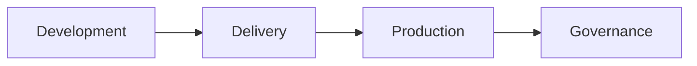
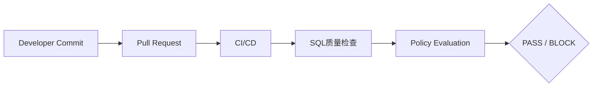
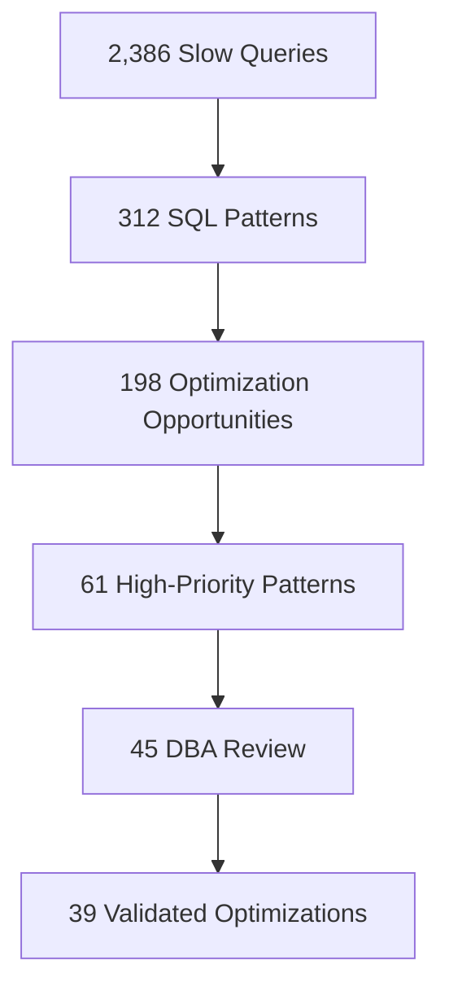
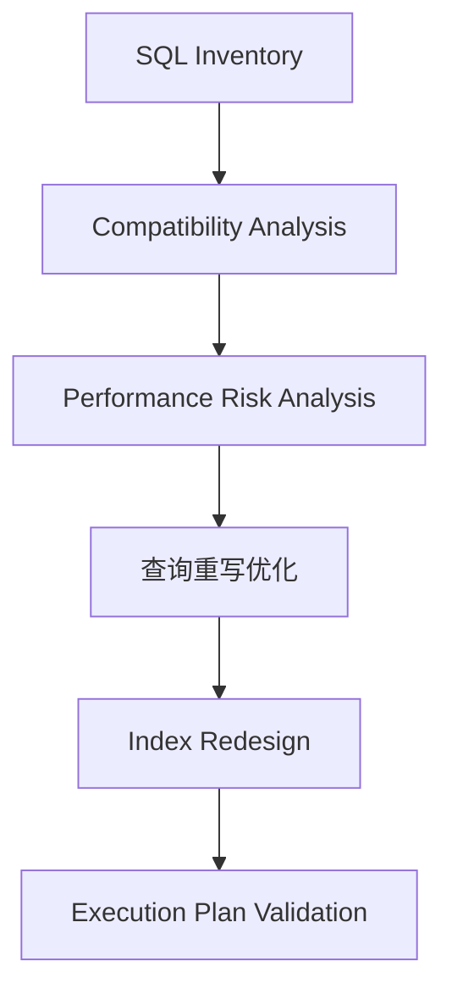
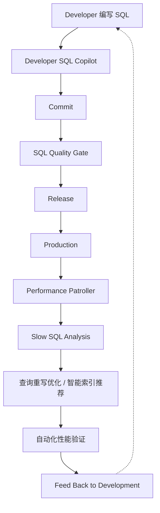

## 让 SQL 治理覆盖从开发到生产的整个生命周期

SQL 问题不会只发生在生产环境。它可能从开发人员写下第一行 SQL 时就已经存在，也可能在代码提交、数据库发布、业务增长、数据分布变化之后才逐渐暴露。

传统方式往往是“上线后救火”：


而 PawSQL 希望把 SQL 治理前移，并贯穿整个软件生命周期：


<Note>
无论你是开发人员、DevOps、DBA、数据库架构师，还是企业技术平台主管，都可以在 PawSQL 中找到对应的 SQL 治理场景。
</Note>

## 从 SQL 优化工具，到 SQL Engineering Platform

很多企业已经拥有 SQL 规范文档、DBA 人工审核、CI/CD、APM、慢查询监控和数据库迁移工具，但这些能力通常是彼此分散的。

PawSQL 将不同阶段的 SQL 工作连接起来：



并提供统一的能力组合：**SQL质量检查 · 查询重写优化 · 智能索引推荐 · 执行计划分析 · 自动化性能验证**，帮助企业逐步建立 SQL Engineering 与 SQL Governance 能力。

## 选择最适合你的场景

### Developer SQL Copilot

开发人员通常最早接触 SQL，但也是最容易在无意中引入性能问题的人。

```sql
SELECT *
FROM orders
WHERE DATE(create_time) = '2026-09-04'
  AND customer_id = 10086;
```

SQL 在开发环境中可能运行很快；但当生产表增长到数千万甚至上亿行后，函数条件、低效子查询、不合理索引和深分页都可能成为性能瓶颈。

PawSQL Developer SQL Copilot 帮助开发人员在编码阶段完成：SQL 性能风险识别 · SQL 问题解释 · 查询重写优化 · 智能索引推荐 · 执行计划分析 · 优化效果验证。

<Note>
**把 SQL 性能问题解决在代码提交之前。**
</Note>

[了解 Developer SQL Copilot →](/use-cases/developer-sql-copilot)

### SQL Quality Gate for CI/CD

应用代码已经拥有单元测试、代码审核、安全扫描和 CI/CD，数据库 SQL 也应该有同样的质量控制。PawSQL 可以将 SQL质量检查和性能分析嵌入 CI/CD 流程：



帮助团队自动发现高风险 DML / DDL、SQL 规范问题、SQL 性能风险、缺失索引、深分页、低效子查询和不合理 Join，并根据风险等级决定 PASS、WARNING、DBA REVIEW 或 BLOCK。

<Note>
**让 SQL质量检查从人工流程升级为自动质量门禁。**
</Note>

[了解 SQL Quality Gate →](/use-cases/sql-quality-gate-cicd)

### DBA 批量治理生产慢 SQL

监控系统通常可以告诉 DBA 哪条 SQL 慢，但 DBA 真正需要解决的是：为什么慢、哪里有问题、怎么改、需要什么索引，以及优化后是否真的更好。

PawSQL 可以将慢查询采集、SQL 归一化、SQL Pattern 聚类、性能分析、查询重写优化、智能索引推荐和执行计划验证串联起来：



DBA 不再需要逐条分析所有慢 SQL，而是聚焦真正值得人工处理的高价值 SQL。

<Note>
**Monitoring tells you which SQL is slow. PawSQL tells you why, how to fix it, and whether the fix is better.**
</Note>

[了解生产慢 SQL 治理 →](/use-cases/slow-sql-optimization)

### 信创 / 数据库迁移中的 SQL 治理

数据库迁移最常见的目标是 SQL 能否在新数据库上执行，但真正进入生产后，更重要的问题是 SQL 在目标数据库上还能不能跑得足够快。PawSQL 可以帮助迁移团队完成：



让数据库迁移从 Syntax Migration 升级为 **Performance-Aware SQL Migration**。

<Note>
**不要只迁移 SQL，也不要把旧数据库中的性能问题一起迁过去。**
</Note>

[了解数据库迁移 SQL 治理 →](/use-cases/database-migration-sql-governance)

### 企业统一 SQL Governance 平台

大型企业内部通常同时存在多个开发团队、多个 DBA 团队、多个数据库平台、多个发布流程和多个 SQL 标准。

PawSQL 可以将 Development Governance、Delivery Governance 和 Production Governance 统一起来，形成覆盖 Developer SQL Copilot、SQL Quality Gate、Performance Patroller、SQL质量检查、查询重写优化、智能索引推荐、执行计划分析 和 Governance Metrics 的统一平台。

<Note>
**建立统一、可执行、可度量的 SQL Governance Platform。**
</Note>

[了解企业统一 SQL Governance →](/use-cases/enterprise-sql-governance)

## 按角色选择 PawSQL

| 角色 | 最常见的问题 | 推荐 Use Case |
|---|---|---|
| 开发人员 | SQL 怎么写得更快、更合理？ | [Developer SQL Copilot](/use-cases/developer-sql-copilot) |
| DevOps / 研发效能 | 如何自动阻止问题 SQL 上线？ | [SQL Quality Gate](/use-cases/sql-quality-gate-cicd) |
| DBA | 如何批量处理生产慢 SQL？ | [Slow SQL Optimization](/use-cases/slow-sql-optimization) |
| 数据库迁移团队 | 如何降低迁移后的 SQL 性能回退？ | [Database Migration Governance](/use-cases/database-migration-sql-governance) |
| 技术平台主管 | 如何统一不同团队和数据库的 SQL 标准？ | [Enterprise SQL Governance](/use-cases/enterprise-sql-governance) |

## 按软件生命周期选择 PawSQL

<Tabs>
  <Tab title="Development">
    ```mermaid
    flowchart LR
        A[编写 SQL] --> B[Developer SQL Copilot]
        B --> C[分析] --> D[重写] --> E[索引推荐] --> F[性能验证]
    ```

    目标：**尽早发现问题。**
  </Tab>
  <Tab title="Delivery">
    ```mermaid
    flowchart LR
        A[Commit] --> B[Pull Request] --> C[CI/CD] --> D[SQL Quality Gate]
    ```

    目标：**阻止问题进入生产。**
  </Tab>
  <Tab title="Production">
    ```mermaid
    flowchart LR
        A[Production SQL] --> B[Monitoring] --> C[Slow SQL] --> D[PawSQL Optimization]
    ```

    目标：**持续发现并治理性能问题。**
  </Tab>
  <Tab title="Governance">
    ```mermaid
    flowchart LR
        A[Rules] --> B[Workflow] --> C[Metrics] --> D[Multi-Database Coverage]
    ```

    目标：**把 SQL 优化从个人能力升级为企业工程能力。**
  </Tab>
</Tabs>

## 一套 SQL 智能能力，服务不同治理场景

| 能力 | 作用 |
|---|---|
| SQL质量检查 | 发现规范、安全和潜在风险 |
| 查询重写优化 | 自动生成等价优化方案 |
| 智能索引推荐 | 根据查询模式推荐索引 |
| 执行计划分析 | 分析数据库执行策略 |
| 自动化性能验证 | 验证优化方案是否真正改善 |
| Multi-Database Support | 支持异构数据库统一治理 |

## 一个完整的 SQL Engineering Lifecycle



这不是几个独立工具的简单组合，而是一套完整的 **SQL Lifecycle Governance**。

## 从这里开始

<CardGroup cols={2}>
  <Card title="Developer SQL Copilot" icon="code" href="/use-cases/developer-sql-copilot">
    在编写 SQL 时获得提示与优化建议。
  </Card>
  <Card title="SQL Quality Gate" icon="git-merge" href="/use-cases/sql-quality-gate-cicd">
    在 CI/CD 中拦截有风险的 SQL。
  </Card>
  <Card title="Slow SQL Optimization" icon="gauge" href="/use-cases/slow-sql-optimization">
    规模化治理生产环境慢 SQL。
  </Card>
  <Card title="Database Migration Governance" icon="arrow-right-left" href="/use-cases/database-migration-sql-governance">
    让迁移后的 SQL 依然跑得足够快。
  </Card>
  <Card title="Enterprise SQL Governance" icon="building-2" href="/use-cases/enterprise-sql-governance">
    建立统一、可执行、可度量的治理平台。
  </Card>
</CardGroup>

## 让 SQL 从“上线后优化”，变成“全生命周期治理”

真正成熟的 SQL 工程体系应该覆盖 **编写 → 审核 → 发布 → 监控 → 优化 → 持续改进** 的完整闭环。

PawSQL 帮助企业把 SQL质量检查、性能优化、CI/CD 门禁、生产治理和多数据库标准连接起来，形成统一的 SQL Engineering 与 SQL Governance 能力。

<Note>
**从第一行 SQL 到生产环境，PawSQL 让 SQL 质量和性能始终处于治理之中。**
</Note>

<CardGroup cols={2}>
  <Card title="快速开始" icon="bolt" href="/getting-started/quickstart">
    用一条 SQL 完成第一次审核、重写与智能索引推荐。
  </Card>
  <Card title="支持的数据库" icon="database" href="/getting-started/supported-databases">
    查看数据库、版本与能力的支持范围。
  </Card>
</CardGroup>
