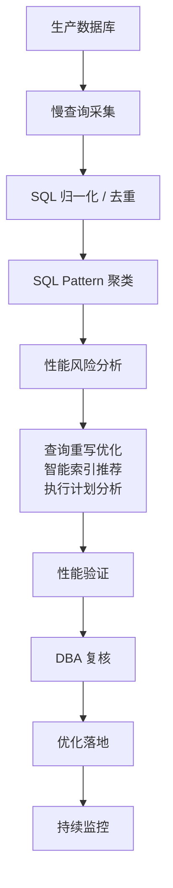
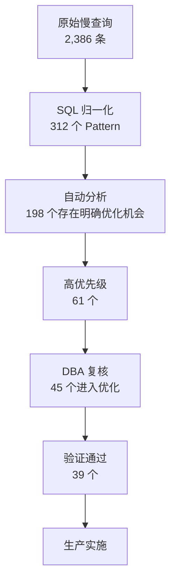
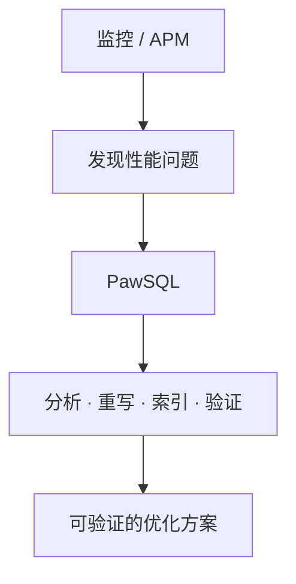

## 用户

DBA / 数据库运维团队，负责生产环境的慢 SQL 治理。

## 问题

生产慢 SQL 治理的难点不在「没有工具」，而在「难以规模化」：

1. **慢 SQL 数量太多**——每天上千条，大量只是参数不同的重复模式
2. **慢不等于 SQL 本身有问题**——可能来自索引失效、数据增长、锁等待、资源竞争
3. **知道「慢」不等于知道「怎么改」**——真正耗时的是分析原因、设计改写、判断索引
4. **优化建议缺少验证**——「建议加索引」远不如「加什么索引、改后是否真的更快」

## 目标

把逐条人工救火，升级为自动化、可规模化的批量治理，让 DBA 聚焦「最值得优化的 SQL」，而不是逐条追着慢查询跑。

## 流程

PawSQL 把生产慢 SQL 治理串成一个可持续运行的闭环：



## 依赖能力

由以下能力组合而成，具体改写规则与索引设计逻辑见各能力页：

<CardGroup cols={2}>
  <Card title="SQL质量检查" icon="list-check" href="/features/sql-review" />
  <Card title="查询重写优化" icon="git-compare" href="/features/automatic-sql-rewrite" />
  <Card title="智能索引推荐" icon="layers" href="/features/index-recommendation" />
  <Card title="执行计划分析" icon="route" href="/features/execution-plan-visualization" />
  <Card title="自动化性能验证" icon="gauge" href="/features/performance-validation" />
</CardGroup>

## 成功标准

| 指标 | 目标 |
|---|---|
| 每日慢 SQL 数量 | 持续下降 |
| SQL Pattern 数量 | 可控 |
| 自动分析覆盖率 | 提升 |
| 自动产生优化建议比例 | 提升 |
| DBA 单条 SQL 平均处理时间 | 降低 |
| 高价值 SQL 优化完成率 | 提升 |
| 慢 SQL 重复发生率 | 降低 |

---

## SQL 归一化：把海量执行记录收敛成少量模式

生产环境大量慢 SQL 只是参数不同：

```sql
SELECT * FROM orders WHERE customer_id = 10001;
SELECT * FROM orders WHERE customer_id = 10002;
SELECT * FROM orders WHERE customer_id = 10003;
```

归一化后统一为同一个 SQL Pattern：

```sql
SELECT * FROM orders WHERE customer_id = ?;
```

于是「10 万条执行记录」收敛成「1,000 个 SQL Pattern」，治理对象从单次查询提升为 SQL 模式。

## 优先级模型：找「最值得优化的」，不是「最慢的」

单次耗时不是唯一标准——一条每天执行 2 万次、耗时 800ms 的 SQL，比一条每天 5 次、耗时 30s 的 SQL 更值得优先治理。综合考虑：

```text
优化优先级 = 执行耗时 × 执行频率 × 资源影响 × 风险等级
```

## 一个典型治理结果

一次批量治理任务中，DBA 不再需要逐条分析几千条 SQL：



最终只需重点关注几十条真正高价值的 SQL。

## 与监控系统互补

APM / 数据库监控擅长回答「哪里慢」；PawSQL 更进一步回答「为什么慢、怎么改、改后是否真的更好」：



<CardGroup cols={2}>
  <Card title="了解查询重写优化" icon="wand-sparkles" href="/features/automatic-sql-rewrite" />
  <Card title="了解执行计划分析" icon="route" href="/features/execution-plan-visualization" />
  <Card title="了解开发者 SQL 智能优化助手" icon="code" href="/use-cases/developer-sql-copilot" />
  <Card title="申请产品演示" icon="plug" href="https://www.pawsql.com" />
</CardGroup>
