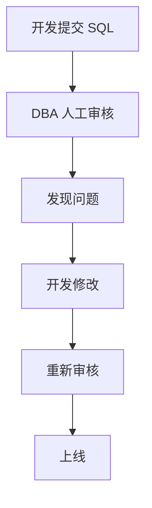
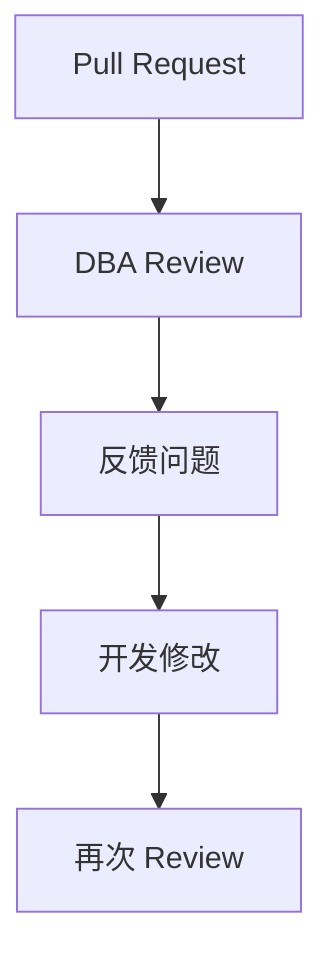
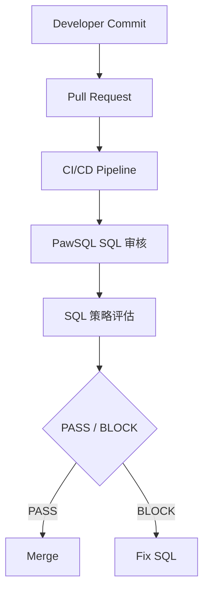
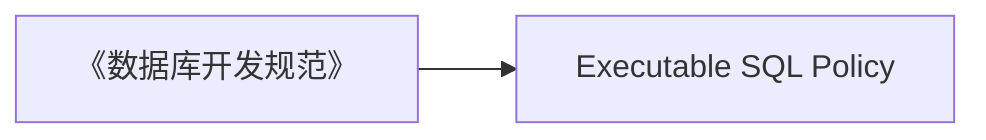
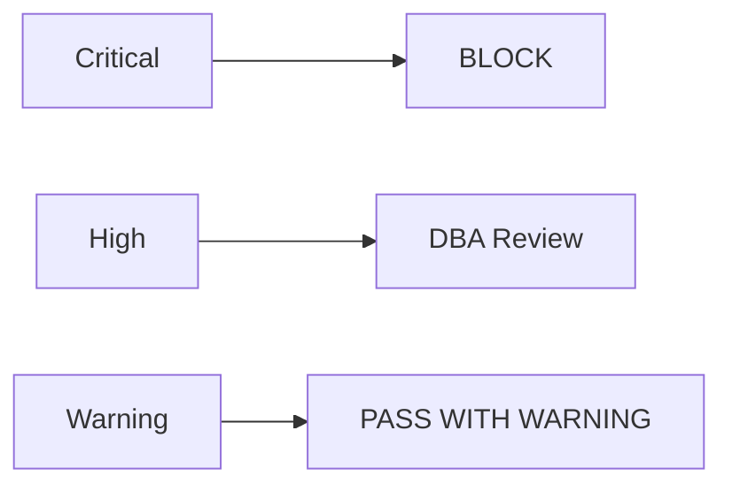
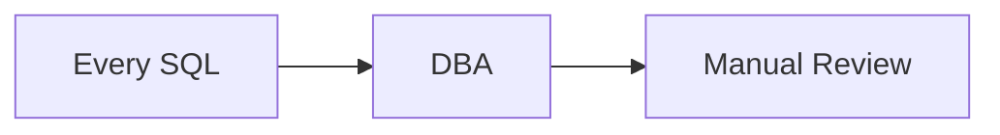
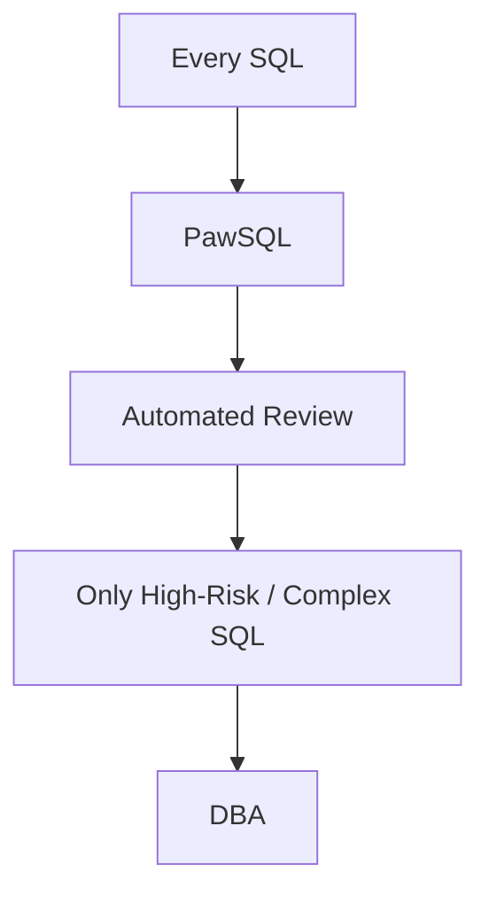
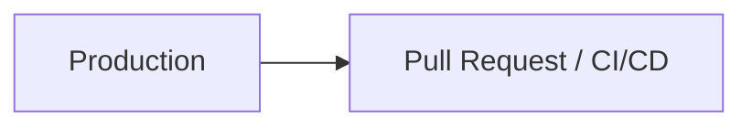
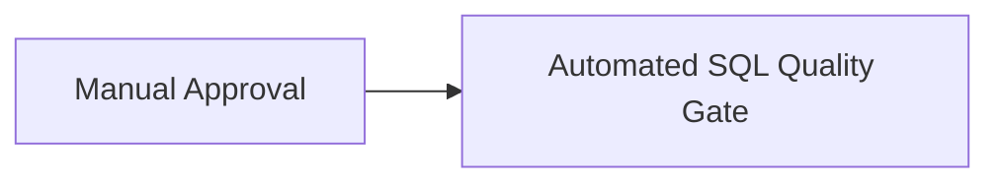

## 在 SQL 进入生产之前，把风险拦下来

现代软件研发已经将大量质量控制自动化：

- 单元测试
- 代码扫描
- 安全检测
- 构建检查
- CI/CD
- 发布审批

但在很多企业中，SQL 仍然依赖：

> DBA 人工审核。

典型流程是：



当开发团队规模扩大、发布频率提高之后，这种模式很容易产生三个问题：

1. DBA 成为交付瓶颈
2. SQL质量检查标准难以统一
3. SQL 性能问题发现得太晚

**PawSQL SQL Quality Gate 将 SQL质量检查和性能分析嵌入 CI/CD 流程，让 SQL 像应用代码一样，在上线前经过自动质量检查。**

---

## 一个典型场景

假设某企业拥有：

```text
300+ 开发人员
50+ 业务系统
几十次版本发布 / 周
数千条 SQL 变更 / 月
```

数据库包括：

```text
MySQL
PostgreSQL
Oracle
SQL Server
TDSQL
OceanBase
openGauss
...
```

传统情况下，每一次数据库变更都可能需要 DBA 人工处理：



对于少量 SQL，这种模式可以工作。

对于大规模研发组织，很难长期持续。

---

## PawSQL 的处理方式

将 PawSQL 接入代码提交和发布流程：



SQL质量检查从：

> 人工检查

变为：

> 自动质量门禁。

---

## PawSQL 可以检查什么？

### SQL 安全风险

例如：

<Tabs>
  <Tab title="DELETE 缺少过滤条件">
    ```sql
    DELETE FROM orders;
    ```
  </Tab>
  <Tab title="UPDATE 缺少过滤条件">
    ```sql
    UPDATE customer
    SET status = 'DISABLED';
    ```
  </Tab>
</Tabs>

如果缺少有效过滤条件，可以被识别为高风险 SQL。

企业可以定义：

```text
Severity: Critical
Action: Block Pipeline
```

直接阻止 SQL 进入后续发布流程。

---

### SQL 开发规范

例如：

- `SELECT *`
- 表名 / 字段名规范
- 索引命名规范
- 数据类型规范
- DDL 规范
- 大事务
- 高风险数据库对象操作

将《数据库开发规范》从一份文档，变成：



即：

> 可自动执行的 SQL 规范。

---

## 不只是 SQL Lint

普通 SQL Lint 工具通常关注：

> SQL 是否符合编码规范？

但生产环境真正需要判断的是：

> SQL 是否安全、合理，并且可能高效运行？

例如：

```sql
SELECT *
FROM orders
WHERE DATE(create_time) = '2026-09-04'
  AND customer_id = 10086;
```

SQL 语法没有问题。

但：

```sql
DATE(create_time)
```

可能降低索引使用效率。

PawSQL 可以进一步识别：

```text
Performance Risk

Function applied to filtering column:

DATE(create_time)

Potential Impact:

Index on create_time may not be efficiently used.
```

---

## 自动生成 SQL 优化建议

原 SQL：

```sql
SELECT *
FROM orders
WHERE DATE(create_time) = '2026-09-04'
  AND customer_id = 10086;
```

可以进一步建议改写为：

```sql
SELECT *
FROM orders
WHERE create_time >= '2026-09-04 00:00:00'
  AND create_time <  '2026-09-05 00:00:00'
  AND customer_id = 10086;
```

这样开发人员在 Pull Request 阶段就能看到：

- 问题在哪里
- 为什么有风险
- 可以如何修改

而不是等到生产环境出现慢查询。

---

## 进一步分析索引

如果目标数据库 Schema 和索引信息可用，PawSQL 还可以分析：

```text
customer_id = ?
+
create_time range
```

是否适合组合索引：

```sql
CREATE INDEX idx_orders_customer_create_time
ON orders(customer_id, create_time);
```

SQL Quality Gate 因此不只是：

> 检查 SQL。

还可以进一步：

> 给出可执行的性能优化方案。

---

## 用执行计划验证优化

如果连接目标数据库，PawSQL 可以进一步比较执行计划。

例如：

<Tabs>
  <Tab title="优化前">
    ```text
    Before

    Large Range Scan
    Estimated Cost: 18,452
    ```
  </Tab>
  <Tab title="优化后">
    ```text
    After

    Index Range Scan
    Estimated Cost: 327
    ```
  </Tab>
</Tabs>

这样 SQL 优化建议不仅仅停留在理论层面。

而是进一步回答：

> 修改之后，数据库优化器是否真的认为它更好？

---

## Pull Request 中直接获得反馈

一个典型的 SQL质量检查结果可以是：

```text
PawSQL SQL 审核

Files analyzed:          4
SQL statements:         37

Passed:                 31
Warnings:                4
Critical:                2
```

例如：

<AccordionGroup>
  <Accordion title="Critical Issue 示例">
    ```text
    Critical Issue #1

    DELETE without selective predicate

    File:
    migration/V20260907_01.sql

    Line:
    28
    ```
  </Accordion>
  <Accordion title="Performance Issue 示例">
    ```text
    Performance Issue #2

    Non-SARGable predicate

    Expression:
    DATE(create_time)

    Suggestion:
    Rewrite as range predicate
    ```
  </Accordion>
</AccordionGroup>

开发人员可以直接在代码提交阶段完成修改。

---

## 根据风险等级决定发布动作

企业可以建立统一的 SQL Policy：

| Severity | 行为 |
|---|---|
| Info | 记录 |
| Warning | 允许通过并提示 |
| Error | 要求确认 / Review |
| Critical | 阻断 Pipeline |

例如：



从而形成可重复、可审计的 SQL 发布标准。

---

## 总部规则 + 项目规则

大型企业通常需要多级规则体系：

```text
Enterprise Baseline
        +
Business Unit Rules
        +
Project Rules
```

例如：

集团级：

```text
禁止无条件 DELETE
禁止无条件 UPDATE
```

核心系统：

```text
高风险 DDL 必须 DBA 审批
```

互联网业务：

```text
OFFSET > 100000
标记为深分页风险
```

这种方式既保证统一底线，又允许业务差异化。

## 策略即代码

SQL Quality Gate 可以作为企业 **SQL Policy as Code** 的执行层：把数据库规范从文档转换为可执行策略。

```text
Policy
├─ No DELETE without WHERE
├─ No full table scan on large tables
├─ No forbidden DDL
├─ Index naming convention
├─ Maximum affected rows
└─ Database-specific production rules
```

规范因此不再只存在于 Wiki 或制度文档中，而是直接进入交付流水线。

### 可配置阈值

企业可以根据自身流程配置：

- 最大 Critical 数量
- 最大 Warning 数量
- 允许忽略的规则
- 必须阻断的规则
- 不同环境的策略

例如测试环境可以相对宽松，而生产发布使用更严格策略。

## 如何接入流水线

SQL Quality Gate 可以通过以下方式接入现有流水线：

- REST API
- Webhook
- CLI / Script
- DevOps Integration

常见集成场景：

<CardGroup cols={2}>
  <Card title="GitLab CI/CD" icon="git-merge" href="/user-guide/cicd/gitlab" />
  <Card title="Jenkins" icon="git-merge" href="/user-guide/cicd/jenkins" />
  <Card title="Coding" icon="git-merge" href="/user-guide/cicd/coding" />
  <Card title="GitHub Actions" icon="git-merge" href="/user-guide/cicd/github-actions" />
</CardGroup>

此外也可集成企业自研发布平台与数据库变更平台。

### 流水线报告

审核结果会生成可用于 CI/CD 的报告，包含：

- 通过 / 失败
- 问题数量
- 风险等级
- 规则名称
- SQL 定位
- 修改建议

---

## DBA 的工作方式发生变化

传统模式：



引入 PawSQL 后：



DBA 不再需要处理所有 SQL。

而是聚焦：

- 高风险 SQL
- 复杂 SQL
- 核心业务变更
- 架构问题
- 关键索引设计

---

## SQL Quality Gate 的核心价值

### 更早发现 SQL 问题

从 Production 前移到 Pull Request / CI/CD：



### 降低 DBA 人工审核量

将大量重复性规范检查自动化。

### 统一企业 SQL 标准

让 SQL 规范不再依赖：

> 谁来审核。

而是依赖：

> 企业统一 Policy。

### 减少高风险 SQL 进入生产

最终目标不是生成更多报告。

而是：

> 阻止问题 SQL 上线。

---

## 建议关注的效果指标

| 指标 | 目标 |
|---|---|
| SQL 自动审核覆盖率 | 提升 |
| 上线前问题发现率 | 提升 |
| DBA 人工审核量 | 降低 |
| SQL 审核平均时间 | 降低 |
| Critical SQL 上线数量 | 降低 |
| 生产慢 SQL 来源于新版本的比例 | 降低 |

---

## 适合哪些团队？

这个场景特别适合：

- 大型研发团队
- 高频发布团队
- DBA 人力有限的企业
- 有严格数据库发布规范的企业
- 金融、政企等高风险行业
- 多数据库环境
- DevOps / Database DevOps 团队
- 已使用 Git / CI/CD / Webhook 的企业

---

## 将 SQL 变成真正的工程质量门禁

应用代码已经有：

```text
Unit Test
+
Code Review
+
Security Scan
+
CI/CD
```

数据库 SQL 也应该拥有同样的工程质量控制。

PawSQL 帮助企业把 SQL质量检查从人工审批升级为：



<Note>
**不要等 SQL 上线之后再发现问题。让问题 SQL 在 CI/CD 阶段就停下来。**
</Note>

<CardGroup cols={2}>
  <Card title="了解 PawSQL SQL质量检查" icon="list-check" href="/features/sql-review">
    在 CI/CD 中审核 SQL 规范、安全与性能风险。
  </Card>
  <Card title="了解 SQL 优化" icon="wand-sparkles" href="/features/automatic-sql-rewrite">
    自动生成等价的 SQL 重写与索引建议。
  </Card>
  <Card title="了解 Developer SQL Copilot" icon="code" href="/use-cases/developer-sql-copilot">
    在编写 SQL 时获得实时优化建议。
  </Card>
  <Card title="申请产品演示" icon="plug" href="https://www.pawsql.com">
    预约 PawSQL 产品演示。
  </Card>
</CardGroup>
