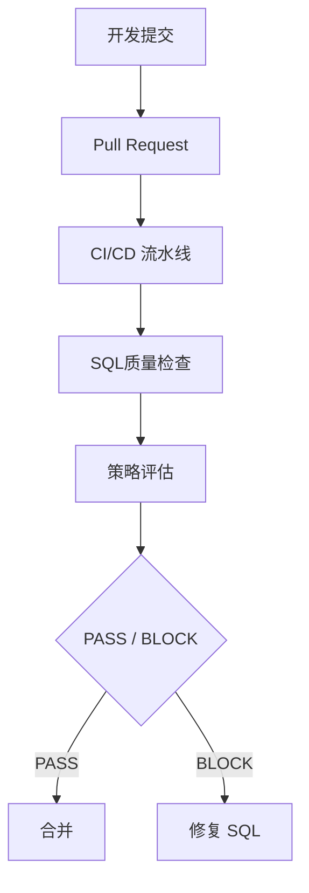
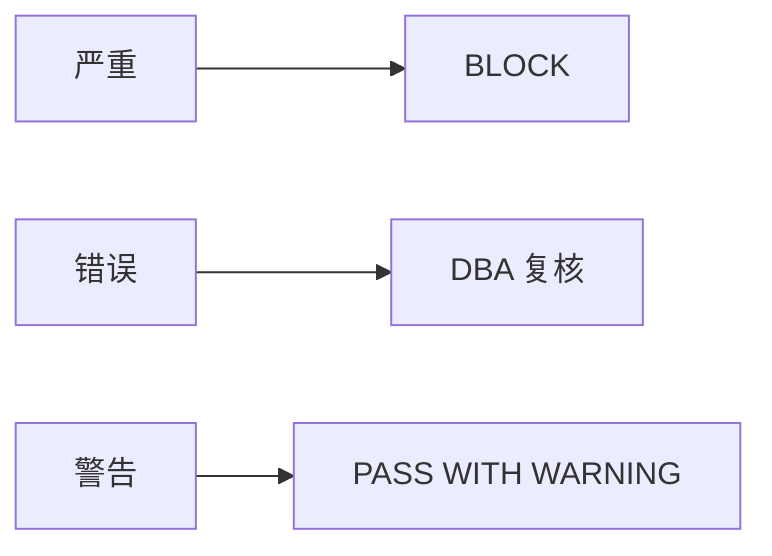

## 用户

DevOps / 平台工程团队、DBA、工程负责人——负责把 SQL 质量控制接入交付流水线的团队。

## 问题

应用代码已经有单元测试、代码扫描、安全检测和 CI/CD，但数据库 SQL 在很多企业里仍然依赖 DBA 人工审核。当团队规模扩大、发布频率提高之后，这种模式会带来三个问题：

1. DBA 成为交付瓶颈
2. SQL质量检查标准难以统一
3. SQL 性能问题发现得太晚

## 目标

让 SQL 像应用代码一样，在上线前经过自动质量门禁——把「人工审批」升级为「可重复、可审计的自动门禁」。

## 流程

把 PawSQL 接入代码提交与发布流程：



## 依赖能力

由以下能力组合而成，具体检查项与改写逻辑见各能力页：

<CardGroup cols={2}>
  <Card title="SQL质量检查" icon="list-check" href="/features/sql-review" />
  <Card title="查询重写优化" icon="git-compare" href="/features/automatic-sql-rewrite" />
  <Card title="智能索引推荐" icon="layers" href="/features/index-recommendation" />
  <Card title="执行计划分析" icon="route" href="/features/execution-plan-visualization" />
  <Card title="自动化性能验证" icon="gauge" href="/features/performance-validation" />
</CardGroup>

## 成功标准

| 指标 | 目标 |
|---|---|
| SQL 自动审核覆盖率 | 提升 |
| 上线前问题发现率 | 提升 |
| DBA 人工审核量 | 降低 |
| SQL 审核平均时间 | 降低 |
| Critical SQL 上线数量 | 降低 |
| 生产慢 SQL 来源于新版本的比例 | 降低 |

---

## 策略即代码

质量门禁的核心价值，是把《数据库开发规范》从文档变成可直接执行的策略（Policy as Code）：

```text
策略
├─ 禁止无条件 DELETE / UPDATE
├─ 大表禁止全表扫描
├─ 禁止高危 DDL
├─ 索引命名规范
├─ 最大影响行数
└─ 数据库专属生产规则
```

规范因此不再只存在于 Wiki 或制度文档里，而是直接进入交付流水线。

### 多级规则体系

大型企业通常需要「统一底线 + 业务差异化」：

- **集团级**：禁止无条件 `DELETE` / `UPDATE`
- **核心系统**：高危 DDL 必须 DBA 审批
- **互联网业务**：`OFFSET > 100000` 标记为深分页风险

### 可配置阈值

可配置最大 Critical / Warning 数量、允许忽略的规则、必须阻断的规则、不同环境的策略——例如测试环境相对宽松，生产发布使用更严格策略。

## 按风险等级决定发布动作

企业可建立统一的等级 → 动作映射：

| 等级 | 行为 |
|---|---|
| 提示（Info） | 记录 |
| 警告（Warning） | 允许通过并提示 |
| 错误（Error） | 要求确认 / 复核 |
| 严重（Critical） | 阻断流水线 |



## 接入流水线

支持 REST API、Webhook、CLI / 脚本、DevOps 平台集成等方式接入现有流水线：

<CardGroup cols={2}>
  <Card title="GitLab CI/CD" icon="git-merge" href="/user-guide/cicd/gitlab" />
  <Card title="GitHub" icon="git-merge" href="/user-guide/cicd/github" />
  <Card title="腾讯 CODING" icon="git-merge" href="/user-guide/cicd/coding" />
  <Card title="蓝鲸流水线" icon="git-merge" href="/user-guide/cicd/blueking" />
  <Card title="Jenkins / GitHub Actions 等（OpenAPI）" icon="git-merge" href="/user-guide/cicd/openapi-pipeline" />
</CardGroup>

<CardGroup cols={2}>
  <Card title="了解 SQL质量检查" icon="list-check" href="/features/sql-review">
    在 CI/CD 中审核 SQL 规范、安全与性能风险。
  </Card>
  <Card title="了解查询重写优化" icon="wand-sparkles" href="/features/automatic-sql-rewrite">
    自动生成等价的 SQL 重写与索引建议。
  </Card>
  <Card title="了解开发者 SQL 智能优化助手" icon="code" href="/use-cases/developer-sql-copilot">
    在编写 SQL 时获得实时优化建议。
  </Card>
  <Card title="申请产品演示" icon="plug" href="https://www.pawsql.com">
    预约 PawSQL 产品演示。
  </Card>
</CardGroup>
