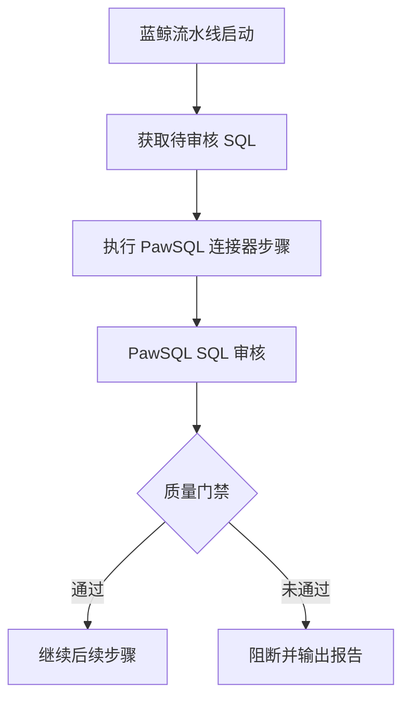

PawSQL 蓝鲸预置连接器将 SQL 审核作为流水线步骤运行。该步骤接收待审核 SQL 和 PawSQL 上下文，等待分析完成，并将门禁结论返回给蓝鲸流水线。

## 目标

使用 PawSQL 预置连接器在蓝鲸流水线中审核 SQL，并根据质量门禁控制后续步骤。

## 开始之前

- 确认 PawSQL 和蓝鲸版本满足连接器要求；
- 从蓝鲸流水线执行环境访问 PawSQL 服务；
- 准备 PawSQL 集成账号、项目、工作空间和审核策略；
- 明确 SQL 文件来源、目录和编码；
- 确定通过、警告、阻断及服务异常行为。

## 配置流程

<Steps>
  <Step title="添加 PawSQL 步骤">在蓝鲸流水线的 SQL 审核阶段添加 PawSQL 预置连接器。具体步骤名称以当前交付版本为准。</Step>
  <Step title="配置服务和凭据">填写 PawSQL 服务地址，并通过蓝鲸凭据管理引用集成账号或令牌。</Step>
  <Step title="指定 SQL 来源">选择工作区文件、制品或前置步骤生成的文件列表，并限定目录、扩展名和忽略规则。</Step>
  <Step title="选择审核上下文">配置 PawSQL 项目、工作空间和审核策略，确保数据库类型与目标环境一致。</Step>
  <Step title="配置质量门禁">设置阻断严重级别、解析失败行为、工单超时和服务异常策略。</Step>
  <Step title="发布并验证">使用测试分支运行流水线，确认通过、阻断、无 SQL 和异常场景均符合预期。</Step>
</Steps>

## 结果检查

连接器步骤应显示门禁结论、问题统计、PawSQL 工单 ID 和报告入口。若流水线被阻断，开发人员应能根据文件和语句定位修复问题。

## 验收标准

- 连接器能够访问 PawSQL 并完成认证；
- 只提交配置范围内的 SQL；
- 工作空间和策略与目标环境匹配；
- 严重问题能够阻断后续步骤；
- 非阻断问题按策略显示警告；
- 超时和服务异常不会无限等待；
- 流水线日志不包含明文凭据和敏感 SQL。

<Note>
  蓝鲸产品版本、连接器发布方式和界面标签可能因交付环境不同。发布前应根据实际安装包补充准确菜单名称和截图。
</Note>
